# Tutorial 2 : ADC and DAC Interface
**AUTHORS:** A. Isaacson

**EXPECTED TIME:** 2-4 hours

## Introduction ##
In this tutorial, you will create a simple Simulink design which interfaces to both the dual channel ADC and interleaved DAC that are utilised on the Red Pitaya 125-10 boards - refer to [Red Pitaya Docs: ReadtheDocs](https://redpitaya.readthedocs.io/en/latest/) and [Red Pitaya Docs: Github](https://github.com/casper-astro/casper-hardware/tree/master/FPGA_Hosts/RED_PITAYA/docs) for more information. In addition, we will learn to control the design remotely, using a supplied Python library for KATCP. 

In this tutorial, the user will be able to input a source sinusoidal signal from the signal generator on either channel 1 or channel 2 of the ADC input and be able to monitor these signals on the channel 1 and channel 2 DAC outputs using an oscilloscope. The user will be able to change the frequency and amplitude of the signal generator and notice the expected change on the oscilloscope if the Simulink design is connected correctly, as explained below. The user can verify the ADC digital data by using a logic analyser configured to read signed data and/or Simulink snap shots, which can be used to capture the ADC data. The python scripts can be utilised to read back this captured data and there are matlab scripts which can be utilised to display this data. The user will also be able to see what happens to the ADC and DAC data when the Digital Signal Processing (DSP) clock is increased from 125MHz to 200MHz.

## Required Equipment ##
The following equipment is required:
1) Oscilloscope, 50MHz, +/-2Vpp, Qty 1
2) Signal Generator, 1MHz-50MHz, +/-2Vpp, Qty 1
3) Logic Analyzer, 1GSps, 2 pods with fly leads, Qty 1
4) SMA Cables, Male to Male, Qty 2

## Background ##
The Red Pitaya 125-10 board consists of a dual channel 10 bit ADC and DAC - refer to [Red Pitaya Docs: ReadtheDocs](https://redpitaya.readthedocs.io/en/latest/) and [Red Pitaya Docs: Github](https://github.com/casper-astro/casper-hardware/tree/master/FPGA_Hosts/RED_PITAYA/docs) for more information on the Red Pitaya. There are currently two versions of the Red Pitaya (125-10 and the 125-14) - refer to [Red Pitaya Hardware Comparison](https://redpitaya.readthedocs.io/en/latest/developerGuide/125-10/vs.html) for differences between the boards.

The Red Pitaya 125-10 is fitted with a single Analog Devices dual channel ADC AD9608 device. The ADC samples at 125MSPS and each digital ADC output channel is 10 bits wide, 1.8V LVCMOS. Refer to [Red Pitaya Docs: Github](https://github.com/casper-astro/casper-hardware/tree/master/FPGA_Hosts/RED_PITAYA/docs) for the schematics of the 125-10. The ADC output is offset binary and converted to two's complement in the firmware running on the Zynq programmable logic (PL).

The Red Pitaya 125-10 is fitted with a single Analog Devices dual channel DAC AD9767 device. The DAC digital input is offset binary, 10 bits, LVCMOS 3.3V and is converted from two's complement inside the firmware running on the Zynq programmable logic. The second channel of the DAC is not connected, which means the DAC is utilised in the interleave mode - refer to DAC data sheet [Red Pitaya Docs: Github](https://github.com/casper-astro/casper-hardware/tree/master/FPGA_Hosts/RED_PITAYA/docs).

Feel free to spend some time reading the data sheets and looking at the schematics. This will be important for the bonus challenge at the end of the tutorial. 

## Create a new model ##
Start Matlab and open Simulink (either by typing 'simulink' on the Matlab command line, or by clicking on the Simulink icon in the taskbar). A template is provided for this tutorial with a pre-created firmware flashing LED function and Red Pitaya XSG core config or platform block and Xilinx System Generator block. Get a copy of this template and save it. Make sure the Red Pitaya XSG_core_config_block or platform block is configured for:

1) Hardware Platform: "RED_PITAYA:xc7z010"
 
2) User IP Clock source: "sys_clk"

3) User IP Clock Rate (MHz): 125 (125MHz clock derived from 125MHz ADC on-board clock). This clock domain is used for the Simulink design

The rest of the settings can be left as is. Click OK. 

### Add Reset logic ###
A very important piece of logic to consider when designing your system is how, when and what happens during reset. In this example we shall control our resets via a software register. We shall have one reset to reset the Simulink design counters and trigger the data capture snap blocks.  Construct reset and control circuitry as shown below.

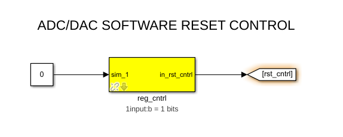

#### Add a software register ####
Use a software register yellow block from the CASPER XPS Blockset -> Memory for the reg_cntrl block. Rename it to reg_cntrl. Configure the I/O direction to be From Processor. Attach one Constant block from the Simulink -> Sources section of the Simulink Library Browser to the input of the software register and make the value 0 as shown above.

#### Add Goto Block ####
Add one Goto block from Simulink -> Signal Routing. Configure them to have the tags as shown (rst_cntrl). These tags will be used by associated From (also found in Simulink -> Signal Routing) blocks in other parts of the design. These help to reduce clutter in your design and are useful for control signals that are routed to many destinations. They should not be used a lot for data signals as it reduces the ease with which data flow can be seen through the system.

#### Add Edge_Detect block ####

Add From blocks from Simulink -> Signal Routing rst_cntrl should go through an edge_detect block (rising and active high) to create a pulsed rst signal, which is used to trigger and reset the counters in the design. This is located in CASPER DSP Blockset -> Misc. Add Goto block rst from Simulink -> Signal Routing. 

It should look as follows when you have added all the relevant registers:

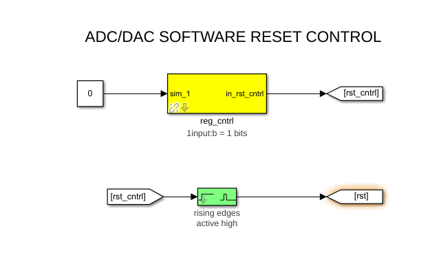


### Add ADC and associated registers and gpio for debugging ###
We will now add the ADC yellow block in order to interface with the ADC device on the Red Pitaya.

#### Add the ADC yellow block for digital to analog interfacing ####
Add a Red Pitaya ADC yellow block from the CASPER XPS Blockset -> ADCs, as shown below. It will be used to interface to the ADC device on the Red Pitaya. Rename it to adc. Double click on the block to configure it and set the number of bits to be 10 bits wide. This should be hard coded for now. This will need to be changed for the bonus challenge exercise below.

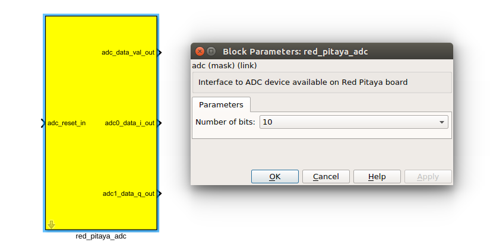

Add the From block as shown below, which connects the reset to the ADC yellow block.

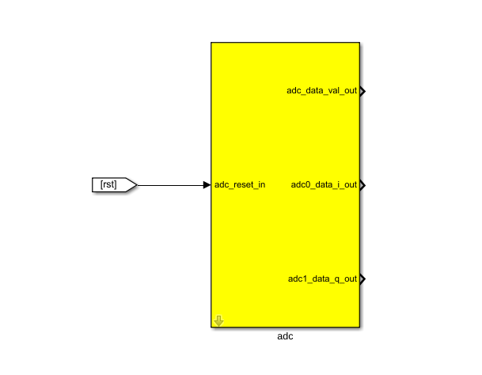

#### Add registers and gpio to provide ADC debugging ####
Add one yellow-block software register to provide an ADC sample counter (32 bits). Name it as shown below. The register should be
configured to send its value to the processor. Connect them to the ADC yellow block as shown below. Delay blocks are added through the design to show the different types of Xilinx Simulink blocks that are available, but they are not really needed - you will find these under Xilinx Blockset -> Basic Elements in the Simulink Library Browser. 

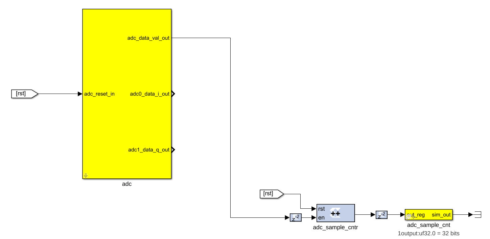

In the event that you will be using the logic analyser, you will need to route the ADC data (channel 1) to the Logic Analyser connector (E1) on the Red Pitaya. In order to do this you will need to add two gpio yellow-blocks from CASPER XPS Blockset -> IO. The first GPIO is for the ADC data valid and the second GPIO yellow block is for the ADC channel 1 10 bit data. It should be connected as shown below for the first gpio for the ADC data valid:

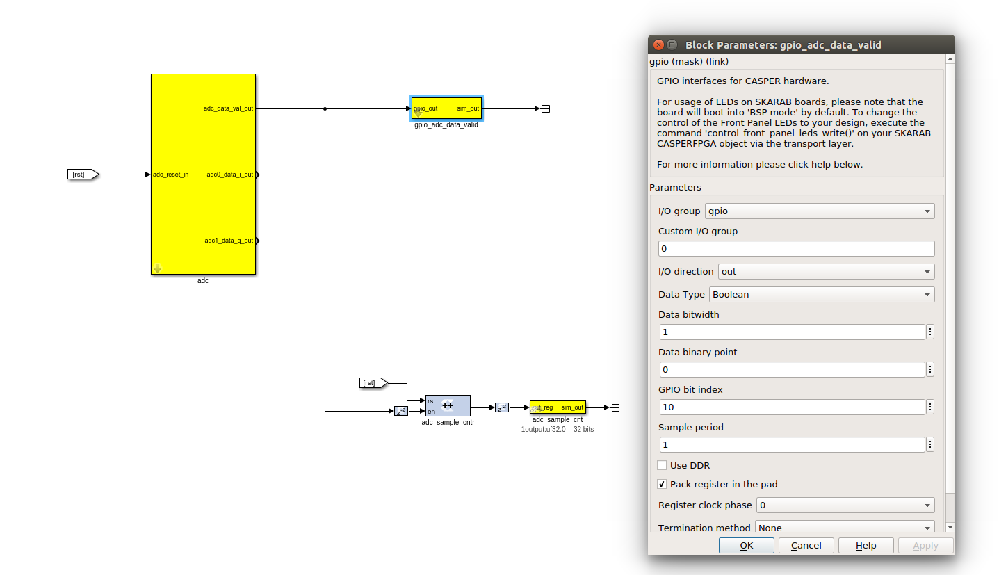

It should be connected as shown below for the second gpio for the ADC 10 bit data on channel 1:

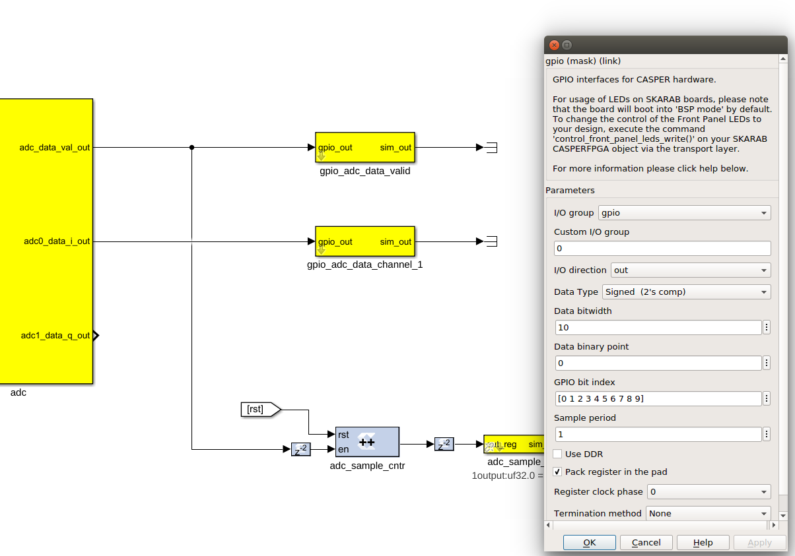

You will now be able to monitor the ADC data using the logic analyser connected to E1 on the Red Pitaya - refer to 125-10 schematics [Red Pitaya Docs: Github](https://github.com/casper-astro/casper-hardware/tree/master/FPGA_Hosts/RED_PITAYA/docs). 

### Add DAC ###
We will now add the DAC yellow block in order to interface with the DAC device on the Red Pitaya.

#### Add the DAC yellow block for digital to analog interfacing ####
Add a Red Pitaya DAC yellow block from the CASPER XPS Blockset -> DACs, as shown below. It will be used to interface to the DAC device on the Red Pitaya. Rename it to dac. Double click on the block to configure it and set the number of bits to be 10 bits wide. This should be hard coded for now. This will need to be changed for the bonus challenge exercise below. Add the From block, which connects the reset to the DAC yellow block and connect the ADC to the DAC as shown below.

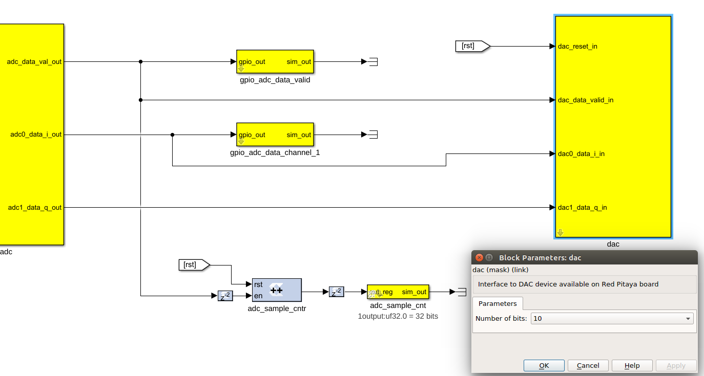

The ADC and DAC functionality is now implemented in your Simulink design. It is now time to setup the ADC data capturing snap shot blocks.


### Buffers to capture ADC Data Valid, ADC Channel 1 and ADC Channel 2 ###
The ADC data valid, ADC data channel 1 and ADC data channel 2 (output) need to be connected to a bitfield snapshot block for data capture analysis (located in CASPER DSP Blockset -> Scopes), as shown below. Using this block, we can capture 1024 ADC samples, read it back and store them as files. These files can then be plotted using a Matlab script and analysed. 

Bitfield snapshot blocks are a standard way of capturing snapshots of data in the CASPER tool-set. A bitfield snap block contains a single shared BRAM allowing capture of 32-bit words (this is a limitation of the new AXI interfacing at the moment). 

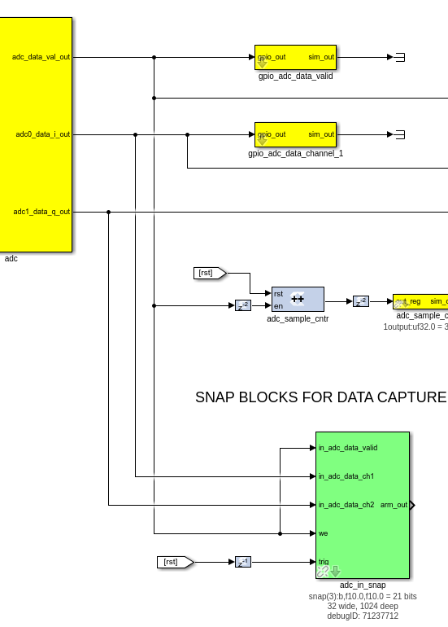

The ctrl register in a snap block allows control of the capture. The least significant bit enables the capture. Writing a rising edge to this bit primes the snap block for capture. The 2nd least most significant bit allows the choice of a trigger source. The trigger can come from an external source or be internal and immediately. The 3rd most least significant bit allows you to choose the source of the valid signal associated with the data. This may also be supplied externally or be immediately enabled.

The basic principle of the snap block is that it is primed by the user and then waits for a trigger at which point it captures a block of data and then waits to be primed again. Once primed the addr output register returns an address of 0 and will increment as data is written into the BRAMs. Upon completion the addr register will contain the final address. Reading this value will show that the capture has completed and the results may be extracted from the shared BRAMs.

In the case of this tutorial, the arming and triggering is done via software. The trigger is the rst signal. The "we" signal on the snapshot blocks is the ADC data valid signal. Configure and connect the snap blocks as shown above. The delay is not really necessary, but if your data was not aligned then you could use delays for this. The following settings should be used for the bitfield snapshot blocks: storage medium should be BRAM, number of samples ("2^?") should be 10, Data width 32, all boxes unchecked except "use DSP48s to implement counters", Pre-snapshot delay should be 0.

You should now have a complete Simulink design. Compare it with the complete ADC and DAC interface tutorial *.slx model provided to you before continuing if unsure.

## Compilation ##

Press CTRL+D to compile the tutorial first and make sure there are no errors before compiling. If there are any errors then a diagnostic window will pop up and the errors can be addressed individually.

It is now time to compile your design into an FPGA bitstream. This is explained below, but you can also refer to the Jasper How To document for compiling your toolflow design. This can be found in the ReadtheDocs mlib_devel documentation link:

[https://casper-toolflow.readthedocs.io](https://casper-toolflow.readthedocs.io/)
 
In order to compile this to an FPGA bitstream, execute the following command in the MATLAB Command Line window:

```bash
jasper_frontend
```

This will enable Vivado's <i>system generator</i> to be run, and the windows below should pop up with the name of your slx file in the window instead of tut_1. The same applies below in the output file path - tut_1 will be replaced with the name of your slx file. In my case it is "tut_adc_dac". 

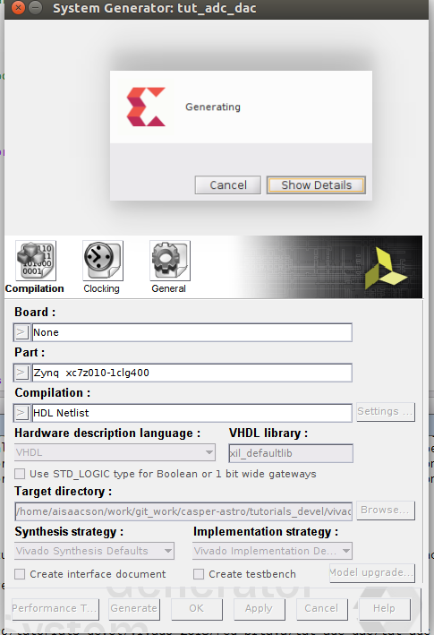

The next step is to open a terminal session (ctrl+T) and change directory to where your git clone of the tutorials_devel is located "../tutorials_devel/vivado_2018/red_pitaya" and source the "startsg startsg.local" script as shown below:

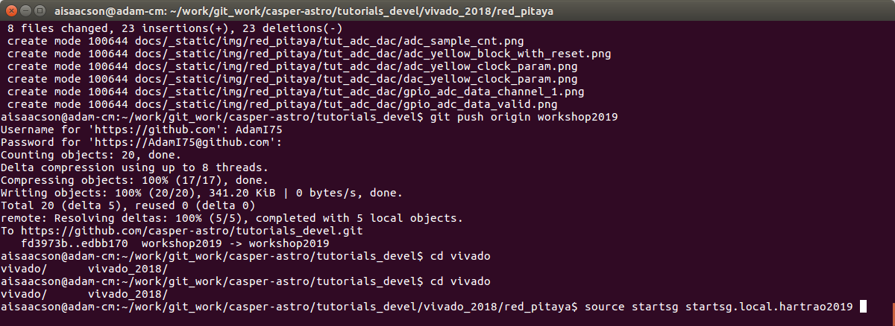

The next step is to cut the python text from the bottom of the MATLAB Command Line Window and paste it into your terminal and press enter. It should look as follows:


This will run the process to generate the FPGA bitstream and output Vivado compile messages to the terminal along the way. 

Execution of this command will result in an output .bof and .fpg file in the 'outputs' folder in the working directory of your Simulink model. <strong>Note: Compile time is approximately 10-15 minutes</strong>, so a pre-compiled binary (.fpg file) is made available to save time.

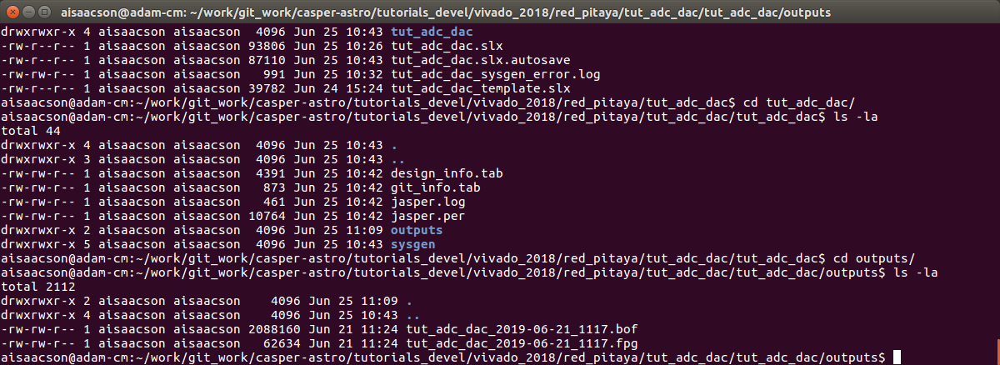

## Programming the FPGA (Zynq PL) ##
Reconfiguration of the Red Pitaya's Zynq is done via the casperfpga python library. The casperfpga package for python, created by the SA-SKA group, wraps the Telnet commands in python. and is commonly used in the CASPER community. We will focus on programming and interacting with the Programmable Logic (PL) of the Zynq using this method.

#### Getting the required packages ####

These are pre-installed on the server in the workshop and you do not need to do any further configuration, but if you are not working from the lab then refer to the How To Setup CasperFpga Python Packages document for setting up the python libraries for casperfpga. This can be found in the "casperfpga" github repo located on GitHub and the ReadtheDocs casperfpga documentation link:

[https://github.com/casper-astro/casperfpga](https://github.com/casper-astro/casperfpga)

[https://casper-toolflow.readthedocs.io](https://casper-toolflow.readthedocs.io/)

#### Copy your .fpg file to your NFS server ####

As per the previous figure, navigate to the outputs folder and (secure)copy this across to a test folder on the workshop server.

```bash
scp path_to/your/model_folder/your_model_name/outputs/your_fpgfile.fpg user@server:/path/to/test/folder/
```

#### Connecting to the board ####

SSH into the server that the Red Pitaya is connected to and navigate to the folder in which your .fpg file is stored.

Start interactive python by running:

```bash
ipython
```

Now import the Zynq control library. This will automatically pull-in the KATCP library and any other required communications libraries.

```bash
 import casperfpga
```

To connect to the Red Pitaya we create an instance of the Red Pitaya board; let's call it rp. The wrapper's fpgaclient initiator requires just one argument: the IP hostname or address of the Red Pitaya board. The hostname of the Red Pitaya board can be found by looking at the top of Red Pitaya Ethernet connector e.g. RP-f0495e.local is the host name on my board. If you ping your host name from the terminal then you will see the IP address. You can do this from ipython by adding "! ping <hostname>".

```python
rp = casperfpga.CasperFpga(host='red_pitaya_name or ip_address', port=7147)
```

The first thing we do is configure the FPGA (Zynq PL).

```python
rp.upload_to_ram_and_program('your_fpgfile.fpg')
```

You should notice that LED0 on the Red Pitaya is flashing, which indicates that the firmware is running. Congratulations, you just configured your Red Pitaya successfully! :).

All the available/configured registers can be displayed using:

```python
rp.listdev()
```

The Zynq PL is now configured with your design. The registers can now be read back. For example, the ADC sample count register can be read back from the FPGA by using:

```python 
rp.read_uint('adc_sample_cnt') or rp.registers.adc_sample_cnt.read_uint();
```

The value returned should be continually incrementing, which indicates that the ADC is successfully sampling the input data.

If you need to write to the reg_cntrl register then do the following:

```python
 
 rp.registers.reg_cntrl.write(rst_cntrl = 'pulse'), this creates a pulse on the rst signal
 
```

Try the following - add a "?" (leave out the brackets) to find out what the functions below does:

```python
 
 rp.is_connected()
 rp.is_running()
 
```

Manually typing these commands by hand will be cumbersome, so it is better to create a Python script that will do all of this for you. This is described below.

#### Running a Python script and interacting with the Zynq PL ####
A pre-written python script, ''tut_adc_dac.py'' is provided. The code within the python script is well commented and won't be explained here. The user can read through the script in his/her own time. In summary, this script programs the Zynq PL with your compiled design (.fpg file), writes to the reset control register, reads back the ADC snap shot captured data and status registers while displaying them to the screen for analysis. It is also saves the ADC data as text data for displaying in Matlab. In order to run this script you will need to edit the file and change the target Red Pitaya IP address and the *.fpg file, if they are different. The script is run using:

```python
python tut_adc_dac.py
```

If everything goes as expected, you should see a whole bunch of text on your screen - this is the output of the snap block and status register contents.

### Analysing the Display Data ###
You should see something like this:

```bash
 user@server:~$ python tut_adc_dac.py
 connecting to Red Pitaya...
 done
 programming the Red Pitaya...
 done
 arming snapshot block...
 done
 triggering the snapshot and reset the counters...
 done
 reading the snapshot...
 done
 writing ADC data to disk ...
 done
 reading back the status registers...
 adc_sample_cnt: 3689577
 done
 Displaying the snapshot block data...
 ADC SNAPSHOT CAPTURED INPUT
 -----------------------------
 Num adc_data_valid adc_data_ch1 adc_data_ch2
[0] 1 -10 -1
[1] 1 6 -1
[2] 1 -6 -1
[3] 1 0 -1
[4] 1 -1 -2
[5] 1 -3 -2
[6] 1 1 -1
[7] 1 -6 -1
[8] 1 3 -1
[9] 1 -6 -1
[10] 1 3 -1
 ....
[589] 1 -6 -2
[590] 1 1 -1
[591] 1 -3 -1
[592] 1 -2 -1
[593] 1 1 -1
[594] 1 -5 -1
[595] 1 4 -1
[596] 1 -9 -1
[597] 1 6 -1
[598] 1 -9 -1
[599] 1 5 -1
```

The above results show that the ADC is sampling continuously and that there is just noise at the ADC input, as no signal generator is connected. The ADC sample count should continue to increase each time this script file is run - try it. You can also try and compile your Simulink design with a higher clock e.g. 200MHz. Does the ADC data valid signal stay high continually? If so, then why?

Setup the signal generator to have an amplitude of 2Vpp, a frequency of 4MHz and sinusoid signal. Check using the oscilloscope that this is correct. Once satisfied connect the one end of the SMA cable to the signal generator output and connect the other end to the Red Pitaya IN1. Remember to also connect the Red Pitaya OUT1 to the other channel of the oscilloscope (needs a BNC to SMA Female) using another SMA to SMA cable. Change the frequency and amplitude to 2MHz and to 1Vpp. What happens to the oscilloscope Red Pitaya OUT1 display? What is the frequency and amplitude now? Try run the python script and see what happens? What is different in your results now?

Now connect the signal generator to Red Pitaya IN2 and the other channel of the oscilloscope to Red Pitaya OUT2 and repeat the above tests. What do you notice?

Remember those gpio yellow blocks you added for the logic analyser? Connect the logic analyser fly leads to connector E1 on the Red Pitaya - do this while the system is powered off and the signal generator is off. Refer to diagram below for E1 connector pin outs:

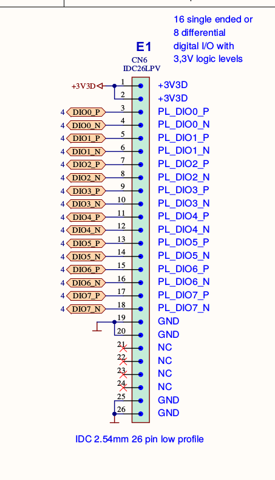

Hint: Checkout schematics: pin 3 is the LSB and pin 12 is the MSB of the ADC data, pin 13 is the ADC data valid.
Hint: What trigger are you going to use to sample the ADC data on channel 1 - internal or external? Why?

Once you have connected everything up then configure the board and switch on the signal generator. Does the data displayed on the logic analyser look similar to the data captured using the python script? How can you display a sinusoid signal on the logic analyser?

Take the captured data written to disk "adc_data.txt" and display using the Matlab script "plot_adc.m" which will reside in your tutorial folder. Does it look correct? Try compute the RMS LSB of each ADC channel. Is there anything besides noise when the channel is unterminated or terminated? 
Hint: edit the plot_adc.m script to compute the standard deviation with the ADC inputs terminated. 

Try and do an FFT (add windowing) of the captured ADC data by editing the plot_adc.m script. What do you get? Does it make sense?
Hint: treat each channel as real data.

### Bonus Challenge ###

You have gone through the ADC and DAC tutorial on the 125-10 board. Now it is time to really test your hardware porting skills and port this tutorial to work on the 125-14 board. Good luck!

Hint: The Zynq pin outs are not the same. You will need to look at the 125-14 schematics. You will need to update the simulink yellow blocks, python blocks and red_pitaya.yaml script. 

#### Other notes ####

• iPython includes tab-completion. In case you forget which function to use, try typing library_name._tab_

• There is also onboard help. Try typing library_name.function?

• Many libraries have onboard documentation stored in the string library_name.__doc__

• KATCP in Python supports asynchronous communications. This means you can send a command, register a callback for the response and continue to issue new commands even before you receive the response. You can achieve much greater speeds this way. The Python wrapper in the corr package does not currently make use of this and all calls are blocking. Feel free to use the lower layers to implement this yourself if you need it!

## Conclusion ##
This concludes the ADC and DAC Interface Tutorial for the Red Pitaya. You have learned how to utilize the ADC and DAC interface on the Red Pitaya to sample incoming data and convert this sampled data to an analog signal. You have learned to play around with Matlab's data manipulation using the signal processing toolbox. You also learned how to further use Python to program the Zynq PL, control the design and debug the design remotely using casperfpga. If you managed to successfully port your tutorial to work with the 125-14 Red Pitaya then you would have gained important hardware porting experience that will allow you to port to any hardware platform in the future.
