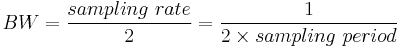
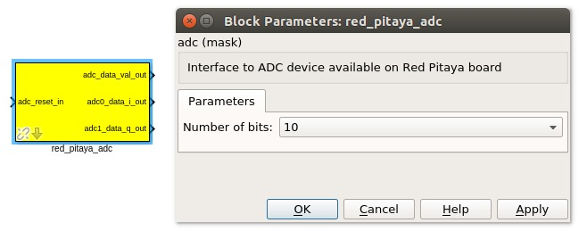
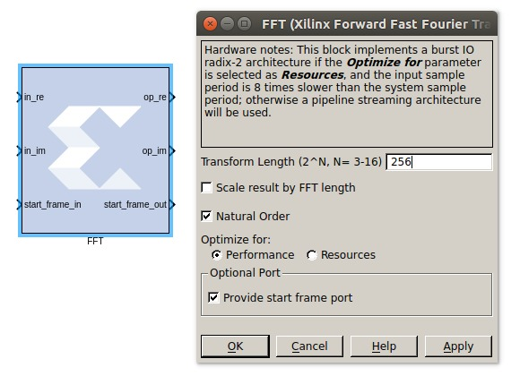
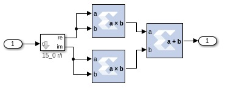
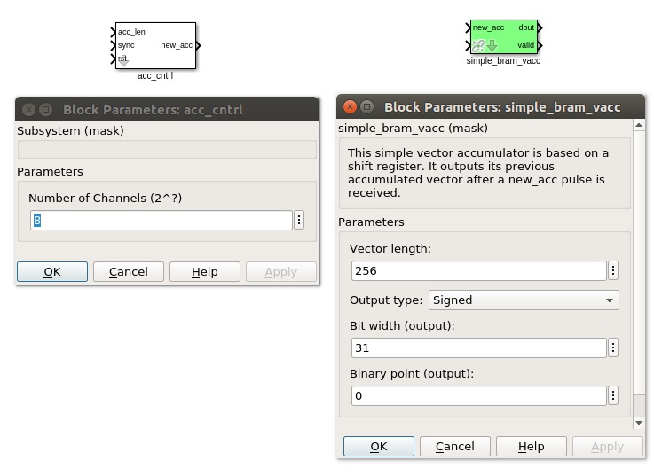
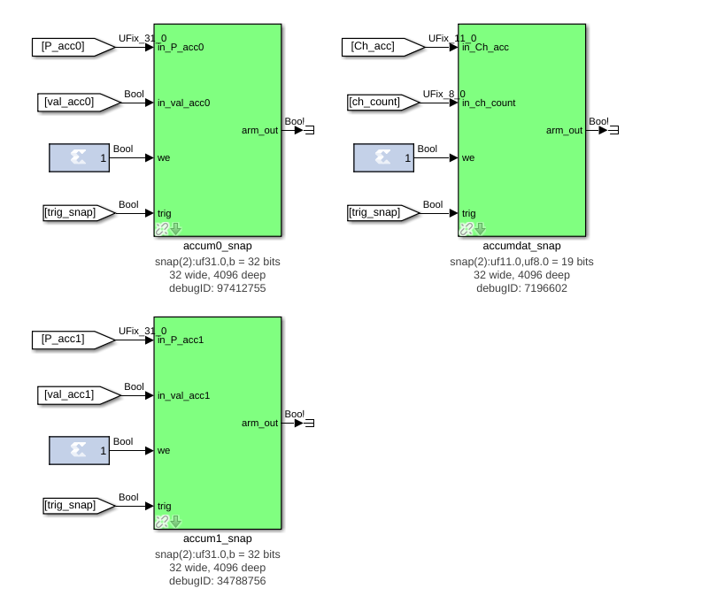
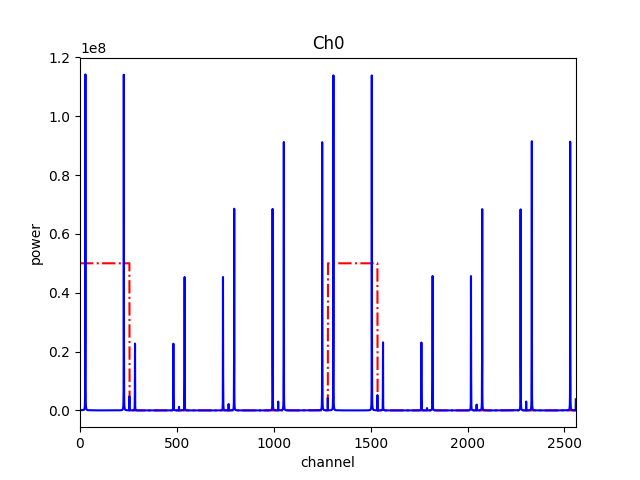
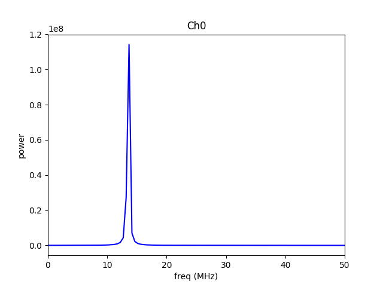

# Tutorial 3: Wide(-ish)band Spectrometer

## Introduction ##
A spectrometer is something that takes a signal in the time domain and converts it to the frequency domain. In digital systems, this is generally achieved by utilising the FFT (Fast Fourier Transform) algorithm.

When designing a spectrometer for astronomical applications, it's important to consider the 	science case behind it. For example, pulsar timing searches will need a spectrometer which can 	dump spectra on short timescales, so the rate of change of the spectra can be observed. In contrast, a deep field HI survey will accumulate multiple spectra to increase the signal to noise ratio. It's also important to note that “bigger isn't always better”; the higher your spectral and time resolution are, the more data your computer (and scientist on the other end) will have to deal with. For now, let's skip the science case and familiarize ourselves with an example spectrometer.

## Setup ##

This tutorial comes with a completed model file, a compiled bitstream, ready for execution on Red Pitaya, as well as a Python script to configure the Red Pitaya and make plots. [Here](https://github.com/casper-astro/tutorials_devel/tree/master/red_pitaya/tut_spec)

## Spectrometer Basics ##

When designing a spectrometer there are a few main parameters of note:
	

- **Bandwidth**: The width of your frequency spectrum, in Hz. This depends on the sampling rate; for complex sampled data this is equivalent to:


In contrast, for real or Nyquist sampled data the rate is half this:



as two samples are required to reconstruct a given waveform .

- **Frequency resolution**: The frequency resolution of a spectrometer, Δf, is given by

,

and is the width of each frequency bin. Correspondingly, Δf is a measure of how precise you can measure a frequency.

- **Time resolution**: Time resolution is simply the spectral dump rate of your instrument. We generally accumulate multiple spectra to average out noise; the more accumulations we do, the lower the time resolution. For looking at short timescale events, such as pulsar bursts, higher time resolution is necessary; conversely, if we want to look at a weak HI signal, a long accumulation time is required, so time resolution is less important.

## Simulink / CASPER Toolflow ##

### Simulink Design Overview ###
If you're reading this, then you've already managed to find all the tutorial files. By now, I presume you can open the model file and have a vague idea of what's happening.
The best way to understand fully is to follow the arrows, go through what each block is doing and make sure you know why each step is done. To help you through, there's some “blockumentation” in the appendix, which should (hopefully) answer all questions you may have. A brief rundown before you get down and dirty:


- The all important Xilinx token is placed to allow System Generator to be called to compile the design.

- In the MSSGE block, the hardware type is set to “RED_PITAYA_10:xc7z010” and clock rate is specified as 125MHz.

- In this tutorial, we use the 10-bit Red Pitaya.  Make sure that the platform and ADC yellow blocks are configured for 10 bits.

- The input signal is digitised by the ADC. The ADC runs at 125MHz, which gives a 62.5MHz nyquist sampled spectrum.  The RF inputs have a slightly narrow bandpass of 50MHz. The output range is a signed number in the range 0 to 1023 (ie 0 bits after the decimal point). This is expressed as fix_10_0.  This is a little non-standard.  You'll notice that tutorials for other platforms have an ADC output between -1 and +1 and a binary point to match.

- The Xilinx FFT is configured for 256 channels.

- You may notice delay blocks dotted in places of the design. It's common practice to add these into the design as it makes it easier to fit the design into the logic of the FPGA. It consumes more resources, but eases signal timing-induced placement restrictions.

- The real and imaginary (sine and cosine value) components of the FFT are plugged into power blocks, to convert from complex values to real power values by squaring.

- The requantized signals then enter the vector accumulators, which are simple_bram_vacc 32 bit vector accumulators. Accumulation length is controlled by the acc_cntrl block.

- The accumulated signal for each channel is then fed into a 32-bit snap block, accum0_snap and accum1_snap.


Without further ado, open up the model file and start clicking on things, referring the blockumentation as you go.

### [adc](https://casper.berkeley.edu/wiki/Adc) ###



The first step to creating a frequency spectrum is to digitize the signal. This is done with an ADC – an Analogue to Digital Converter. In Simulink, the ADC is represented by a yellow block.

The ADC block converts analog inputs to digital outputs. Every clock cycle, the inputs are sampled and digitized to 10 bit binary point numbers in the range of -1024 to 1023 and are then output by the ADC. This is achieved through the use of two's-complement representation with the binary point set to 0. Simulink represents such numbers with a fix_10_0 moniker.

ADCs often internally bias themselves to halfway between 0 and -1. This means that you'd typically see the output of an ADC toggling between zero and -1 when there's no input. It also means that unless otherwise calibrated, an ADC will have a negative DC offset.

In this design the ADC is clocked to 125MHz, generated from the Red Pitaya's system clock. This gives us a bandwidth of 62.5MHz, as Nyquist sampling requires two samples (or more) each second.

**INPUTS**

|                   Port                  | Description                                                                                                               |
| --------------------------------------- |---------------------------------------------------------------------------------------------------------------------------|
| adc_reset_in | Reset port for ADC. This signal will be activated by our script upon startup. This is a boolean signal. |


**OUTPUTS**

The ADC outputs are a data valid flag and two signals: i and q, which correspond to the coaxial inputs of the Red Pitaya (inputs 0 and 1).


### Xilinx FFT ###



This Red Pitaya tutorial utilizes the Xilinx FFT block -- one for each channel of the ADC.  adc_di and adc_dq route to the real inputs on each FFT.  Each block is configured for a 256 point transform.

**INPUTS**

|                   Port                  | Description                                                                                                               |
| --------------------------------------- |---------------------------------------------------------------------------------------------------------------------------|
| in_re | Real input for FFT.  ADC signals are routed here. This is a fix_10_0 port. |
| in_im | Imaginary input for FFT. We are sampling real signals, so we tie this line to zero. This is a fix_10_0 port. |
| start_frame_in | Reset port for FFT. We sync this once in the beginning of the run script. This is a boolean signal.|

**OUTPUTS**

|                   Port                  | Description                                                                                                               |
| --------------------------------------- |---------------------------------------------------------------------------------------------------------------------------|
| op_re | Real output of FFT.  This is a fix_19_0 port.|
| op_im | Imaginary output of FFT. Also a fix_19_0 port.|
| start_frame_out | Flag indicating the start of spectra.  This port is routed to the acc_cntrl block. This is a boolean signal. |

### [power](https://casper.berkeley.edu/wiki/Power) ###



The power block computes the power of a complex number. Underneath the subsystem blocks, you see that the power block will compute the power of its input by taking the sum of the squares of its real and imaginary components.
The output of the block is 31.0 bits.

**INPUTS/OUTPUTS**

| Port | Direction | Data Type | Description |
|-------|-----------|----------------------------------|---------------------------------------------------------------------------------------------------------------|
| c | IN | 2*BitWidth Fixed point | A complex number whose higher BitWidth bits are its real part and lower BitWidth bits are its imaginary part. |
| power | OUT | ufix_(2*BitWidth+1)_(0) | The computed power of the input complex number. |


### simple_bram_vacc ###



The simple_bram_vacc block is used in this design for vector accumulation. If you wanted a really long accumulation (say a few hours), you'd have to use a block such as the qdr_vacc or dram_vacc. As the name suggests, the simple_bram_vacc is simpler so it is fine for this demo spectrometer.
The FFT block outputs 256 frequency bins in total. We have two of these bram vacc's in the design, one for each port on the Red Pitaya. The vector length is set to 256 on both.

**PARAMETERS**

| Parameter | Description |
|-----------------------|-------------------------------------------------------------------------------------------------------------------------------------------------------------------------------------------------------------------------------|
| Vector length | The length of the input/output vector. The FFT block produces a stream of 256 length, so we set this to 256. |
| no. output bits | The input is 31.0 from the FFT block, we have set this to 31 bits. Note: As there is bit growth due to accumulation, we really ought to set this higher than the input bits to avoid overflows.  Other CASPER spectrometer tutorials handle this by requantizing the data stream between the FFT and the accumulator.|
| Binary point (output) | Since we are accumulating 31.0 values there should be 0 bits below the binary point of the output, so set this to 0. |

**INPUTS/OUTPUTS**

| Port | Description |
|----------|--------------------------------------------------------------------------------------------------------------------------------------------------------------------------------------------------------------------------------------------------------------------|
| new_acc | A boolean pulse should be sent to this port to signal a new accumulation. We can't directly use the sync pulse, otherwise this would reset after each spectrum. So, the sync is first connected to the acc_cntrl block, a block which allows us to set the accumulation period. |
| din/dout | Data input and output. The output depends on the no. output bits parameter. The input/output is ufix_31_0 in this case. |
| Valid | The output of this block will only be valid when it has finished accumulating (signalled by a boolean pulse sent to new_acc). This will output a boolean 1 while the vector is being output, and 0 otherwise. |

### Snap Blocks ###



The final blocks, accum0_snap and accum1_snap, capture the data coming from the accumulators, which we will read out the values of using the tut_spec.py script.

**PARAMETERS**

| Parameter | Description |
|-------------------|------------------------------------------------------------------------------------------------------------------------------------------------------------------------------------------------------------------------------------------------------------------------------------|
| Names | These are the names of the variables captured -- in this case, power and data valid. |
| Bitwidths | Bitwidths corresponding to the named variables.  Presently, the snap blocks for the Red Pitaya support a maximum bitwidth of 32. |
| Binary pts | The data from the accumulators is ufix_31_0, so set this to zero. |
| Data types | We have one unsigned fixed point and one boolean data type. |


**INPUTS/OUTPUTS**

| Port | Description |
|----------|------------------------------------------------------------------------------------------------------------------------------------------|
| in_P_acc0 / in_P_acc1 | Input port for power. This is ufix_31_0.  |
| in_val_acc0 / in_val_acc1 | Data valid signal, which is a boolean.  The last accumulation is the valid spectrum and is flagged by this port. |
| we | We tie the write enable port high so we can see if there are any invalids in the in_val_acc0 and in_val_acc1 port. This is a boolean signal. |
| trig | Trigger for the snap block. This is a boolean signal. Note, the block diagram is configured so that the trigger happens following a reset, but we can override this trigger in the casperfpga controls of tut_spec.py by setting man_trig=True in the snapblock call. |

### [Software Registers](https://casper.berkeley.edu/wiki/Software_register) ###

There are a few [control registers](https://casper.berkeley.edu/wiki/Software_register), led blinkers, and [snap](https://casper.berkeley.edu/wiki/Snap) block dotted around the design too:

- **reg_cntrl**: Counter reset control. Pulse this high to reset the ADC and ADC counter.

- **acc_len**: Sets the accumulation length. Have a look in tut_spec.py for usage.

- **sync_reg**: Synchronizes the FFTs.  Pulse this high to start/restart the FFT output.

- **sync_cnt**: Logs the number of syncs into the FFTs.

- **fft_sync_inc**: Logs the number of syncs leaving each FFT.

- **acc_cnt**: Accumulation counter. Keeps track of how many accumulations have been done.

- **gpio_led**: LED flashes while the bitcode is running.

There are a few additional software registers for debug purposes only.

If you've made it to here, congratulations, go and get yourself a cup of tea and a biscuit, then come back for part two, which explains the second part of the tutorial – actually getting the spectrometer running, and having a look at some spectra.

## Configuration and Control ##

### Hardware Configuration ###

The tutorial comes with a pre-compiled fpg file, which is generated from the model you just went through (tut_spec.fpg)

Next, you need to set up your Red Pitaya. Power it on, making sure that:

•	By default, the Red Pitaya takes RF inputs between -1 and +1 V though it can be configured for higher voltages.

•	Connect inputs 0 and 1 to sine wave generators. The frequencies should be between 0 and 50 MHz.


### The tut_spec.py spectrometer script ###

This short script does the following:

•	calls the Red-Pitaya
•	uploads an fpg file
•	activates the reset registers
•	pulls data from the snap blocks
•	plots the spectra.

Browse to where the tut_spec.py file is in a terminal and at the prompt type

```bash
 python tut_spec.py -f <fpgfile name> -r <Red-Pitaya IP or hostname> -a <accumulation length>
```

replacing <Red-Pitaya IP or hostname> with the IP address of your Red-Pitaya and <fpgfile name> with your fpg path and filename. You should see a spectrum like this:



In the plot, the blue solid line represents several spectra concatenated one after the next.  You see that after each accumulation -- in this case 5 -- the amplitude of the tones build.  After the fifth spectrum, then the accumulation resets and repeats.  The data valid flag, shown by a red-dashed line scaled to the range of the plot, shows the indecies of the last accumulation.  We plot the valid accumulation in frequency space, you see the tone at 14 MHz.  Inspect the tut_spec.py script to see how this is done.




## Conclusion ##
If you have followed this tutorial faithfully, you should now know:

•	What a spectrometer is and what the important parameters for astronomy are.

•	Which CASPER blocks you might want to use to make a spectrometer, and how to connect them up in Simulink.

•	How to connect to and control a Red Pitaya spectrometer using python scripting.

