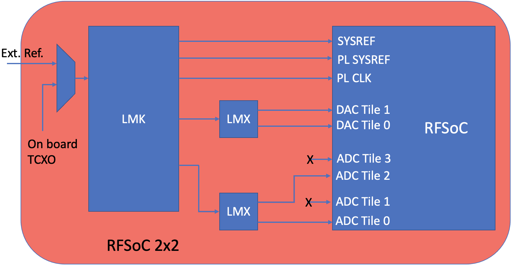

# RFSoC2x2

vendor [link][pynq-rfsoc2x2]

# RF Clocking
The following figure shows a high-level block diagram for the clocking network:

The PLLs used on this board are the:
  * LMK04832
  * LMX2594

The `RESET/GPO` pin of the LMK04832 is connected to the FPGA. The power-on
default for the `RESET/GPO` pin is as an input with a pulldown resistor. This
requires that hardware designs include a GPIO to remove reset from the LMK for
programming.

This can be done in the a CASPER design by using a software register and GPIO
yellow block.  Configure the software register to be `From Processor` with an
initial value of `0`, a bitwidth of `1` and a bitfield data type of `2`.
Configure the GPIO yellow block with I/O group set to `custom`, I/O direction
`out`, Data Type `Boolean`, and Data bitwidth of `1`.

# ADC Inputs
This board only exposes two ADC inputs; one input on tile 1 and the other on
tile 3. Callout `ADC 2` (`J5`) is connected to tile 0 corresponding to ports
`m0X_axis_tdata` on the `rfdc`. Callout `ADC 1` (`J4`) is connected to tile 2
corresponding to ports `m2X_axis_tdata` on the `rfdc`.

[pynq-rfsoc2x2]: https://www.rfsoc-pynq.io
