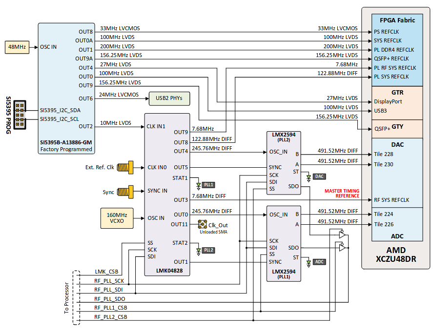

# RFSoC 4x2

vendor links: [PYNQ infromation][pynq-rfsoc4x2] and [Real-Digital][real-digital-rfsoc4x2]

All information and images come from the Real-Digital rfsoc4x2 reference manual

This figure shows the physical layout of the RFSoC4x2.

# RF Clocking

The following figure shows a high-level block diagram for the clocking network:

The Clocking modules onboard the RFSoC4x2 are:
- Skyworks Si5395
- TI LMK04828
- TI LMX2594

At boot the RFSoC 4x2 the LMK will be programmed to provide a 122.88 MHz
reference to the PL and a 245.76 MHz reference for the ADC and DAC LMX. The LMX
PLLs are programmed to provide a reference of 491.52 reference to the RFDC ADC
and DAC tiles.

LEDs labeled PLL1 and PLL2 are lit up to indicate clock stability

[pynq-rfsoc4x2]: https://www.rfsoc-pynq.io
[real-digital-rfsoc4x2]: https://www.realdigital.org/hardware/rfsoc-4x2

