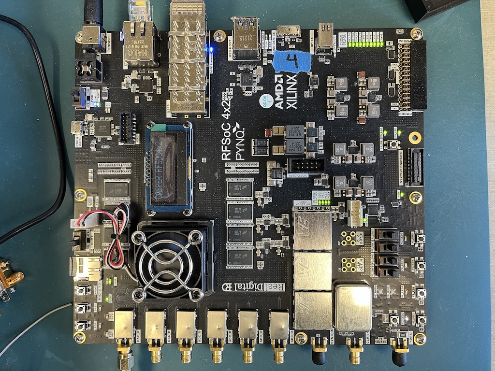

RFSoC 4x2
=========

vendor links: `PYNQ infromation <pynq-rfsoc4x2_>`_ and `Real-Digital <real-digital-rfsoc4x2_>`_

RF Clocking
-----------

The following figure shows a high-level block diagram for the clocking network:

At boot the RFSoC 4x2 the LMK will be programmed to provide a 122.88 MHz
reference to the PL and a 245.76 MHz reference for the ADC and DAC LMX. The LMX
PLLs are programmed to provide a reference of 491.52 reference to the RFDC ADC
and DAC tiles.

.. _pynq-rfsoc4x2: https://www.rfsoc-pynq.io
.. _real-digital-rfsoc4x2: https://www.realdigital.org/hardware/rfsoc-4x2
