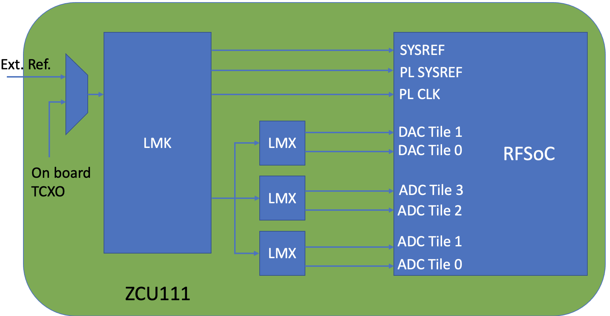

ZCU111
======

vendor `link <https://www.xilinx.com/products/boards-and-kits/zcu111.html>`_

.. image:: ../../../_static/img/rfsoc/readme/zcu111.jpeg
   :target: ../../../_static/img/rfsoc/readme/zcu111.jpeg
   :alt: 

RF Clocking
===========

The following figure shows a high-level block diagram for the clocking network:

The PLLs used on this board are the:

* LMK04208
* LMX2594
