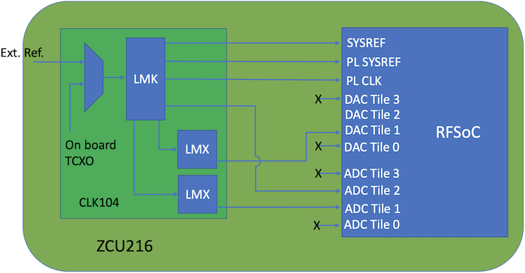

ZCU216
======

vendor `link <zcu216_>`_

.. image:: ../../../_static/img/rfsoc/readme/zcu216.jpeg

RF Clocking
-----------

The following figure shows a high-level block diagram for the clocking network:

The CLK104 board is a seperate module board providing the RF Clocks to the RFSoC
ADC/DAC tiles. The PLLs on this board are the:

  * LMK04828b
  * LMX2594

Only two of the ADC/DAC tiles recieve a clock. The other two are
not connected. One of the connections to the ADC is from the LMK chip and the
other tile recieves its clock from the LMX chip.

In this topology this board relies on the Gen 3 clock forwarding capabilites of
the RFSoC to distribute the sample clock to all ADC tiles (`PG269 Ch.4,
Clocking <pg269_>`_). The ``rfdc`` yellow block checks the source of ADC tile clock
using the RFSoC platform ``.yaml`` file and uses that information to forward the
source clock to the other tiles. The platform configuration file for the ZCU216
is set to receive its sample clock from the LMK (source tile 2), to update the
platform to use the LMX as the source instead set ``adc_clk_src`` to ``1`` for all
four tiles.

.. _zcu216: https://www.xilinx.com/products/boards-and-kits/zcu216.html
.. _pg269: https://www.xilinx.com/support/documentation/ip_documentation/usp_rf_data_converter/v2_4/pg269-rf-data-converter.pdf
