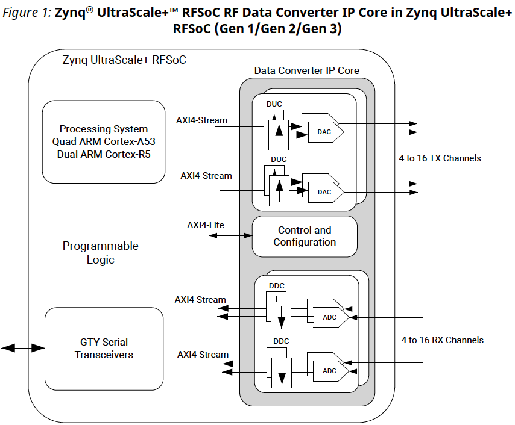
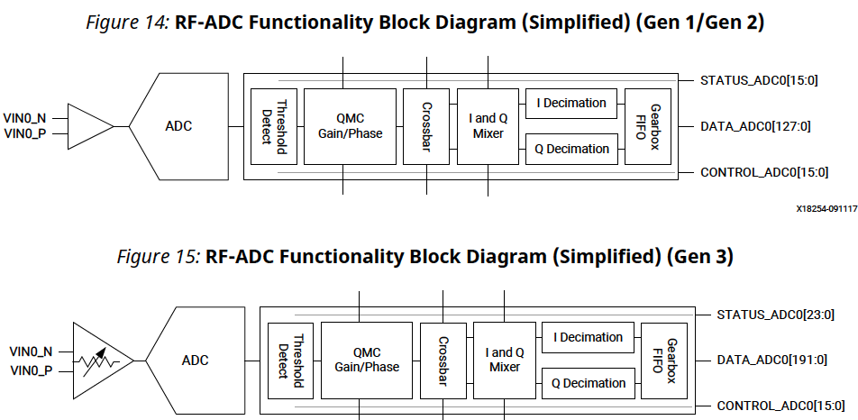
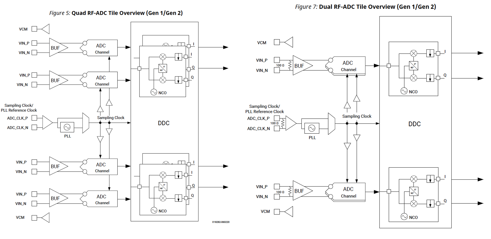
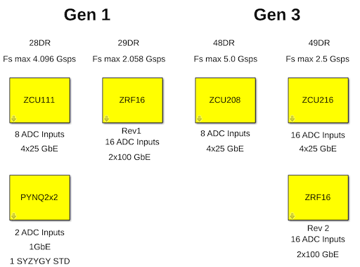
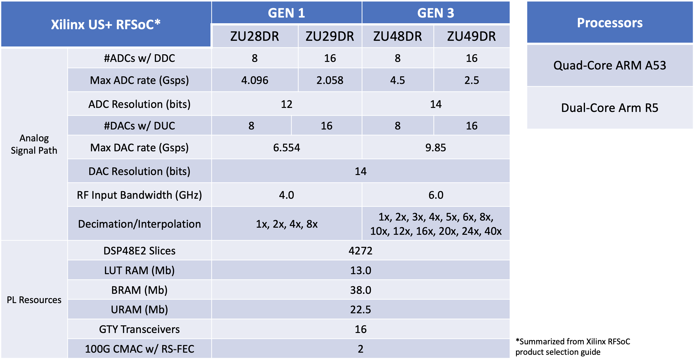

CASPER RFSoC README
======================

Introduction
--------------
This documentation aims to introduce Xilinx Zynq UltraScale+ RFSoC to the CASPER
community along with the platforms and capabilities currently supported in the
CASPER tools. The hardware and design flexibility of RFSoC within CASPER will
continue to proliferate the design philosophy of CASPER of decreasing the
time-to-science metric and provide a way of bringing the needed capabilities to
next generation instruments.

Before starting with the tutorials and reviewing the available platforms, the
following is a brief introduction and overview of the RFSoC architecture and its
capabilities. The primary source of the information presented here is Xilinx
documentation and data sheets pertaining to the `Zynq UltraScale+
RFSoC <https://www.xilinx.com/products/silicon-devices/soc/rfsoc.html#documentation>`_. 
Please reference those materials (`PG269 <https://docs.xilinx.com/v/u/2.4-English/pg269-rf-data-converter>`_, 
`DS889 <https://docs.xilinx.com/v/u/en-US/ds889-zynq-usp-rfsoc-overview>`_, and 
`DS926 <https://docs.xilinx.com/r/en-US/ds926-zynq-ultrascale-plus-rfsoc/Summary>`_) 
for more details as this is a rehashing of only some high-level details.

The RFSoC
-----------
A high-level block diagram of the RFSoC package is shown in the below figure.

The RFSoC integrates programmable logic with the Zynq ARM (A53) processor, high
speed serial transceivers, and the RF Data Converters (RFDC); a hardened IP core
implementing all RF functionality. The RFDC groups together multi-gigasample per
second ADCs (DACs) capable of direct sampling (synthesis) for RF signals up to 6
GHz (9.85 GHz). Additionally, these cores include digital down (up) converters,
a mixer capable of a fixed coarse setting or fine frequency tuning by a
numerically controlled oscillator (NCO), and interpolation and decimation
filters. A block diagram of the analog signal path for the ADCs is shown in the
following figure.

The ADCs and DACs are grouped into "tiles" to some extent similar to the idea of
other columnar tile components of a Xilinx FPGA. In this case however, the ADCs
or DACs and their supporting components populate the entire tile. There are two
different tile architectures found in RFSoC devices: quad-tile and dual-tile.
The number of tiles found in the device and their capabilities varies between
RFSoC packages and generation. The quad- and dual-tile architectures are
depicted in the below figure.

As the RFDC is the focus of the RFSoC, in order to bring the functionality to
CASPER an RFDC yellow block is needed to access and configure the IP. This
yellow block instances the underlying Vivado RFDC IP and interfaces to the
CASPER user in a similar fashion as would be presented to the hardware designer
in Vivado providing many of the same configuration options. This was done to
maintain the flexibility of the RFDC and provide as much control as possible
over its configuration and provide that to the general CASPER user.

The RFDC yellow block is designed to detect the tile architecture (quad/dual)
and the generation (gen 1/3) of the selected platform as specified by an RFSoC
platform yellow block. This provides a forward compatibility mechanism as more
RFSoC platforms are targeted in CASPER and as Xilinx inevitably produces future
generations of the RFSoC.

Platforms
-----------

The CASPER library contains support and has been tested for the following
RFSoC platforms:

 * `ZCU216 <./platforms/zcu216.html#rf-clocking>`_
 * `ZCU208 <./platforms/zcu208.html#rf-clocking>`_
 * `ZCU111 <./platforms/zcu111.html#rf-clocking>`_
 * `PYNQ RFSoC 4x2 <./platforms/rfsoc4x2.html#rf-clocking>`_
 * `PYNQ RFSoC 2x2 <./platforms/rfsoc2x2.html#rf-clocking>`_
 * `HTG ZRF16-29DR <./platforms/zrf16.html#rf-clocking>`_
 * `HTG ZRF16-49DR <./platforms/zrf16.html#rf-clocking>`_

A summary of the board resources taken from the Xlinx RFSoC product selection
guide is shown in the following table. In the context of astronomy signal
processing these features are ideal for small form factor and low power
digitizers streaming raw voltages over 2x100GbE, or suitable as modest sized
channelizers using the available fabric resources.

Tutorials
-----------

Links
^^^^^^
* :doc:`Getting Started With RFSoC <./tut_getting_started>`
* :doc:`RFSoC Platform Yellow Block and Simulink Overview <./tut_platform>`
* :doc:`Using the RFDC <./tut_rfdc>`
* :doc:`Example Spectrometer <./tut_spec>`
* :doc:`100GbE <./tut_100g>`

Designs
^^^^^^^^
* `Tutorial Designs <https://github.com/casper-astro/tutorials_devel/tree/master/rfsoc>`_
