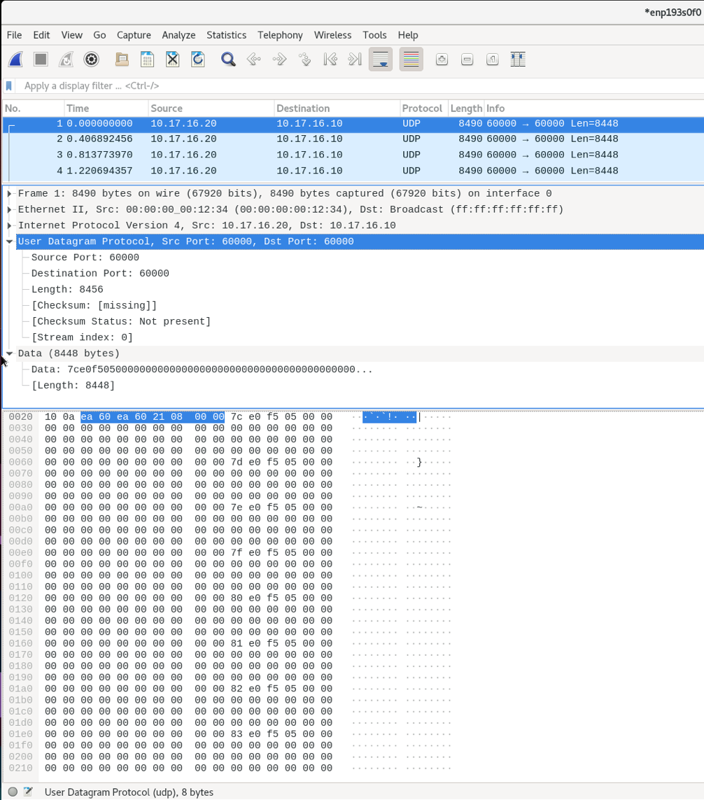
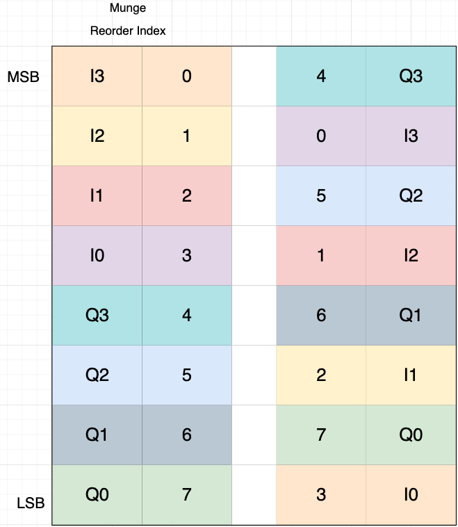

Tutorial 4: 100GbE
==================

Introduction
-------------
This tutorial will introduce and demonstrate functionality of using the ``100GbE`` yellow block with the ``RFDC`` over two parts. The first part is used as a simple example to get familiar with the ``100GbE`` yellow block and to test your hardware setup. The second part of this tutorial will stream and packetize time samples from the ``RFDC`` and send them over 100GbE to a server and demonstrate a simple catcher and processing script for processing packets received from the RFSoC.

.. contents::

Prerequisites and Common Troubleshooting
^^^^^^^^^^^^^^^^^^^^^^^^^^^^^^^^^^^^^^^^^
- Make sure the CASPER development environment is setup for RFSoC as described in the :doc:`Getting Started <./tut_getting_started>` tutorial. This includes the initialization of the git submodules.

- The use of the integrated UltraScale+ 100G CMAC requires that the no charge license be downloaded and included with your licenses. That can be acquired `here <https://www.xilinx.com/products/intellectual-property/cmac_usplus.html>`_ following the instructions under the section titled "Activation Instructions". After the license has been added you can check the status of the license using the Vivado License Manager. This is can be accessed from in Vivado going to Help > Manage License. Or it can be opened from the Xilinx Information Center (XIC) Manage Installs Tab > Manage License. If the license has succussfully been included a line starting with ``cmac_usplus`` should appear in the licenses table. You may need to refresh the license cache if it has not been updated to reflect the ``cmac_usplus`` license. For more license related issues the `managing licenses documentation from Xilinx <https://docs.xilinx.com/r/en-US/ug973-vivado-release-notes-install-license/Obtain-and-Manage-Licenses>`_ may help here.

- A 100GbE QSFP28 NIC installed in a server.

- A 100GBASE-SR4 QSFP28 active optical cable (AOC) or 100GBASE-CR4 QSFP28 direct attach copper cable (DAC). Fiber is recommended as it has been tested more frequently.

- All possible network hardware configurations (transceivers, cables, NICs, etc.) have not been tested and as such results may vary based on your chosen hardware.

- When working with fiber, the transceivers must be coded to match the vendor for the hardware they plug into (e.g., NIC, switch). When the pluggable transceiver is to be used with the FPGA the "Generic" coded module should be purchased. But, in some cases it has been reported that vendor compatible transceivers have worked with the FPGA. Examples of hardware that would be purchased for using 100GbE between an RFSoC and a Mellanox 100GbE NIC would be: `generic compatible 100GBASE-SR4 module <FSGenericModule_>`_, `MTP fiber cable <100GFiberCable_>`_, and `Mellanox Compatible 100GBASE-SR4 module <FSMellanoxModule_>`_. Other vendor transceivers and fiber should work as long as this scheme is followed.

- When working with copper, cables longer than 3m may not work well. It is required to check the datasheets for the NIC (and switch) for compatibility with copper and the supported cable lengths they can drive. 

- A 100GbE switch is optional but can be used with this tutorial to switch packets if wanting to test as part of a larger network.

- This design is (and others will typically always will be) setup to send `Jumbo Ethernet <https://en.wikipedia.org/wiki/Jumbo_frame>`_ packets. If no packets show up, make sure the NIC (and switch if used) are configured to have their MTU set to 9000 bytes. Otherwise packets can be filtered out by the OS and not received.

- Configuring the ``RFDC`` was covered in the :doc:`RFDC Interface tutorial <./tut_rfdc>`. Refer back to this tutorial for any questions regarding the ``RFDC`` or what might be done to change the parameters to fit a different requirement.

Simulink / CASPER Toolflow
--------------------------
This tutorial comes with completed simulink model files for a few RFSoC platforms. Those files can be found in the `tutorials design repository <https://github.com/casper-astro/tutorials_devel/tree/master/rfsoc/tut_onehundred_gbe>`_. In this tutorial we will be working with the ``RFSoC 4x2`` specific files. These examples can be used to derive the same functionality for other RFSoC platforms if not already provided, or as a starting point to extend for use with different application requirements. There are also prebuilt ``.fpg`` and ``.dtbo`` files in the ``prebuilt/`` directory.

Part 1: Testing the 100GbE yellow block
^^^^^^^^^^^^^^^^^^^^^^^^^^^^^^^^^^^^^^^^^^
Part one of this tutorial will use the ``rfsoc4x2_tut_onehundred_gbe.slx`` model file. As with previous tutorials, the best way to get familiar with what is happening in the design is to first explore the model and identify the blocks in the design. This model does not have a lot going on with it. It is only a minimal working example to get bits into the 100GbE and begin transmitting. Make sure to also open a few blocks configuration windows to review how each are configured.

A breif overview of the design:

- The Xilinx System generator Token must be placed in the design.

- Right in the middle is the 100GbE yellow block. This block sends and receives UDP/IPv4 packets. These tutorials only exercise the transmit capabilities but the receive side of the core is functional. A bit of "blockumentation" follows this section and explains some of the ports and configuration parameters of the block.

- The data ``tx_data`` port of the 100GbE yellow block is a 512-bit bus. The incoming data for this design is a simple 32-bit free-running counter. Since the port is expecting a 512-bit signal a ``cast`` block is used to zero-extend the signal to the required 512-bit width.

- The logic generating the ``tx_valid`` is a comparison of the free-running counter against a constant. And the ``tx_end_of_frame`` comes from an ``edge detect`` for when there is a falling edge on that valid signal.

- The relational block outputs a ``tx_valid`` of high for 132 clocks when the counter is greater than the defined constant value. With 132 clocks of 64-byte words the total packet payload size is ``132*64 = 8448`` bytes. With the additional 42 bytes for Ethernet, IP and UDP the total packet length is 8480 bytes. These are the sizes of packets we should expect to see coming into the design.

- The end of frame signal is also sent to a pulse extender and drives one of the boards LEDs for some visual feedback (and satisfaction) that the design is working and transmitting packets.

- The ``tx_byte_enable`` is a 64-bit signal and acts as a mask of valid bytes at the ``tx_data`` port. This **must be** set to all ``1's`` **except when** transmitting the last valid word of a frame that is less than 512-bits. In this case, data must be in the lower bits of the 64-byte data bus corresponding to their location in the byte enable signal. This signal **must be** continuous in the LSBs.

- The ``tx_dest_ip`` is the destination IP address in the IPv4 header of the packet and is hardcoded with a constant to "10.17.16.10"

- The ``tx_dest_port`` is the UDP port and hardcoded to a constant of ``60000``

When you have recreated this design and have successfully finished the ``jasper`` flow, or you want to use the prebuilt products, go to the section `Observing Packets at the NIC`_ for the next step of part 1.

100 GbE Yellow Block
^^^^^^^^^^^^^^^^^^^^^^

**INPUTS/OUTPUTS**

+-------------------+-----------+-----------------------------------------------------------------------+
| Port              | Data Type | Description                                                           |
+===================+===========+=======================================================================+
| rst               | bool      | Resets the core. Active high. Link is lost entire core re-initialized.|
+-------------------+-----------+-----------------------------------------------------------------------+
| tx_data           | UFix_512  | | Input data to the core. The least significant bytes are transmitted |
|                   |           | | first.                                                              |
+-------------------+-----------+-----------------------------------------------------------------------+
| tx_valid          | bool      | | Valid signal indicating the data present at the ``tx_data`` port    |
|                   |           | | should be clocked into the core. Note that after the end of a frame |
|                   |           | | the valid signal must be held low before accepting new data for a   |
|                   |           | | few cycles while the core starts to flush the internal FIFO.        |
+-------------------+-----------+-----------------------------------------------------------------------+
| tx_dest_ip        | UFix_32   | The destination IP address in the IPv4 header.                        |
+-------------------+-----------+-----------------------------------------------------------------------+
| tx_dest_port      | UFix_16   | The destination port in the UDP header.                               |
+-------------------+-----------+-----------------------------------------------------------------------+
| tx_end_of_frame   | bool      | | Indicates that the current valid data is the last to be clocked into|
|                   |           | | the core and should begin transmitting. This must be received in the|
|                   |           | | same cycle that a ``tx_valid`` is also asserted. After the end of a |
|                   |           | | frame has been received the ``tx_valid`` must remain low for a few  |
|                   |           | | cycles to flush the internal FIFOs of the core.                     |
+-------------------+-----------+-----------------------------------------------------------------------+
| tx_byte_enable    | UFix_64   | | 64-bit signal and acts as a mask of valid bytes at the ``tx_data``  |
|                   |           | | port. This **must be** set to all ``1's`` **except when**           |
|                   |           | | transmitting the last valid word of a frame that is less than       |
|                   |           | | 512-bits. In this case, data must be in the lower bits of the       |
|                   |           | | 64-byte data bus corresponding to their location in the byte enable |
|                   |           | | signal. This signal **must be** continuous in the LSBs.             |
+-------------------+-----------+-----------------------------------------------------------------------+

**PARAMETERS**

+-----------------------------+-------------------------------------------------------------------------+
| Parameter                   | Description                                                             |
+=============================+=========================================================================+
| Port                        | | Indicates the physical port this core will map to on platforms where  |
|                             | | multiple physical QSFP28 interfaces are present.                      |
+-----------------------------+-------------------------------------------------------------------------+
| Shallow RX FIFO             | | Used to limit the amount of memory allocated to the RX FIFO. When RAM |
|                             | | is a limited resource for designs this can save on RAM but the DSP    |
|                             | | must be ready to receive data without overruning the FIFO.            |
+-----------------------------+-------------------------------------------------------------------------+
|  Enable Large TX Frames     | Enables the support for Jumbo frames                                    |
+-----------------------------+-------------------------------------------------------------------------+
| Incoming pipeline delay     | | The number of registers to add for pipelining on the input. This may  |
|                             | | help a design where timing is tight.                                  |
+-----------------------------+-------------------------------------------------------------------------+
| Enable fabric on startup    | | Use default parameters to initialize fields for Ethernet/IPv4/UDP     |
|                             | | frames. All configuration parameters and ARP cache is also software   |
|                             | | programmable.                                                         |
+-----------------------------+-------------------------------------------------------------------------+
| Fabric MAC address          | | Initial value of the MAC address used as the source MAC address in the|
|                             | | Ethernet frame. Software programmable after startup.                  | 
+-----------------------------+-------------------------------------------------------------------------+
| Fabric IP address           | | Initial value of the source IP address used in the IPv4 frame of the  |
|                             | | packet. Software programmable after startup.                          |
+-----------------------------+-------------------------------------------------------------------------+
| Fabric UDP port             | | Initial value of the source port used used in the UDP frame of the    |
|                             | | packet. Software programmable after startup.                          |
+-----------------------------+-------------------------------------------------------------------------+
| Fabric gateway              | | The last octet of the gateway residing in the same subnet as the core |
|                             | | using subnet mask 255.255.255.0.                                      |
+-----------------------------+-------------------------------------------------------------------------+
| Enable CPU RX               | Not implemented                                                         |
+-----------------------------+-------------------------------------------------------------------------+
| Enable CPU TX               | Not implemented                                                         |
+-----------------------------+-------------------------------------------------------------------------+
| TTL                         | Time to live value used in packets                                      |
+-----------------------------+-------------------------------------------------------------------------+

_`Observing Packets at the NIC`
^^^^^^^^^^^^^^^^^^^^^^^^^^^^^^^

Using the prebuilt ``rfsoc4x2_tut_onehundred_gbe`` output products or one that you have produced from recreating the tutorial it is now time to program the FPGA and begin to observe packets at the NIC. The 100GbE tutorial design is setup to begin transmitting after being programmed without needing to pull anything out of reset. The 100GbE CMAC is setup to use RS-FEC by default and so after programming there is a small training period on the link to establish a complete connection and begin transmitting.

Before programming the RFSoC platform, make sure the cable connection is made between the RFSoC and server, you know the name of the ethernet interface that the 100GbE is assigned (e.g., ``eth0`` or in the predictable name format like ``enp*``), and have an application such as `wireshark <https://www.wireshark.org>`_ on the connected server. Note that using wireshark and other packet sniffer applications to capture and analyze raw ethernet packets by default requires elevated (root) permissions to operate. 

With this in mind all that is needed is to connect to the RFSoC platform and program the FPGA.

.. code:: python

  import casperfpga
  rfsoc = casperfpga.CasperFpga('<ip_address_or_hostname>')
  rfsoc.upload_to_ram_and_program('</path/to>/rfsoc4x2_tut_onehundred_gbe.fpg')

After a short period of time packets should begin to appear at the NIC and presented by the capture utility. The following is an example screenshot from wireshark.

In this screenshot the end of the UDP header is highlighted showing the source and destination ports. The very next sequence of bytes begins the packet payload and we can see the 32-bit counter value is present. The counter value is incrementing by one with each new 64-byte segment.

Part 2: Streaming from the RFDC
^^^^^^^^^^^^^^^^^^^^^^^^^^^^^^^^^^

In this part of the tutorial, instead of transmitting data from a free-running counter we now interface with the RFDC buffering time samples and sending them to the 100GbE yellow block. A python script is then used to capture, parse, perform a simple spectrometer operation, and plot the spectra. The model file for this design is the ``rfsoc4x2_stream_rfdc_100g.slx``. Prebuilt products for this are also provided in the ``prebuilt/`` directory with the python scripts in the ``py/`` directory.

Open the model file and look over the design. There is a little more going on this time, but if having previously completed the :doc:`RFDC interface <./tut_rfdc>` or :doc:`example spectrometer <./tut_spec>` tutorials some of the components of the design may already be familiar. Follow the flow of the RFDC data samples from the ``RFDC`` through to the ``100GbE``. The following is an overview of some of the models componets:

RFDC
^^^^^
The ``RFDC`` is configured similar to the parameters that were chosen in the :doc:`example spectrometer tutorial <./tut_spec>`. Review that tutorial again if there are any questions regarding the setup of the ``RFDC``.

Munge blocks
^^^^^^^^^^^^^^^^
Because we will ultimately be working with this data in the server we will need to packetize the data. The way this is done is an implementation dependent decision. Therefore, for reasons similar to the :doc:`example spectrometer tutorial <./tut_spec>` where samples were expected in a particular order for the DSP blocks we again use munge blocks on the output of the RFDC for bit-twiddling to reorder the ADC samples in a way that will make parsing the packets in the server more convenient.

Recall that different RFSoC platforms have different ADC tile architectures: quad- and dual-tile. The way data is presented on their interfaces is dependent on the the data output mode configuration: ``Real`` or ``I/Q``. Quad- and dual-tile platforms present the data in different between the different configurations of their output data type. Revist the :doc:`RFDC interface tutorial <./tut_rfdc>` and :doc:`example spectrometer tutorial <./tut_spec>` where this is explained a little more. The `RFDC product guide PG269 <PG269_>`_ is also an important reference whenever questions of the ``RFDC`` come up.

For working with samples at the server we choose here to reorder the data to have complex (real/imaginary) ordered samples with the oldest time sample positioned in the LSBs of the word. This way as the data are clocked into the packetizer the oldest sample will be the first 4 bytes of the packet and advance time in sequence. With the ``RFSoC 4x2`` and other dual-tile platforms, when configured to output complex samples we have to build the interleaved real/imaginary samples before sending them to packetizer portion of the design. To do this, the real and imaginary parts of the samples coming from the output of the ``RFDC`` on their respective interfaces are first combined with a ``bus_create`` block. The munge then reorders the blocks. The following figure graphical shows how the divisions are reordered and their respective index for when the output is 4 samples per clock. Here ``I<#>`` represents the real time sample at sample index ``#`` and the same for ``Q<#>`` but corresponding to the imaginary sample. In these examples, ``I3`` and ``Q3`` correspond to the newest time sample and ``I0`` and ``Q0`` are the oldest.

The colors in this figure are used to track the sample input position relative to the output position. Also note that that the "munge reorder index" column places the ``0-th`` element at the MSB with the highest value at the LSB. The 3rd column top-to-bottom is then what is input to the ``Division Packing Order`` field of the ``munge`` block. The resulting vector used in as the munge block parameter is the reordered column entered top to bottom from this table. In this design for the ``RFSoC 4x2`` there are ``8`` samples per clock. Take a look at the munge block in the ``rfsoc4x2_tut_spec_cx.slx`` model and this example to see if you can follow how the complex samples are created.

Packetizer
^^^^^^^^^^^^^^
Between the mux that selects the adc output from the ``RFDC`` to the the ``100GbE`` yellow block is effectively our "packetizer". This is a very simple packetizer, but it gets the job done. The first part of our packetizer up to the ``bus_create`` block is a sort of "ping-pong" approach used to do a 2:1 serial-to-parallel conversion. The samples out of the ``RFDC`` are ``Fix_256`` but we need a 512-bit version. Two registers are used to clock the 256-bit samples into the ``bus_create`` block that is attached to a FIFO block. A counter is used selecting the LSB to "ping-pong" back and forth between the two registers and indicate when a valid 512-bit parallel word is clocked into the FIFO. In this serial-to-parallel conversion the oldest 256-bit sequence of samples is stored in the lower 256-bits of the 512-bit word.

The FIFO is used to buffer the time samples until 128 512-bit words have been stored. The FIFO is configured to output on the ``dcount`` port the number of words currently stored. When 128 words are clocked into the FIFO this triggers an incremement to the packet sequence counter that is used to create the first 512-bit word of our packet (the packet header) and then on the next cycle the read enable for clocking data out of the FIFO begins. The data and the read enable (used as the valid on the ``100GbE``) are then pipelined to the ``100GbE`` yellow block. On the 128th read the "end of frame" is generated sending out the full ``packet count + rfdc samples`` payload. With 128 64-byte words and a 64-byte header for the packet sequence count this is an expected received packet payload of 8256 bytes. With the additional 42 byte Ethernet/IPv4/UDP framing the total packet size is 8298 bytes.

Simple Packet Capture and Processing with Python
-------------------------------------------------

Script Overview
^^^^^^^^^^^^^^^^
We assume here working with the ``RFSoC 4x2`` and the provided python scripts under the ``py/`` directory. These scripts can be extended for use with other platforms looking to implement similar functionality.

There are two scripts that are to be ran together in this example: a ``catcher``, and a ``listener``. The ``catcher`` (implemented in ``tut_100g_catcher.py``) is the packet sniffer. It will open an Ethernet interface and capture and buffer raw Ethernet packets. Because opening a raw packet socket requires elevated (root) permissions it is required to run this script as root. It may not be desirable to do everything as root, so the ``listener`` (implemented in ``tut_100g_listener.py``) creates a simple socket for the cathcer to forward the received packets to. The listener then parses the packets, does some simple packet filtering, extracts the packet payload (ADC time samples), performs a simple spectrometer operation, and plots the data. With 16 complex time samples per 512-bit word, and the packetizer sending 128 words per packet, there are 2048 time samples per packet. The FFT size chosen for this spectrometer was a 1024.

Before going through the code, it will help to go over what is being done and have first ran the scripts. This will help identify what is being done by knowing before what is being presented.

The ``listener`` and ``catcher`` implement a simple state machine where the ``listener`` is to be started first accepting configuration parameters for its arguments. These parameters are the RFSoC platform (``casperfpga`` server) to connect to, the the ADC port to capture data on, and the number of packets to catch in a sequence. The ``listener`` then configures the RFSoC and sets up the socket for the ``catcher`` to connect to.

This same information is preneted by running the ``tut_100g_listener.py`` with the ``-h`` switch

.. code:: bash

  ./tut_100g_listener.py -h
  Usage: tut_100g_listener.py <HOSTNAME_or_IP> [options]

  -h, --help            show this help message and exit
  -n NUMPKT, --numpkt=NUMPKT
                        Set the number of packets captured in sequence and
                        then sent to listener. Must be power of 2. default is 2**8
  -s, --skip            Skip programming and begin to plot data
  -b FPGFILE, --fpg=FPGFILE
                        Specify the fpg file to load
  -a ADC_CHAN_SEL, --adc=ADC_CHAN_SEL
                        adc input to select values are 0,1,2, or 3. deafult is 0

The ``catcher`` is then started by passing the name of the ethernet interface it is to conenct to. It then opens that interface and connects to the ``listener`` socket. The ``listener`` will post the number of packets to capture in a sequence and wait for the ``listener`` to report that it is "ready" to start receiving packet sequences. After a sequence of packets has been sent the ``catcher`` waits until the ``listener`` is "ready" again before catching and sending the next sequence of packets.

The ``listener`` unpacks the sequence of packets parsing each packets IPv4/UDP header, payload packet count header, and packet payload data. The data is then transformed using an FFT, averaged over all the packets received in the sequence, and updates the plot of the spectra. After it plots it reports that it is "ready" to process the next packet sequence. This sequence repeats back and forth between the ``listener`` and the ``catcher`` until terminted with a keyboard interrupt at the ``catcher`` (also ending the ``listener``).

Running the Scripts
^^^^^^^^^^^^^^^^^^^^^
With the above in mind, let's run them!

First start the ``listener``. If you are using your ``.fpg`` file that you created in this tutorial you would use the ``-b`` flag with the path to the ``.fpg``. Otherwise, the prebuilt is used by default. An example using the prebuilt and connecting to an RFSoC with hostname ``rfsoc4x2``, transmitting packets from the third ADC port, and setting the number of packets received in a sequence to 256 would be:

.. code:: bash

  python tut_100g_listener.py rfsoc4x2 -n 256 -a 3

After starting the listener the following output should be reported:

.. code:: bash

  using prebuilt fpg file at ../prebuilt/rfsoc4x2/rfsoc4x2_tut_100g_stream_rfdc.fpg
  Connecting to rfsoc4x2
  Programming FPGA with ../prebuilt/rfsoc4x2/rfsoc4x2_tut_100g_stream_rfdc.fpg...
  done
  setting capture on adc port 3
  waiting for catcher to connect

At this point the ``catcher`` can be started. In the following the Ethernet interface that is opened is ``enp193s0f0``.

.. code:: bash

  python tut_100g_catcher.py enp193s0f0

A plot should then appear and continue to update with an increasing number of packet sequence counts reported in the title of the plot and by the ``catcher`` process. The ``catcher`` process will have also reported the configuration parameters received from the ``listener`` with a prompt to end the programs with a keyboard interrupt (Ctrl-c).

With an input on the RFSoC 4x2, and if all goes well, an example of the output should look like the following. Here a tone is injected starting at 500 MHz and stepping through the spectrum up to 1750 MHz.

.. video:: ../../_static/img/rfsoc/tut_onehundred_gbe/tut_100g_spec_sweep.mp4
  :width: 500
  :height: 300

Like in the :doc:`example sepctrometer <./tut_spec>`, a more interesting signal could be used at the input of the RFSoC. In the following, a wideband noise source is filtered to a passband from about 1280-1780 MHz with a tone present starting in that passband at 1520 MHz. The tone is then moved around that passband and ends back at 1520 MHz.

.. video:: ../../_static/img/rfsoc/tut_onehundred_gbe/tut_100g_spec_wideband_noise.mp4
  :width: 720
  :height: 280

Conclusion
-------------

High-rate data transport is a critical component of digital radio astronomy instrumentation. This tutorial has demonstrated the functionality and use of the 100GbE yellow block on RFSoC platforms. Additionally, the manipulation of the output data from the RFDC with a simple packetization scheme has been demonstrated. More common packetizer implementations will vary in complexity, but the fundamentals lie in being able to manipulate data ordering and buffering. Capturing, parsing, and processing Ethernet packets received at NIC from the FPGA is typically where data reduction in a science backend begins. This simple example provides a starting point for being able to work with the fundamentals of capturing and working with Ethernet packets. When lossless data streams are required it is more typical to use optimized dediated high-throughput pipelines. In these frameworks where the NIC and CPU perform the packet capturing functions the computation is typically performed on a GPU. These function are also distributed over many threads and optimized for performance and throughput. In this tutorial we did not focus on processor performance, but rather focused on the fundamentals that lead in that direction.

Appendix and Reference
-----------------------

Memory Map and Software Programmable Interface
^^^^^^^^^^^^^^^^^^^^^^^^^^^^^^^^^^^^^^^^^^^^^^^^^
This section of the tutorial will not provide a complete explanation of everything that can be done with the software interface, but rather demonstrate breifly some of the software programmable capabilities of the 100GbE core through ``casperfpga`` that can be further explored by the casper-ite.

When using ``casperfpga`` the memory map for the platform can be accessed using the ``listdev()`` command. This was demonstrated and explained briefly in the :doc:`Platform Getting Started tutorial <./tut_platform>`. A quick example is as follows:

.. code:: python

  import casperfpga
  rfsoc = casperfpga.CasperFpga('<ip_address_or_hostname>')
  rfsoc.upload_to_ram_and_program('/path/to/design.fpg')
  rfsoc.listdev()

The ``rfsoc`` ``Casperfpga`` object here returns a list of all the registers in the memory map. With a ``100GbE`` yellow block in the design the registers that make up that core's memory mapy will be present. These can be accessed using the normal ``read_uint``/``write_int`` ``casperfpga`` methods.

However, when a ``100GbE`` is present in the design the ``casperfpga`` object will build a ``100GbE`` object that abstracts working with the core by providing methods that manage the lower-level read and writes. For example, with the tutorial design programmed on the FPGA we can get a reference the ``100GbE`` object and configure the IP address and MAC after startup

.. code:: python

  # get the eth core
  eth = rfsoc.gbes['onehundred_gbe']

  # get core information
  ip = '10.17.16.61'
  mac = 0x02a202000203

  # configure core 
  eth.configure_core(mac, ip, 60000)

If ever in doubt however, all can be configured from the memory map

.. code:: python

  rfsoc.write_int('gmac_reg_mac_address_l_0', (mac & 0xffffffff))
  rfsoc.write_int('gmac_reg_mac_address_h_0', (mac >> 32) & 0xffff)

The ``100GbE`` also has an ARP table that can be programmed. The following is an example for how to do this:

.. code:: python

  # a configuration dictionary with IP/MAC key-value pairs
  c = {
    'arp': {
      10.17.16.10: 0x0c42a1a39a06,
      # ...
      # ...
      10.17.16.61: 0x0c42a1a3992e
    }
  }

  # set arp table
  for ip, mac in c['arp'].items():
    print("Configuring ip {:s} with mac {:x}".format(ip, mac))
    eth.set_single_arp_entry(ip, mac)

..
  Notes
  ^^^^^^^

  The catch to getting this one to work was to remember the time order into the
  100G block. E.g., The LSB of the 512-bit word is clocked into the packet first
  and then becomes the first sequence of bits into the packet. From the
  spectrometer tutorial to this one the munge block needed to be changed again so
  that the oldest sample was in the LSB so that when the binary data showed up in
  the application it was already in sequence

.. _FSGenericModule: https://www.fs.com/products/75308.html
.. _FSMellanoxModule: https://www.fs.com/products/71009.html
.. _100GFiberCable: https://www.fs.com/products/69009.html
.. _PG269: https://www.xilinx.com/support/documentation/ip_documentation/usp_rf_data_converter/v2_4/pg269-rf-data-converter.pdf
