Tutorial 2.5: The RFDC DAC Interface
====================================

Introduction
************
In the previous tutorial we introduced the RFDC Yellow block, configuring
it for dual- and quad-tile RFSoCs ADCs. It it worth providing a brief
introduction to the DAC interface. This tutorial assumes you have completed through
the RFDC tutorial :doc:`RFDC Interface <./tut_rfdc>`

In this tutorial we have two designs,
:ref:`The Loopback Design<loopback>` and 
:ref:`The Waveform Generator Design<wf_generator>`. 
The specific configuration targets a RFSoC4x2 board, but should
be similar for other RFSoC based devices.
We'll start with the loopback.

.. _loopback:

The Loopback Design
*******************

This design will:
  * Configure the DAC
  * Configure the ADC
  * Demonstrate data transfer
  
The final design will look like this for the RFSoC 4x2:

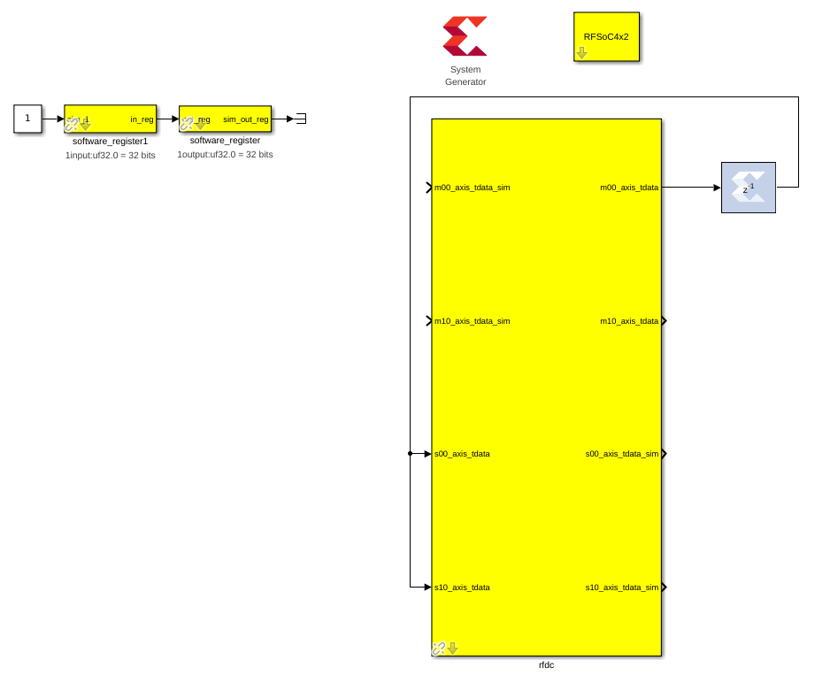

Section 1: Assembling & Configuring the blocks
----------------------------------------------

You'll need all these blocks
 * System Generator
 * RFSoC 4x2 block
 * RFDC
 * Two software registers
 * Delay

Add your ``System Generator`` and ``RFSoC 4x2`` blocks
^^^^^^^^^^^^^^^^^^^^^^^^^^^^^^^^^^^^^^^^^^^^^^^^^^^^^^

.. code:: bash

  # RFSoC4x2
  User IP Clock Rate: 245.76, RFPLL PL Clock Rate: 122.88

Add your ``rfdc`` block
^^^^^^^^^^^^^^^^^^^^^^^
Enable the first and second DAC tiles (228, 229), and only
enable DAC 0 in either. Other tiles can be optionally disabled,
but all enabled tiles should have the same ``Required AXI4-Stream Clock``
Your ``Required AXI4-Stream Clock (MHz)`` should be 245.76.
Configure each enabled DAC tile as follows:

.. code:: bash

  # DAC Tile Config
  Enable Multi-Tile Sync - False
  Sampling Rate   (MHz)  - 1966.08
  Clock Out       (MHz)  - 122.88
  Reference Clock (MHz)  - 491.52
  Enable Tile PLLs       - True
  Output Power           - 20

  # DAC 0 Config
  Analog Output Data     - Real 
  Interpolation Mode     - 1x 
  Samples Per AXI Cycle  - 8 
  Mixer Type             - Coarse
  Mixer Mode             - Real -> Real
  Frequency              - 0
  Nyquist Zone           - Zone 1
  Decoder Mode           - SNR Optimized

  CHECK:
  Does your Required AXI4-Stream clock say 245.76?

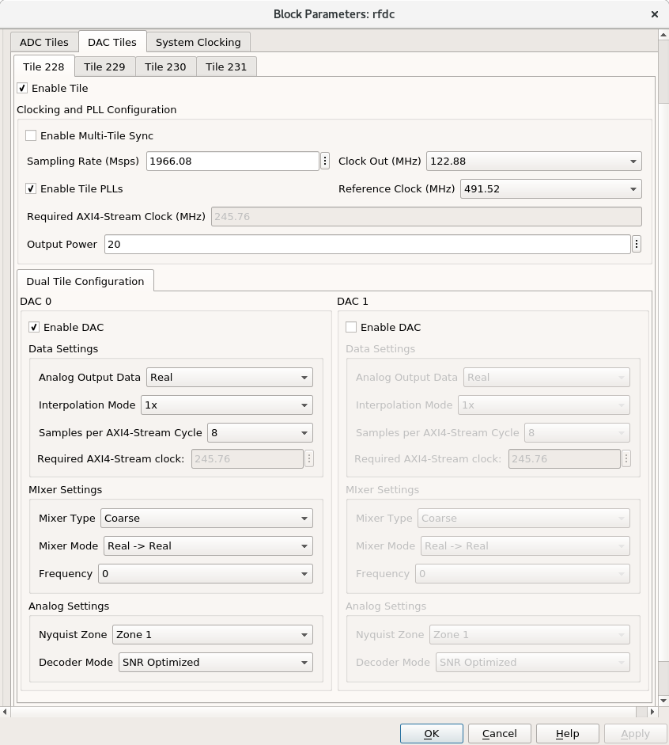

Enable the first and second ADC tiles (224, 225), and only
enable ADC 0 in either. Other tiles can be optionally disabled,
but all enabled tiles should have the same ``Required AXI4-Stream Clock``
Your ``Required AXI4-Stream Clock (MHz)`` should be 245.76.
Configure each enabled ADC tile as follows:

.. code:: bash

  # ADC Tile Config
  Enable Multi-Tile Sync - False
  Sampling Rate   (MHz)  - 3932.16
  Clock Out       (MHz)  - 122.88
  Reference Clock (MHz)  - 491.52
  Enable Tile PLLs       - True

  # ADC 0 Config
  Digital Output Data    - Real 
  Decimation Mode        - 2x
  Samples Per AXI Cycle  - 8
  Mixer Type             - Bypassed
  Mixer Mode             - Real -> Real
  Nyquist Zone           - Zone 1
  Calibration Mode       - Mode 2

  CHECK:
  Does your Required AXI4-Stream clock say 245.76?

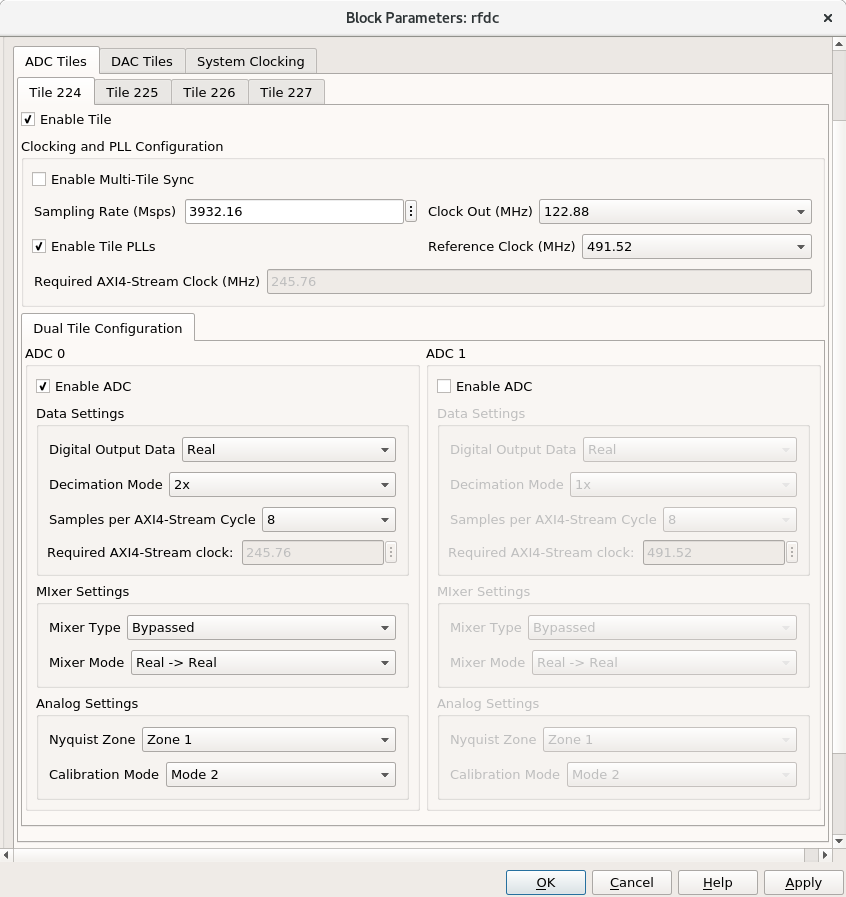

**Your ADC m00_axis_tdata signal should drive both DAC inputs
(s00_axis_tdata and s10_axis_tdata)**

Add your ``software_register`` blocks
^^^^^^^^^^^^^^^^^^^^^^^^^^^^^^^^^^^^^
We need to add one input and one output software register
so that the AXI bus can be configured correctly when we run ``jasper``.
A simulink constant should drive a register with direction 
``From Processor`` which should drive a register with direction
``To Processor``, which should drive a terminator. We never write
to nor read from these blocks.

Add your ``delay`` block
^^^^^^^^^^^^^^^^^^^^^^^^
To more easily meet timing constraints I added a delay block
on the wire between ADC output and DAC input. This is best 
practice, but might not be needed for this design.

Section 2: Hardware Test
------------------------

0) Start an ipython session
1) Import casperfpga, and connect to and program your board normally
2) Program your DAC clocks as you did for the ADCs in tutorial 2, run ``init()`` and ``status()`` on your RFDC
   Make sure your rfdc finishes its power-up sequence

.. code:: bash

  ADC0: Enabled 1, State 15, PLL 1
  ADC1: Enabled 1, State 12, PLL 1
  ADC2: Enabled 0
  ADC3: Enabled 0
  DAC0: Enabled 1, State 15, PLL 1
  DAC1: Enabled 1, State 15, PLL 1
  DAC2: Enabled 0
  DAC3: Enabled 0

3) Connect a signal generator to your input (ADC D if using tile 224)
   I used a 400MHz signal at -20 dBm.

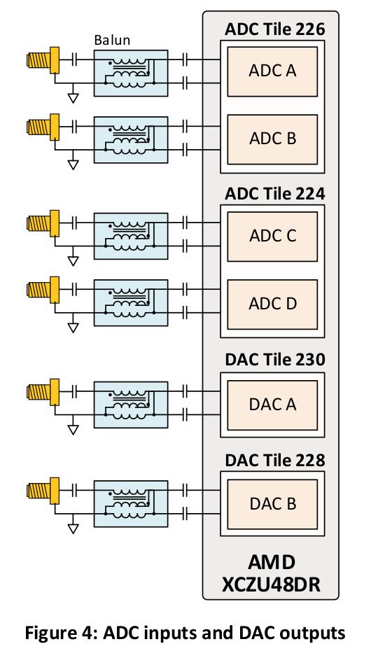

4) Connect a network analyzer or oscilloscope to your output. 
   DAC B if using tile 228
   (`RealDigital <https://www.realdigital.org/hardware/rfsoc-4x2>`_ -> Resources -> Reference Manual (Revision A5))

5) Check that the input signal appears on your nextwork analyzer

.. _wf_generator:

The Waveform Generator Design
*****************************
In this example we will run the RFDC with data from a bram on a the RFSoC4x2 board.

This design will:
  * Set sample rates
  * Use the internal PLLs to generate the sample clock
  * Write and read data from a bram
  * Output a signal from a DAC

The final design will look like this for the RFSoC 4x2:

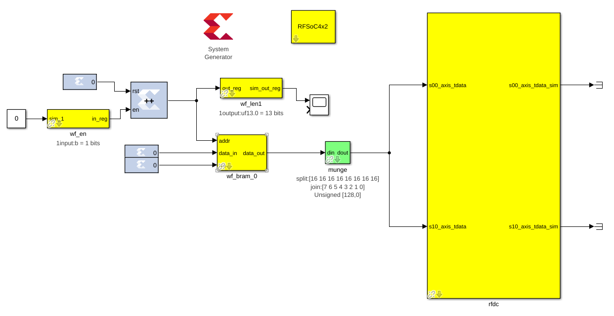

Section 1: Assembling & Configuring the blocks
----------------------------------------------

You'll need all these blocks
 * System Generator
 * RFSoC 4x2 block
 * RFDC
 * An "enable" software register
 * Bram
 * Munge
 * Counter
 * Xilinx constants

Add your ``System Generator`` and ``RFSoC 4x2`` blocks
^^^^^^^^^^^^^^^^^^^^^^^^^^^^^^^^^^^^^^^^^^^^^^^^^^^^^^

.. code:: bash

  # RFSoC4x2
  User IP Clock Rate: 245.76, RFPLL PL Clock Rate: 122.88

Add your ``rfdc`` block
^^^^^^^^^^^^^^^^^^^^^^^
Double click on it, and disable all available ADC tiles. 
Enable the first and second DAC tiles (228, 229), and only
enable DAC 0 in either. Your ``Required AXI4-Stream Clock (MHz)`` should be 245.76.
Configure the DAC tiles as follows:

.. code:: bash

  # Tile Config
  Sampling Rate   (MHz) - 1966.08
  Clock Out       (MHz) - 122.88
  Reference Clock (MHz) - 491.52
  Enable Tile PLLs      - True
  Output Power          - 20

  # DAC 0 Config
  Analog Output Data    - Real 
  Interpolation Mode    - 1x 
  Samples Per AXI Cycle - 8 
  Mixer Type            - Coarse
  Mixer Mode            - Real -> Real
  Frequency             - 0
  Nyquist Zone          - Zone 1
  Decoder Mode          - SNR Optimized

  CHECK:
  Does your Required AXI4-Stream clock say 245.76?

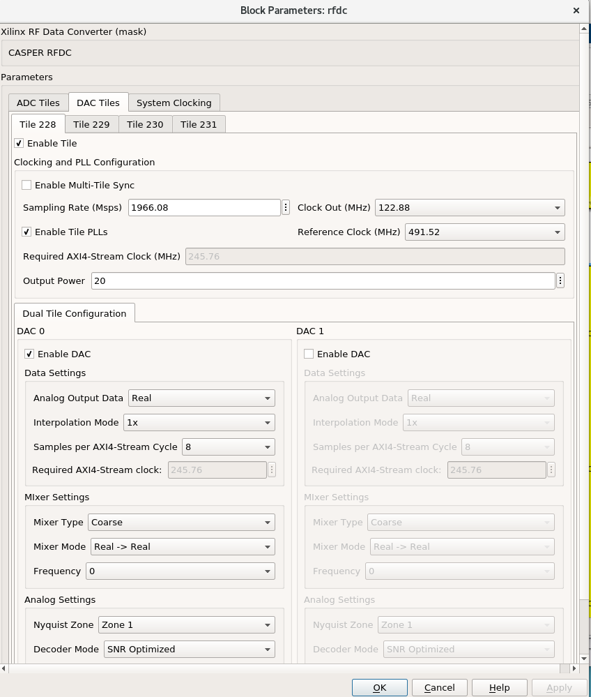

Add your ``shared_bram`` block
^^^^^^^^^^^^^^^^^^^^^^^^^^^^^^
The bram is where we'll save the data to drive the dac.
Inside of our FPGA PL (Programmable Logic) there are bram memory blocks spread 
throughout the fabric. Each of these memory banks has a specific size,
if we request more capacity than a single bram can provide, we may encounter
timing violations, which can be resolved with delay blocks.

We choose a ``Data Width`` of 128 because the ``rfdc`` takes in 8 16-bit samples
every clock cycle.

We'll drive this block's ports as follows:
 * ``addr`` - A counter to loop through our samples,
 * ``we`` - A boolean 0 to prevent this bram from being written to by any PL blocks
 * ``data_in`` - A 128 bit 0 Xilinx block for data width compatibility

.. code:: bash

  Name                      - wf_bram_0

  Output Data Type          - Unsigned
  Address width             - 13
  Data Width                - 128
  Register Primitive Output - No
  Register Core Output      - No
  Optimization              - Minimum_Area
  Data Binary Point         - 0
  Initial Values (sim only) - Not important
  Sample rate               - 1

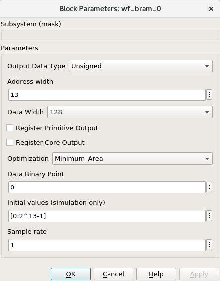

Add your ``munge`` block
^^^^^^^^^^^^^^^^^^^^^^^^
On the output of our ``bram`` we're using a munge to reorder data for compatibility between 
the ``bram`` data order and the ``rfdc`` data order. We'll study this block more in depth in 
:doc:`Tutorial 3 <./tut_spec>`. This block takes a bus of 
some width (128 bits in our case), and separates it into pieces 
(some number of divisions, with some size for each)
(8 16-bit samples for us), and then reorders them (we're just reversing things 
for DAC compatibility here). In hardware, this routes wires and costs nothing.

``din`` should connect to the ``bram`` ``data_out``. 

``dout`` should connect to both ``s00_axis_tdata`` and ``s10_axis_tdata`` on the ``rfdc``

.. code:: bash

  Number of divisions       - 8
  Division size (bits)      - 16*ones(1,8)
  Division packing order    - [7 6 5 4 3 2 1 0]
  Output arithmetic type    - Unsigned
  Output binary point       - 0

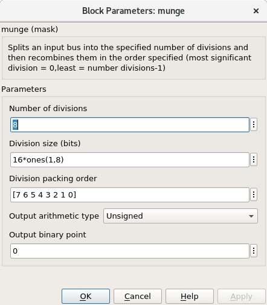

Add your ``Counter`` block
^^^^^^^^^^^^^^^^^^^^^^^^^^
Connect the output of the counter to the ``bram``'s ``addr`` port.

This block will loop through all of the addresses in our bram, 
playing our signal on repeat. 

If you drive the counter reset port with logic,
you can set a specific address to restart playback, which could
clean up the signal. For this tutorial we don't need that level of control.

.. code:: bash

  Counter type              - Free running
  Count direction           - Up
  Initaial value            - 0
  Step                      - 1
  Output type               - Unsigned
  Number of bits            - 13
  Binary point              - 0
  Provide load port         - No
  Provide sync reset port   - Yes
  Provide enable port       - Yes
  Sample period source      - Explicit
  Sample rate               - 1

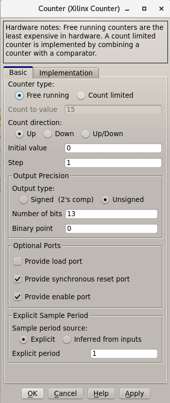

Add some ``Constant`` blocks
^^^^^^^^^^^^^^^^^^^^^^^^^^^^
We need 3 Xilinx Constant blocks.

.. code:: bash

  bram constants:
    we
      Constant Value    - 0
      Output Type       - Boolean
      Sampled Constant  - Yes
      Sample period     - 1

    data_in
      Constant Value    - 0
      Output Type       - Fixed Point
      Number of Bits    - 128
      Binary point      - 0
      Sampled Constant  - Yes
      Sample period     - 1

  counter constant:
    rst
      Constant Value    - 0
      Output Type       - Boolean
      Sampled Constant  - Yes
      Sample period     - 1      

Add your ``Enable`` software_register block
^^^^^^^^^^^^^^^^^^^^^^^^^^^^^^^^^^^^^^^^^^^
Connect the input of this block to a Simulink constant
Connect the output of this block to the ``Counter``'s ``en`` port.
By activating or deactivating the counter, we can play or pause our signal.

.. code:: bash

  Name                      - wf_en

  I/O direction             - From processor
  I/O delay                 - 0
  Initial Value             - dec2hex(0)
  Sample period             - 1
  Bitfield names [msb..lsb] - reg
  Bitfield widths           - 1
  Bitfield binary pts       - 0
  Bitfield types            - 2 (bool)

.. image:: ../../_static/img/rfsoc/tut_dac/tut_dac_enable_config.png

Add a waveform length ``wf_len`` register
^^^^^^^^^^^^^^^^^^^^^^^^^^^^^^^^^^^^^^^^^
While this block is useful for debugging, it primarily exists because
we need an output software register (``To processor``) for the design
to compile correctly.

To keep track of how many addresses our counter iterates over, we can 
add register wf_len1. This block is primarily useful for debugging. We'll
connect its output to a scope, for a simulation in simulink.

.. code:: bash

  Name                      - wf_len

  I/O direction             - To processor
  I/O delay                 - 0
  Initial Value             - dec2hex(0)
  Sample period             - 1
  Bitfield names [msb..lsb] - reg
  Bitfield widths           - Equal to counter width
  Bitfield binary pts       - 0
  Bitfield types            - 0 (ufix)

We'll be able to check this register's value from ipython.
For now, we can press run, and watch our counter iterate over the addresses.
If we right click the scope block, then click ``Signals & Ports``, we can
Number of Input Ports to 2.
We can connect the either input to the bram or munge and see the data change. 

Section 2: Generating your signal
---------------------------------

For this tutorial we will generate a sine wave in software, then 
copy it to the ``bram``.
We would recommend that you save the provided code to a file.
A file named ``sine.py`` in the active directory can be run in 
ipython with ``run sine.py``.
All of the variables declared in ``sine.py`` are accessible in that
ipython session.

.. code:: python

  import numpy as np
  import struct
  
  # bram parameters - need to match our yellow block's values
  block_size = 128     # <bram data_width>
  bram_addr_width = 13 # <bram address_width>
  blocks = 2**bram_addr_width  # number of bram blocks
  bits_per_val = 16 # <rfdc input data size> 16 bits for rfsoc4x2
  # We need our output data size to match the bram's
  # capacity so we don't fail on writes
  num_vals = int(block_size / bits_per_val * blocks)
  
  # sine wave parameters
  fs = 1966.08e6      # RFDC sampling frequency
  fc = 393.216e6      # Carrier frequency
  dt = 1/fs           # Time length between samples
  tau = dt * num_vals # Time length of bram 
  
  # Print useful info
  print(f"bram_size = 2**{bram_addr_width}")
  print(f"fs = {fs / 1e6} MHz")
  print(f"fc = {fc / 1e6} MHz")
  
  # Setup our array
  t = np.arange(0,tau,dt)
  
  # Generate our sine wave
  # frequency fc
  # range 0, 1
  x = 0.5*(1+np.cos(2*np.pi* fc *t))
  # scale our function to use the whole DAC range
  maxVal = 2**14-1
  x *= maxVal
  # set each value to a 16 bit integer, for DAC compatibility
  x = np.round(np.short(x))
  # Shift right, DAC is 14 bits
  x <<= 2

  # Save our array x as a set of bytes  
  buf = bytes()
  for i in x:
    buf += struct.pack('>h',i)

  # We're done!, we can now write buf to our
  # bram. To make sure it exists, enter len(buf)
  # in your ipython terminal

.. code:: python

  # Code used to create plots shown below code
  # this code runs in same session as code block above
  import matplotlib.pyplot as plt
  plt.plot(np.ushort(x[:100]))
  plt.title(f"fs = {fs / 1e6} MHz; fc = {fc / 1e6} MHz")
  plt.show()

  # If needed we can save it as a file 
  # for later use or transferability  
  f = open("sine.txt", "bw")
  f.write(buf)

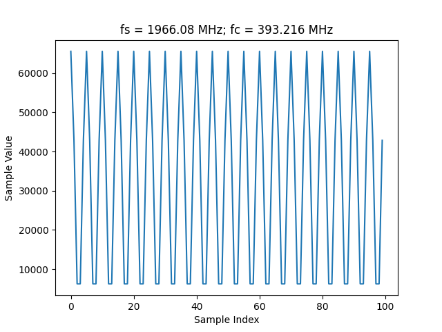

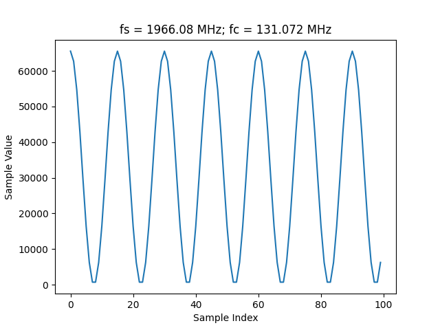

These images plot our sine wave data points written to our bram.
In most cases, the wave will not be continuous between the last 
element of the bram and the first element, causing noise. Additional 
logic can reset our counter on a sample which will provide
a smooth transition, but for this tutorial we've elected to
keep things as simple as possible.
327.68 MHz (``rfdc_sampling_rate`` / 6) 
and 393.216 MHz (``rfdc sampling rate`` / 5) work well.

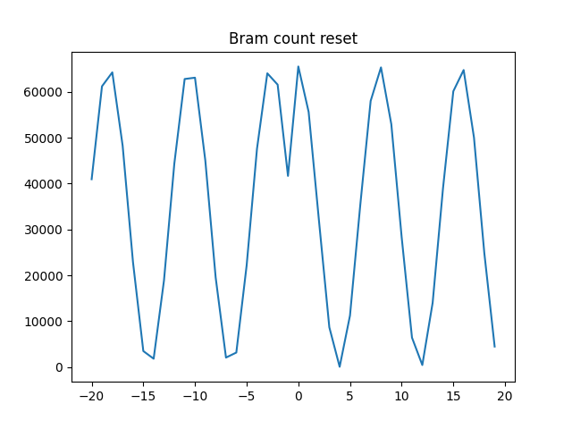

Example of noise on transition from last element to first (fc = 250 MHz)

Note that these sine wave data points are simply samples passed
into our dac. In order to convert these to dBm we would
consider the output power of our dac

Section 3: Sending your signal out
----------------------------------

0) Start an ipython session
1) Import casperfpga, and connect to and program your board normally
2) Program your DAC clocks as you did for the ADCs in tutorial 2, run ``init()`` and ``status()`` on your RFDC
3) Generate your sine wave with ``run sine.py``. 
   This has to be done within your ipython session or in the same script to that your values are available in buf
4) Write your sine wave to your bram, and a 1 to your enable register

.. code:: python

  In [9]: rfsoc.listdev()
  Out[9]: 
  ['rfdc',
  'sys',
  'sys_board_id',
  'sys_clkcounter',
  'sys_rev',
  'sys_rev_rcs',
  'sys_scratchpad',
  'wf_bram_0',
  'wf_len'
  'wf_en']

  In [10]: rfsoc.write('wf_bram_0', buf)

  In [11]: rfsoc.write_int('wf_en', 1)

5) Connect a network analyzer or oscilloscope to your output. DAC B if using tile 228 (`RealDigital <https://www.realdigital.org/hardware/rfsoc-4x2>`_ -> Resources -> Reference Manual (Revision A5))

Your signal in a network analyzer should look something like this:

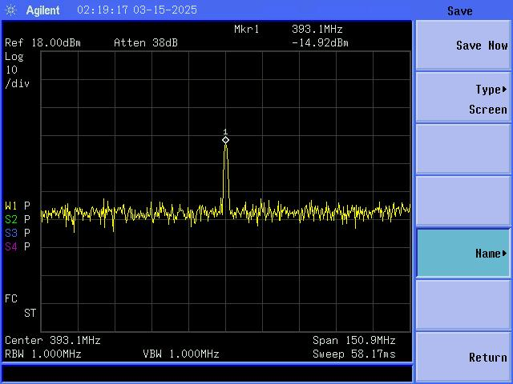

Be aware, that if ``wf_en`` is disabled, you may still have signals
at 491.52 MHz and 245.76 MHz, equivalent to your DAC Reference Clock and 
User IP Clock Rate. Our counter controls the address data is read from. If 
we pause our counter, we won't stop playing data, we'll play the 
same 8 samples every clock cycle.
If we set our ``bram`` samples to 0s (or any constant), we lose those signals.

Errors
------
If you get an error like the following, make sure that your constant block driving
data_in on your bram has ``Number of Bits == 128``

.. code:: bash

  Width of slice (number of bits) is set ot a value of 32, but the value 
  must be less than or equal to 16. The input signal bit-width, 16,
  determines the upper bound for the width of the slice.
  Error occurred during "Rate and Type Error Checking"

  Reported by:
    'design/shared_bram/munge_in/split/slice3'

If you get an error like the following, make sure your bram address width in your
simulink model matches the bram address width in your ``sine.py`` script (the script
in Section 2)

.. code:: python

  UnicodeDecodeError                        Traceback (most recent call last)
  Cell In[7], line 1
  ----> 1 rfsoc.write('shared_bram', buf)

  ...
  ...

  File ~/.conda/envs/enmotion/lib/python3.8/site-packages/katcp/core.py:384, in Message.__str__(self)
      382     return byte_str
      383 else:
  --> 384     return byte_str.decode('utf-8')

  UnicodeDecodeError: 'utf-8' codec can't decode byte 0x88 in position 21: invalid start byte

