# Tutorial 1: RFSoC Platform Yellow Block and Simulink Overview

In this tutorial, you will make a simple design for an rfsoc board using the
CASPER toolflow. It will take you through launching the toolflow, creating a
valid CASPER design in Simulink, generating an `.fpg` file, programming the
`.fpg` file to a CASPER rfsoc board, and interacting with the hardware running
on the board using the casperfpga library through a python interface.

This tutorial assumes that you have already setup your environment correctly, as
explained in the [Getting Started With
RFSoC](./tut_getting_started.md#core-setup) tutorial, specifically that MATLAB
R2020b and Vivado 2020.2 are installed. You should also have all the programs and
packages installed, configuration files set, and have successfully set up and
tested your connection to the rfsoc board.

## Creating Your First Design

### Create a New Model
Make sure you are in your previously set up environment and navigate to
`mlib_devel`.  **Start Matlab by exectuing `startsg`.** This will properly load
the Xilinx and CASPER libraries into Simulink, so long as your `startsg.local`
file is set correctly. Within Matlab, start Simulink by typing `simulink` into
Matlab's command line. Create a new blank model and save it with an appropriate
name.

### Library Organization
There are three primary libraries in Simulink you will use when designing for
your rfsoc board:

  1. The **CASPER XPS Library** contains the CASPER "Yellow Blocks". These blocks
  encapsulate interfaces to your board's hardware (ADCs, memory chips, CPUs,
  various ports, etc).

  2. The **CASPER DSP Library** contains (often green) blocks that implement DSP
  functions (filters, FFTs, etc).

  3. The **Xilinx Library** contains blue blocks which provide low-level fpga
  functionality (multiplexing, delaying, adding, etc). It also contains the
  `System Generator` block, which contains information about the FPGA you are
  using.

### Add the Xilinx System Generator and XSG core config blocks
The first thing to add is the 'System Generator' block, found using the Simulink
Library Browser in `Xilinx Blockset->Basic Elements->System Generator`. Add the
block by clicking and dragging the block into your design. See the Simulink
documentation by Mathworks for other methods of finding and adding blocks to
your design.

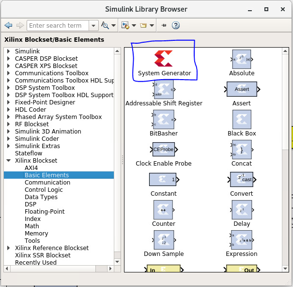

You can double-click on the added block to see its configuration. However,
instead of configuring the System Generator ourselves, we will use a platform
Yellow Block from the **CASPER XPS Library** to configure it. Locate the block
for the board you are using in `CASPER XPS Blockset->Platforms-><your
platform>`. This example uses the ZCU216 pltform block, so this example adds
the ZCU216 Yellow Block to our Simulink model. All RFSoC platfrom Yellow Blocks
are similar in their configuration. The following is therefore easily applied to
your specific platform.

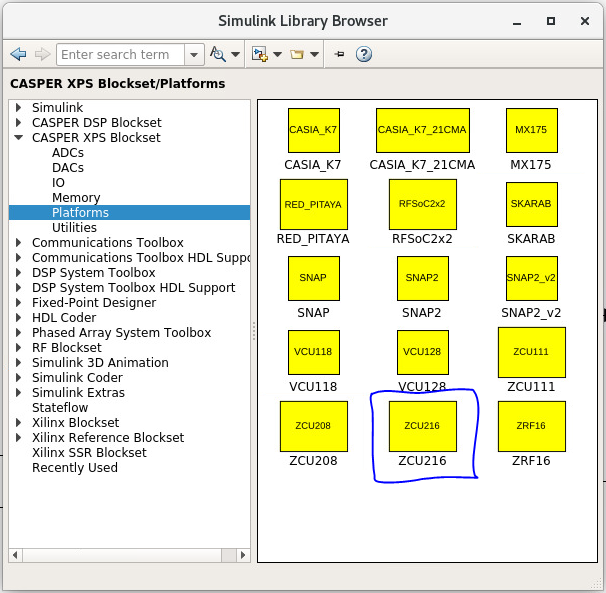

Double-click on the added platform block to see its configuration. Confirm that
the `Hardware Platform` parameter matches the platform you are using. From here,
you can also configure other options, such as the board clocks.

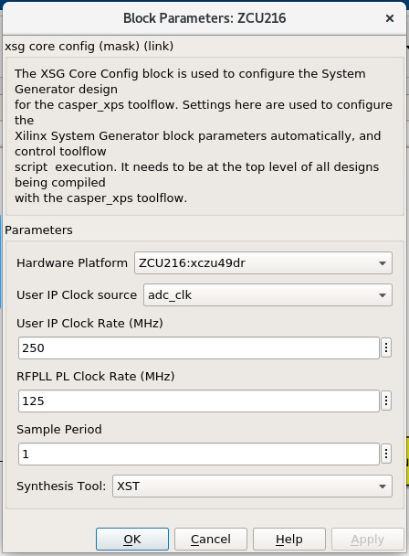

*Note: The platform blocks for the various rfsoc boards are configured to use the
adc clocks. See the relevant tutorial on those for more information (to be
written).*

Note: **The System Generator and XPS platform blocks are required by all CASPER
designs**

### The Example Design
In order to demonstrate the basic use of hardware interfaces and software
interaction, this design will implement three different functions on the board:

1. A Flashing LED
2. A Software Controllable Counter
3. A Software Controllable Adder

The final design will look something like this:

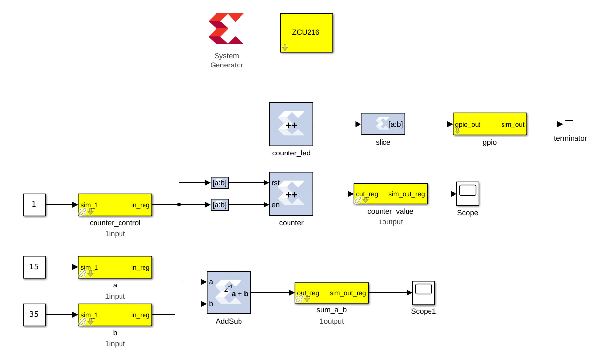

### Function 1: Flashing LED
We can create a flashing LED by using a 27-bit counter. On the ZCU216, the
default clock given by its CASPER platform block is 250 MHz, which will toggle
the most significant bit on the 27 bit counter about every 0.27 seconds. The
principle is the same for any clock rate on any board.  We can output this most
significant bit to an LED on the board, causing the LED to flash at about 50%
duty cycle every so many seconds (half a second for this example).

#### Step 1: Add a counter
Add a blue counter block to the design. It can be found in `Xilinx
Blockset->Basic Elements->Counter`.

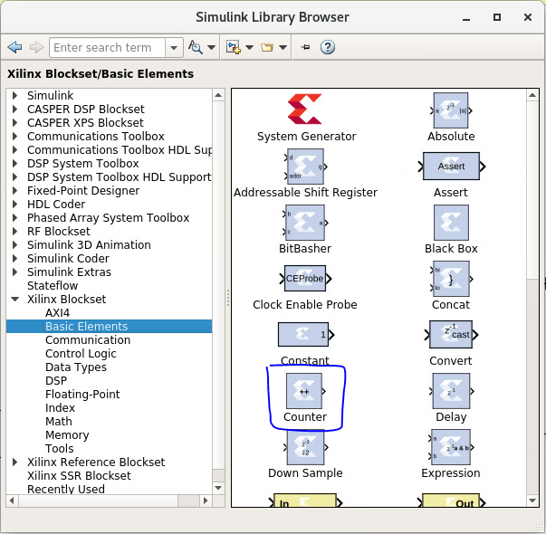

Double-click the block to access its parameters, and set it to free running,
27-bits, unsigned. This will set the counter to count from `0` to `(2^27)-1`,
wrap back to zero, and continue.

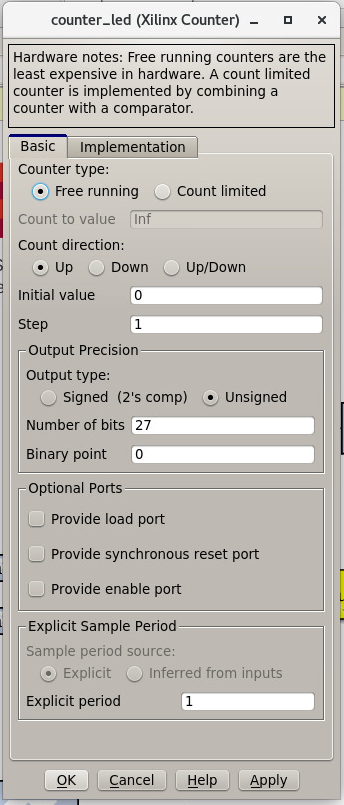

#### Step 2: Add a slice block to select the MSB
Now that we have a counter, we want to select just the most significant bit so
that we can send it to an LED.  Do this by adding a blue slice block, found in
`Xilinx BLockset->Basic Elements->Slice`.

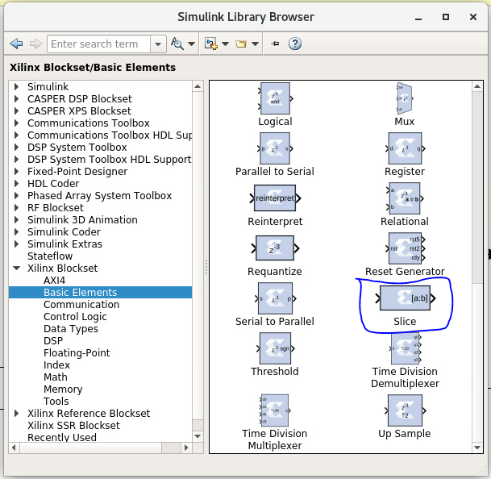

Double-click on the slice block to modify it. There are several ways to use the
slice block to grab the bit we want.  For this example, we will select the MSB
by indexing from the upper end and selecting the first bit.


#### Step 3: Add a GPIO Block
Next we want to access an LED to send that bit to. We can access the correct
FPGA output pin by using a GPIO block. GPIO blocks allow you to route signals
from Simulink to various FPGA pins. Add a yellow GPIO block, found in `CASPER
XPS Library->IO->gpio`.


Double-click the gpio block and set it to the `led` `I/O group`. Set the `I/O
direction` to `out`, the data type to `boolean`, the data bitwidth to `1`, and
the `GPIO bit index` to `0`. This tells the toolflow that it will be connecting
a 1-bit input to LED0.

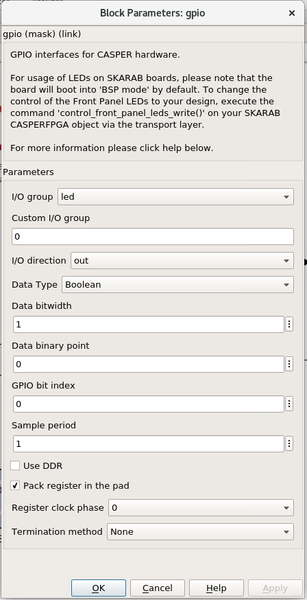

#### Step 4: Add a terminator
To prevent warnings (from MATLAB & Simulink) about unconnected outputs,
terminate all unused outputs using a `Terminator` block.

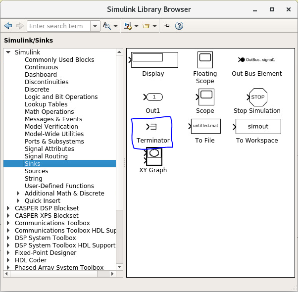

#### Step 5: Connect the design
If you haven't done so already, rename the blocks to sensible names, such as
`counter_led` instead of counter.  You can do this by double-clicking the name on
the blocks.

Connect the blocks together by clicking and dragging from teh output arrow on
one block and dragging it to the input arrow on another block.

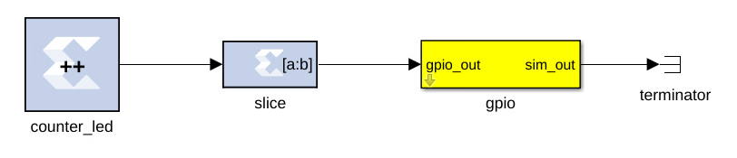

And you're done with the flashing LED!

### Function 2: Software Controllable Counter
Next we will design a hardware counter that we can start, stop, reset, and read
using software. The design will look similar to the flashing LED we just
finished.

#### Step 1: Add the software registers
In order to interact with the hardware while it's running, we need some software
registers. For our counter, we want two software registers, one to control the
counter, and another to read it's current value. Add two yellow
`software_register` blocks to the design, found in `CASPER XPS
Blockset->Memory->software_register`.

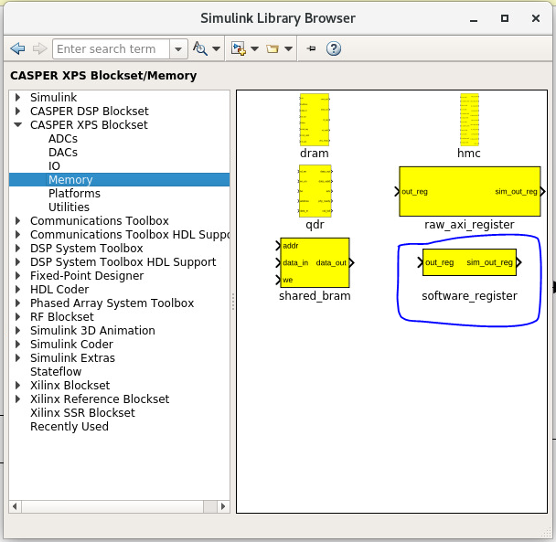

On one of the `software_register` blocks, set the `I/O direction` to `From
Processor`. This will allow a value from the software to be sent to the FPGA
hardware. This block will be the counter controller.

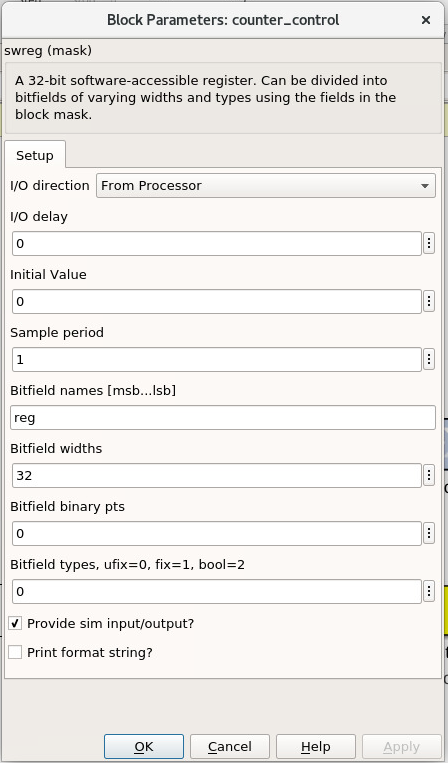

On the other `software_register` block, set the `I/O direction` to `To Processor`.
This will allow the FPGA hardware to send a value to the software when prompted.
This block will be what allows us to read the counter.

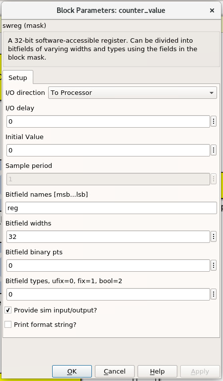

Set both registers to a bitwidth of 32-bits and rename them something sensible.
The names of the blocks here are the names used to access them from
`casperfpga`. **Do not use spaces, slashes, or other funny characters for these
names**.  In this example, they are named `counter_control` and `counter_value`.

See that the registers have `sim` inputs and outputs. These allow you access the
blocks in Simulink for simulation and test purposes. A `sim` input port can be
fed inputs by simulink blocks, and a `sim` output port can be read by simulink
blocks.

So that the counter runs during simulation, add a simulink constant block (found
in `Simulink->Sources->Constant`), set it to `1`, and connect it to the 'sim'
input of the counter controller register. To monitor the counter's value in
simulation, add a simulink scope block (found in `Simulink->Sinks->Scope`) and
connect it to the `sim` output of the counter value register.

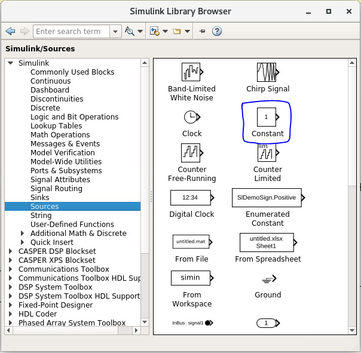

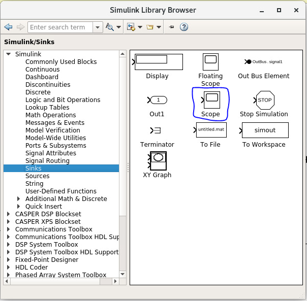

Note that these white simulink blocks will not be compiled to the fpga hardware.
They are for simulation purposes only. Only blue System Generator blocks are
acutally compiled. Yellow blocks are required to interface white simulink blocks
to the blue System Generator blocks.

#### Step 2: Add the counter
Add another counter block the same way we did before. You can also copy the
existing counter block by the usual copy-paste or by ctrl-click-drag-drop. Open
it's paramters and set it to free running, unsigned, 32-bits, with synchronous
reset port and enable port turned on.

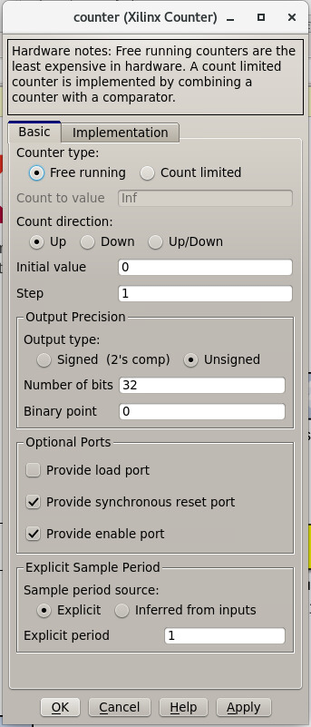

#### Step 3: Add the slice blocks
We want to be able to control the enable and reset ports on this new counter
with the counter control register we made before. We can do this by slicing out
one bit of the register for the enable port and slicing out another bit for the
reset port. Alternatively, we could use two seperate registers, one for the
reset and one for the enable, but as the registers are 32-bits each, that would
be wasteful.

Add two new slice blocks (or copy them from the flashing LED function). Configure
one slice block for the enable by setting it to `boolean` output, specifying the
range as `Lower bit location + width`, offset `0`, and relative to `LSB of
input`.


Configure the other slice block for the reset with the same approach, but
setting the offset to `1`.

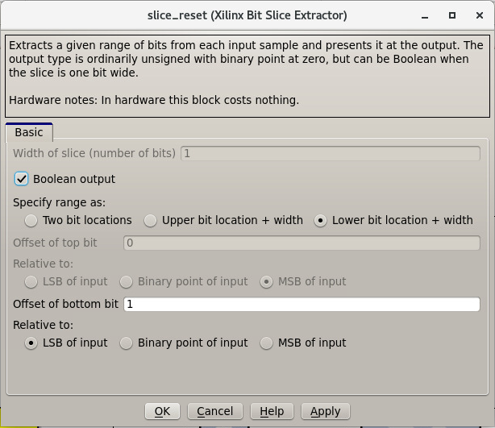

#### Step 4: Connect the design
Connect the blocks together. Take time to make the design look neat as well,
renaming and resizing blocks as needed.

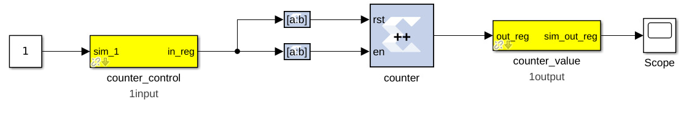

And that concludes this counter!

### Function 3: Software Controllable Adder
The last function we will implement is a software controllable adder. We will be
able to give the adder two value over software, it will add in the hardware, and
we will be able to read the result back using software.

#### Step 1: Add the software registers
Add two software registers and configure them as inputs (`From Processor`).
These will let us specify the values to add.  Add another register and configure
it as an output (`To Processor`), so that we can read back the result.  Name
them something reasonable. Remember that the register names are how they will be
accessed by the software.

#### Step 2: Add the adder block
Add a blue adder/subtractor block to the design, found in `Xilinx
Blockset->Math->AddSub`. Check its configuration and make sure it is set to
addition.

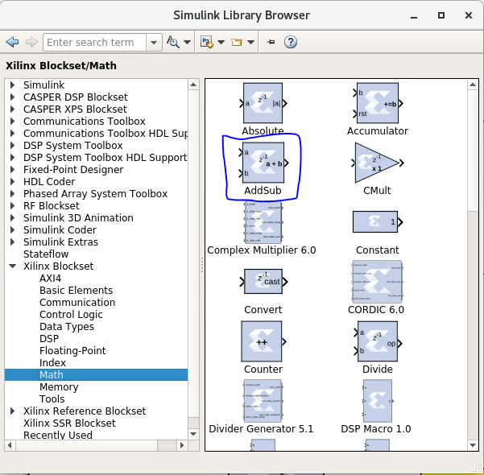


The output register is 32-bits. If we add two 32-bit numbers, we will have
33-bits.

There are a number of ways of fixing this:

 * limit the input bitwidth(s) with slice blocks limit the output bitwidth with
 * slice blocks create a 32-bit adder.
 
For this example, we will configure the AddSub block to be a 32-bit adder. In
its configuration, under the `Output` tab, set it to `unsigned 32-bits`. Also set
its `overflow` to `Saturate`. This way if two very large numbers are added, it will
just return its max `(2^32-1)`.

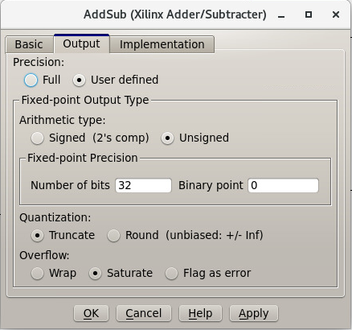

#### Step 3: Add the scope and simulation inputs
Add simulink scope and constant blocks to the output register and input
registers. Set the constant blocks to something so we can check the adder in
simulation.

#### Step 4: Connect the design
Connect all the blocks together, name things properly, and adjust/resize the
design so it is easy to look at. Of course, these can all be done as you go, and
probably should be done as you go.

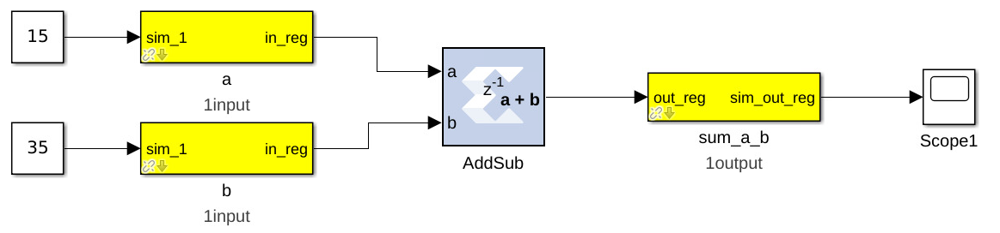

Now the adder is done!

### Simulating the design


With all hardware functions configureed has hooked up, we can simulate the
design with Simulink.

Under the simulate section of the simulation tab on the ribbon, set the `stop
time` to the number of clock cycles you want to simulate. This example uses
`10`.  Note that (at least in MATLAB R2020b) it says that the stop time is in
seconds, but this is actually clock cycles because of the way the toolflow and
CASPER blocks are configured.


Press `Run` to simulate the design. Once the simulation is done, and assuming
there are no errors, you can double-click the scopes to view the output signals.
You should see the counter incrementing once every clock cycle and the adder
should show you the result of the addition. You may have to scale the scopes to
see the results properly.

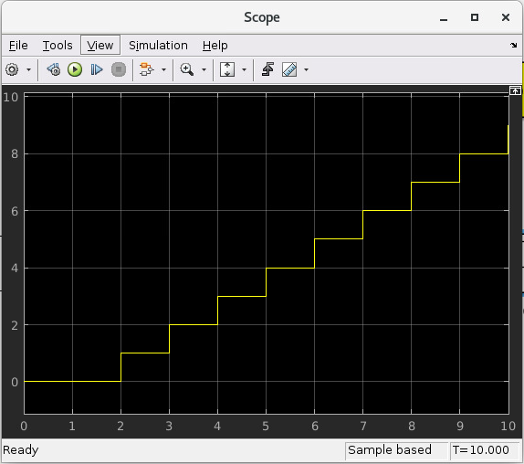


Once everything looks like it should, you're ready to compile for the FPGA!

## Compiling
We now have a design with three independent functions all working off the same
FPGA clock. From here, compiling the design is easy, so long as your environment
was set up correctly.

To compile the design, go to the MATLAB command line and enter

```Matlab
>> jasper
```

You should not have to do anything else. This should work for any of the rfsoc
platforms.

The `jasper` command will run the various parts of the build process. The first
part uses Xilinx's System Generator to compile any Xilinx blocks in the design
to a circuit that can be implemented on the FPGA, i.e., HDL code.

The second part runs Vivado's synthesis tools to create the physical
implementation of the design for the board. Lastly, the toolflow creates the
final output `.fpg` file that is used to program the FPGA. The `.fpg` file
contains the bitstream that Vivado created as well as meta-data that describes
the yellow blocks from the simulink design. The .fpg file will be made the
'outputs' folder in the working directory of the Simulink model. The `.fpg` file
will be named using the simulink file name and the date/time that compilation
begain. When putting together this example, compilation took about 25 minutes.

## Programming the FPGA
Reconfiguration on any CASPER platform is done using the `casperfpga` python
library. You should have installed and used this in the [Getting
Started](./tut_getting_started.md#setup-casperfpga) tutorial to check your
connection to your board.

#### Step 1: Copy the `.fpg` file to where you need it
Navigate to the prevously mention 'outputs' folder and copy the `.fpg` file to
wherever you are going to be running your ipython session from.

#### Step 2: Connect to the board
Assuming that your board is on, configured, and on the same network you are
working on, connect to the board the same way demonstrated in the [Getting
Started](./tut_getting_started.md#setup-casperfpga) tutorial:

```bash
$ ipython
```

```python
In [1]: import casperfpga

In [2]: fpga = casperfpga.CasperFpga('ipaddress.of.board')

In [3]: fpga.is_connected()
Out[3]: True
```
If the output of `is_connect()` is true, you're good to go.

We can now program the fpga with the `.fpg` file with the following:

```python
In [4]: fpga.upload_to_ram_and_program('/path/to/your_fpgfile.fpg')
```
## Interacting with the board
The design we created is now running on the board! You should see the first
function working by observing the blinking LED on the board. From here we can
check to see if the software registers in the design worked. If you forgot what
the registers were named, you can use `listdev()` to get a list of available
registers:

```python
In [5]: fpga.listdev()
Out[5]:
['a',
 'b',
 'counter_control',
 'counter_value',
 'sum_a_b',
 'sys_block',
 'sys_board_id',
 'sys_clkcounter',
 'sys_rev',
 'sys_rev_rcs',
 'sys_scratchpad']
```
 
Let's test the adder function first. Reading and writing to the registers can be
done with `write_int()` and `read_int()`:
```python
 In [6]: fpga.write_int('a',15)

In [7]: fpga.write_int('b',35)

In [8]: fpga.read_int('sum_a_b')
Out[8]: 50
```

Lastly, let's test the controllable counter:

```python
In [9]: fpga.read_uint('counter_value')
Out[9]: 0

In [10]: fpga.write_int('counter_control',1)

In [11]: fpga.read_uint('counter_value')
Out[11]: 1103388123

In [12]: fpga.read_uint('counter_value')
Out[12]: 1849175237

In [13]: fpga.read_uint('counter_value')
Out[13]: 2590065552

In [14]: fpga.write_int('counter_control',0)

In [15]: fpga.read_uint('counter_value')
Out[15]: 1159837158

In [16]: fpga.read_uint('counter_value')
Out[16]: 1159837158

In [17]: fpga.write_int('counter_control',2)

In [18]: fpga.read_uint('counter_value')
Out[18]: 0
```

We can see that the counter starts at `0` and does not start counting until it
receives the proper signal in the proper register.  We can also see that the
counter wraps properly, and stops and resets as expected according the signals
and registers we designed.  Note that `read_uint()` is used here to read the
counter properly (otherwise it would have reported a negative value half the
time).

## Conclusion
In this tutorial, you have gone through the process of using `startsg` to initiate
the toolflow, used Simulink to create a design, called `jasper` to compile and
obtain a `.fpg` file, and use `casperfpga` to program and interact with your rfsoc
board. Congratulations!
