Tutorial 1: RFSoC Platform Yellow Block and Simulink Overview
==============================================================

In this tutorial, you will make a simple design for an RFSoC board using the
CASPER toolflow. You will:

* Launch the toolflow
* Create a valid CASPER design in Simulink
* Generate an ``.fpg`` and ``.dtbo`` file
* Program the ``.fpg`` and ``.dtbo`` file to a CASPER rfsoc board
* Use the ``casperfpga`` library in a python interface to interact with the hardware running on the board

This tutorial assumes that you have already setup your environment correctly, as
explained in the `Getting Started With RFSoC <./tut_getting_started.md#core-setup>`_
tutorial, specifically that the correct versions of Vivado and Matlab are installed.
You should also have all the programs and packages installed, configuration files set,
and have successfully set up and tested your connection to the RFSoC board.

Creating Your First Design
--------------------------

Create a New Model
~~~~~~~~~~~~~~~~~~

Make sure you are in your previously set up environment and navigate to
``mlib_devel``.  **Start Matlab by exectuing** ``./startsg``. This will properly load
the Xilinx and CASPER libraries into Simulink, so long as your ``startsg.local``
file is set correctly. Within Matlab, start Simulink by typing ``Simulink`` into
Matlab's command line. Create a new blank model and save it with an appropriate
name—no capital letters or spaces.

Library Organization
~~~~~~~~~~~~~~~~~~~~

There are three primary libraries in Simulink you will use when designing for
your RFSoC board:

1. The **CASPER XPS Library** contains the CASPER "Yellow Blocks". These blocks
   encapsulate interfaces to your board's hardware (ADCs, memory chips, CPUs,
   various ports, etc).

2. The **CASPER DSP Library** contains (often green) blocks that implement DSP
   functions (filters, FFTs, etc).

3. The **Xilinx Library** contains blue blocks which provide low-level FPGA
   functionality (multiplexing, delaying, adding, etc). It also contains the
   ``System Generator`` block, which contains information about the FPGA you are
   using.

Add the Xilinx System Generator and CASPER Platform blocks
~~~~~~~~~~~~~~~~~~~~~~~~~~~~~~~~~~~~~~~~~~~~~~~~~~~~~~~~~~

The first thing to add is the ``System Generator`` block, found using the Simulink
Library Browser in ``Xilinx Blockset->Basic Elements->System Generator``. Add the
block by clicking and dragging the block into your design. See the Simulink
documentation by Mathworks for other methods of finding and adding blocks to
your design.

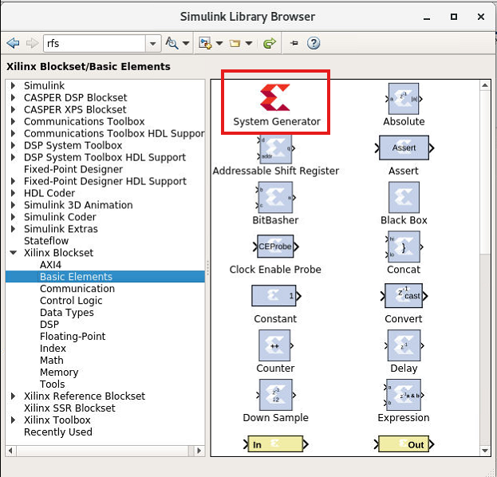

You can double-click on the added block to see its configuration; however,
instead of configuring the System Generator ourselves, we will use a platform
Yellow Block from the **CASPER XPS Library** to configure it. Locate the block
for the board you are using in ``CASPER XPS Blockset->Platforms-><your
platform>``. This example uses the RFSoC4x2 platform block, so this example adds
the RFSoC4x2 Yellow Block to our Simulink model. All RFSoC platform Yellow Blocks
are similar in their configuration. The following is therefore easily applied to
your specific platform.

Note: **The System Generator and XPS platform blocks are required by all CASPER
designs**

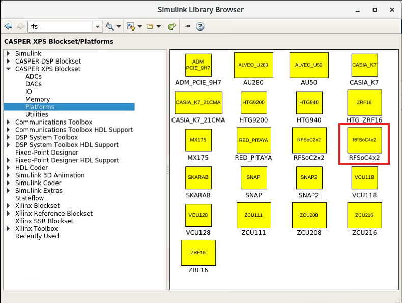

Double-click on the added platform block to see its configuration.

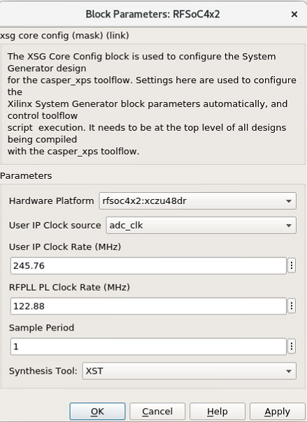

Confirm that the ``Hardware Platform`` parameter matches the platform you are
using. The ``User IP Clock Rate`` is the desired frequency for the IP of the
design. For the RFSoC platform the ``adc_clk`` user IP clock source is derived
from the ``pl_clk`` coming from the first stage PLL in the clocking hierarchy for
the RFDC. In most cases this is an LMK creating the ``pl_clk`` in addition to the
clock that drives the RFDC tiles. This frequency coming from the LMK as ``pl_clk``
is what is to be entered into the ``RFPLL PL Clock Rate`` field. In other words,
this is the clock rate the design is expecting to produce as the clock frequency
for the user IP clock.

Before proceeding briefly review the clocking information for your target
platform and any additional setup/configuration required:

* `RFSoC2x2 <./platforms/rfsoc2x2.html#rf-clocking>`_
* `RFSoC4x2 <./platforms/rfsoc4x2.html#rf-clocking>`_
* `ZCU111 <./platforms/zcu111.html#rf-clocking>`_
* `ZCU208 <./platforms/zcu208.html#rf-clocking>`_
* `ZCU216 <./platforms/zcu216.html#rf-clocking>`_
* `ZRF16 <./platforms/zrf16.html#rf-clocking>`_

Set the ``User IP Clock Rate`` and ``RFPLL PL Clock Rate`` as follows for your
target RFSoC platform:

.. code-block:: bash

   # RFSoC 2x2
   User IP Clock Rate: 245.76, RFPLL PL Clock Rate: 15.36

   # RFSoC 4x2
   User IP Clock Rate: 245.76, RFPLL PL Clock Rate: 122.88

   # ZCU111
   User IP Clock Rate: 245.76, RFPLL PL Clock Rate: 122.88

   # ZCU208
   User IP Clock Rate: 250, RFPLL PL Clock Rate: 125

   # ZCU216
   User IP Clock Rate: 250, RFPLL PL Clock Rate: 125

   # ZFR16
   User IP Clock Rate: 250, RFPLL PL Clock Rate: 50

The Example Design
~~~~~~~~~~~~~~~~~~

In order to demonstrate the basic use of hardware interfaces and software
interaction, this design will implement three different functions on the board:

1. A Flashing LED
2. A Software Controllable Counter
3. A Software Controllable Adder

The final design will look something like this:

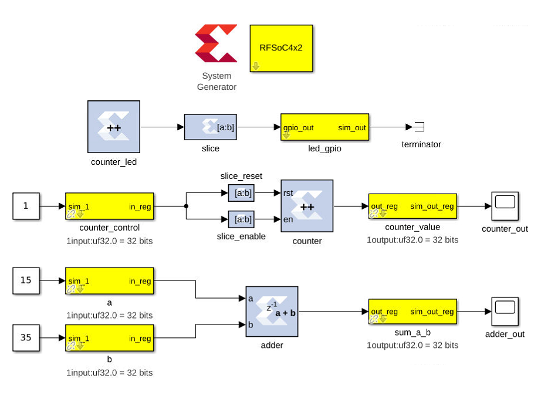

Function 1: Flashing LED
~~~~~~~~~~~~~~~~~~~~~~~~

We can create a flashing LED by using a 27-bit counter. On the RFSoC4x2, the
default clock given by its CASPER platform block is 245.76 MHz, which will toggle
the most significant bit on the 27-bit counter about every 0.27 seconds. The
principle is the same for any clock rate on any board.  We can output this most
significant bit to an LED on the board, causing the LED to flash at about 50%
duty cycle every so many seconds (half a second for this example).

Step 1: Add a counter
^^^^^^^^^^^^^^^^^^^^^

Add a blue counter block to the design. It can be found in ``Xilinx
Blockset->Basic Elements->Counter``.

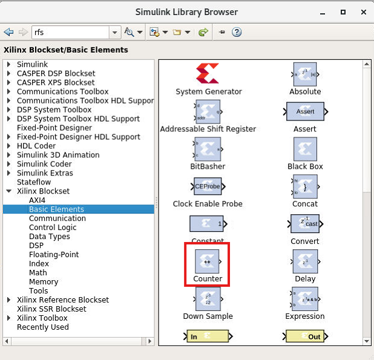

Double-click the block to access its parameters, and set it to free running,
27-bits, unsigned. This will set the counter to count from ``0`` to ``(2^27)-1``,
wrap back to zero, and continue.

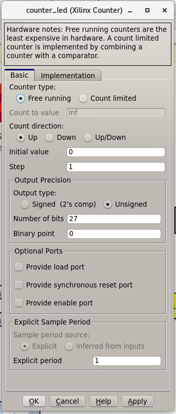

Step 2: Add a slice block to select the MSB
^^^^^^^^^^^^^^^^^^^^^^^^^^^^^^^^^^^^^^^^^^^

Now that we have a counter, we want to select just the most significant bit so
that we can send it to an LED.  Do this by adding a blue slice block, found in
``Xilinx BLockset->Basic Elements->Slice``.

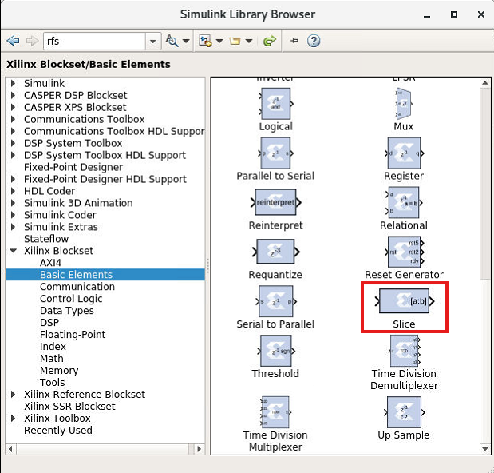

Double-click on the slice block to modify it. There are several ways to use the
slice block to grab the bit we want.  For this example, we will select the MSB
by indexing from the upper end and selecting the first bit.

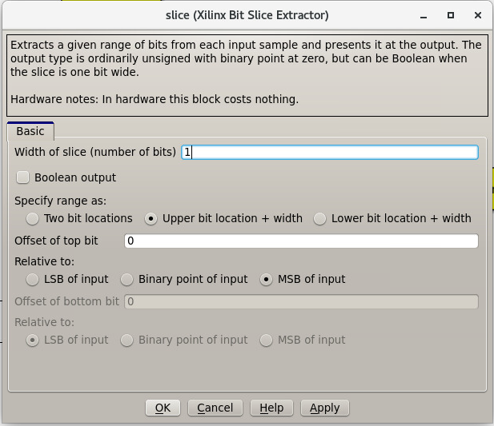

Step 3: Add a GPIO Block
^^^^^^^^^^^^^^^^^^^^^^^^

Next we want to access an LED to send that bit to. We can access the correct
FPGA output pin by using a GPIO block. GPIO blocks allow you to route signals
from Simulink to various FPGA pins. Add a yellow GPIO block, found in ``CASPER
XPS Library->IO->gpio``.

.. image:: ../../_static/img/rfsoc/tut_plat/gpio_block.png

Double-click the gpio block and set it to the ``led`` ``I/O group``. Set the ``I/O
direction`` to ``out``, the data type to ``boolean``, the data bitwidth to ``1``, and
the ``GPIO bit index`` to ``0``. This tells the toolflow that it will be connecting
a 1-bit input to LED0.

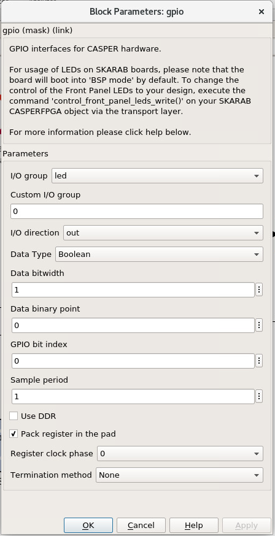

Step 4: Add a terminator
^^^^^^^^^^^^^^^^^^^^^^^^^

To prevent warnings (from MATLAB & Simulink) about unconnected outputs,
terminate all unused outputs using a ``Terminator`` block.

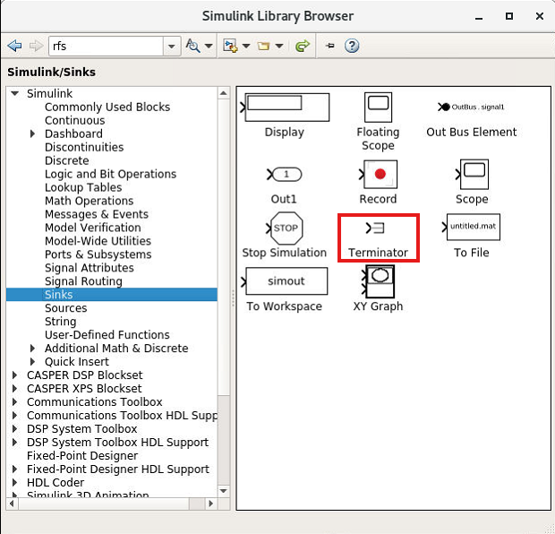

Step 5: Connect the design
^^^^^^^^^^^^^^^^^^^^^^^^^^^

If you haven't done so already, rename the blocks to sensible names, such as
``counter_led`` instead of counter.  You can do this by double-clicking the name on
the blocks.

Connect the blocks together by clicking and dragging from the output arrow on
one block and dragging it to the input arrow on another block.

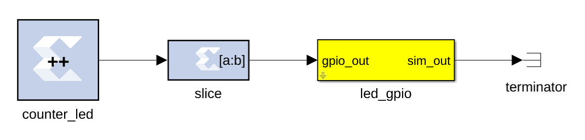

And you're done with the flashing LED!

Function 2: Software Controllable Counter
~~~~~~~~~~~~~~~~~~~~~~~~~~~~~~~~~~~~~~~~~

Next we will design a hardware counter that we can start, stop, reset, and read
using software. The design will look similar to the flashing LED we just
finished.

Step 1: Add the software registers
^^^^^^^^^^^^^^^^^^^^^^^^^^^^^^^^^^

In order to interact with the hardware while it's running, we need some software
registers. For our counter we want two software registers—one to control the
counter and another to read its current value. Add two yellow
``software_register`` blocks to the design, found in ``CASPER XPS
Blockset->Memory->software_register``.

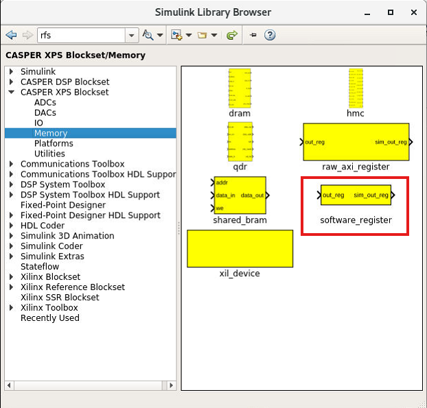

On one of the ``software_register`` blocks, set the ``I/O direction`` to ``From Processor``. 
This will allow a value from the software to be sent to the FPGA
hardware. This block will be the counter controller.

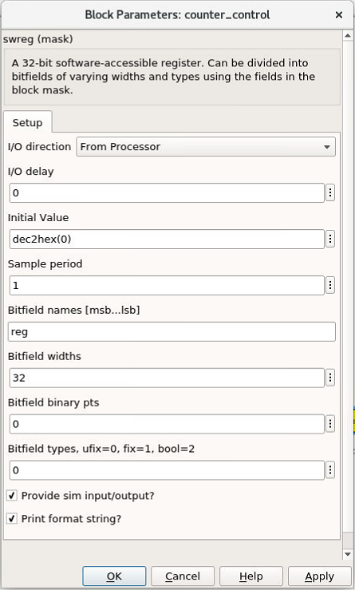

On the other ``software_register`` block, set the ``I/O direction`` to ``To Processor``.
This will allow the FPGA hardware to send a value to the software when prompted.
This block will be what allows us to read the counter.

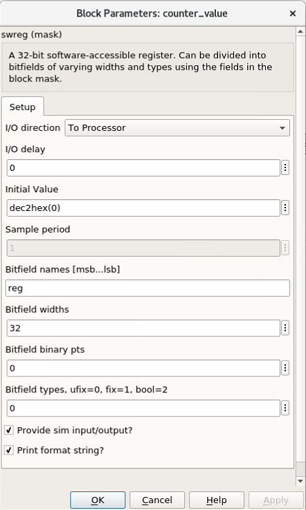

Set both registers to a bitwidth of 32-bits and rename them something sensible.
The names of the blocks here are the names used to access them from
``casperfpga``. **Do not use capital letters, spaces, slashes, or other funny characters for these
names**.  In this example, they are named ``counter_control`` and ``counter_value``.

Note that the registers have ``sim`` inputs and outputs; these allow you to access the
blocks in Simulink during simulation for testing purposes. A ``sim`` input port can be
fed inputs by Simulink blocks, and a ``sim`` output port can be read by Simulink
blocks.

So that the counter runs during simulation, add a Simulink constant block (found
in ``Simulink->Sources->Constant``), set it to ``1``, and connect it to the 'sim'
input of the counter controller register. To monitor the counter's value in
simulation, add a Simulink scope block (found in ``Simulink->Sinks->Scope``) and
connect it to the ``sim`` output of the counter value register.

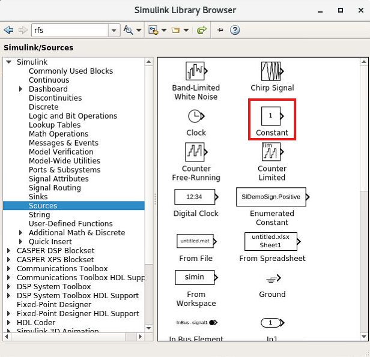

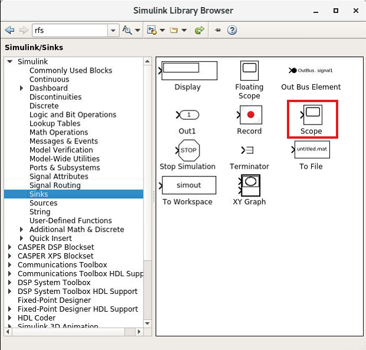

Note that these white Simulink blocks will not be compiled to the FPGA hardware.
They are for simulation purposes only. Only blue Xilinx blocks are
acutally compiled. Yellow blocks are required to interface white Simulink blocks
to the blue Xilinx blocks.

Step 2: Add the counter
^^^^^^^^^^^^^^^^^^^^^^^

Add another counter block the same way we did before. You can also copy the
existing counter block via the usual copy-paste or by ctrl-click-drag-drop. Open
its paramters and set it to free running, unsigned, 32-bits, synchronous
reset port on, and enable port on.

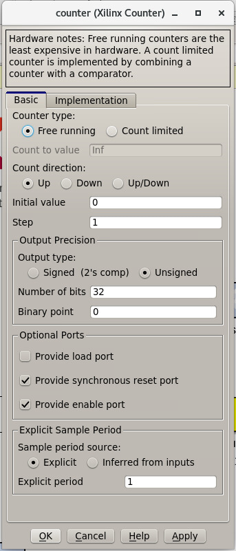

Step 3: Add the slice blocks
^^^^^^^^^^^^^^^^^^^^^^^^^^^^

We want to be able to control the enable and reset ports on this new counter
with the counter control register we made before. We can do this by slicing out
one bit of the register for the enable port and slicing out another bit for the
reset port. Alternatively, we could use two seperate registers, one for the
reset and one for the enable, but as the registers are 32-bits each, that would
be wasteful.

Add two new slice blocks (or copy them from the flashing LED function). Configure
one slice block for the enable by setting it to ``boolean`` output, specifying the
range as ``Lower bit location + width``, offset ``0``, and relative to ``LSB of
input``.

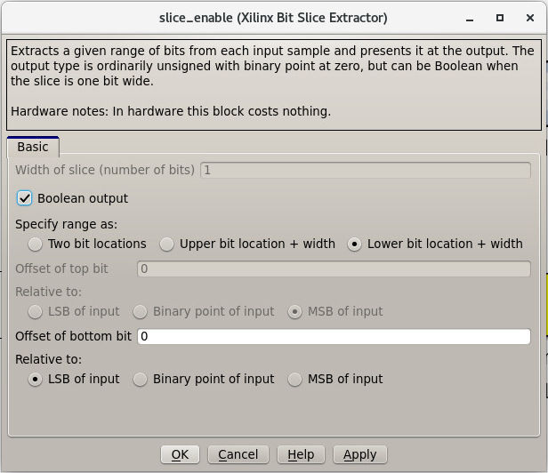

Configure the other slice block for the reset with the same approach, but
setting the offset to ``1``.

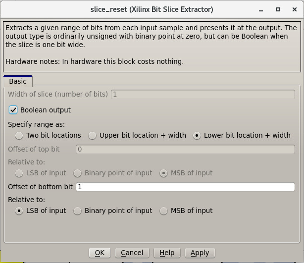

Step 4: Connect the design
^^^^^^^^^^^^^^^^^^^^^^^^^^

Connect the blocks together. Take time to make the design look neat as well,
renaming and resizing blocks as needed.

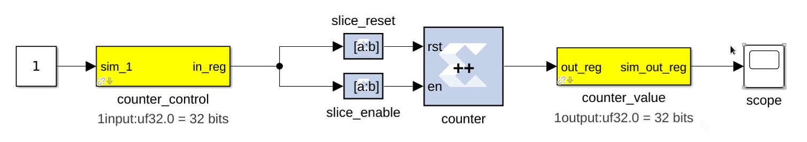

And that concludes this counter!

Function 3: Software Controllable Adder
~~~~~~~~~~~~~~~~~~~~~~~~~~~~~~~~~~~~~~~

The last function we will implement is a software controllable adder. We will be
able send two values to the adder from software, have it add them in hardware, and
then read the result using software again.

Step 1: Add the software registers
^^^^^^^^^^^^^^^^^^^^^^^^^^^^^^^^^^

To specify the values to add, add two software registers and configure them as 
inputs (``From Processor``). To read back the result, add another register and configure
it as an output (``To Processor``).  Name them something reasonable. Remember that the
registers' names are used to access their data in software.

Step 2: Add the adder block
^^^^^^^^^^^^^^^^^^^^^^^^^^^

Add a blue adder/subtractor block to the design, found in ``Xilinx
Blockset->Math->AddSub``. Check its configuration and make sure it is set to
addition.

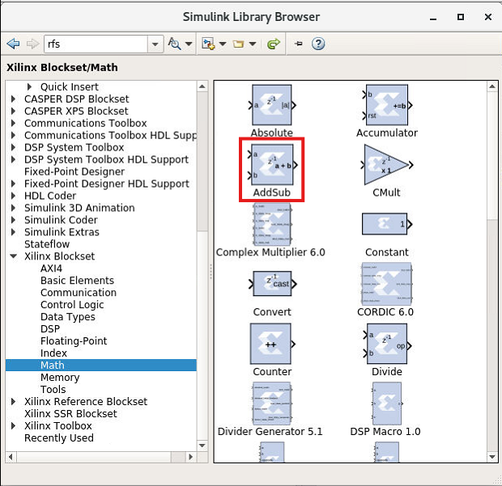

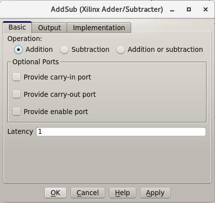

The output register is 32-bits. If we add two 32-bit numbers, we will have
33-bits.

There are a number of ways of fixing this:

* Limit the input bitwidth(s) with slice blocks.
* Limit the output bitwidth with slice blocks.
* Create a 32-bit adder instead.

For this example, we will configure the AddSub block to be a 32-bit adder. In
its configuration, under the ``Output`` tab, set it to ``unsigned 32-bits``. Also set
its ``overflow`` to ``Saturate``. This way, if two very large numbers are added, it will
just return its max ``(2^32-1)``.

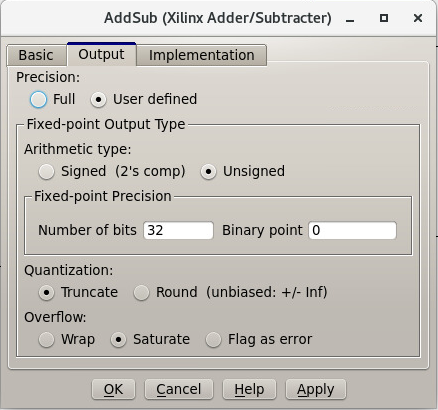

Step 3: Add the scope and simulation inputs
^^^^^^^^^^^^^^^^^^^^^^^^^^^^^^^^^^^^^^^^^^^

Add Simulink scope and constant blocks to the output register and input
registers. These will be set and used so we can check the adder design
in simulation.

Step 4: Connect the design
^^^^^^^^^^^^^^^^^^^^^^^^^^

Connect all the blocks together, name things properly, and adjust/resize the
design so it is nice to look at. Of course, this can be done as you go, and
probably should be.

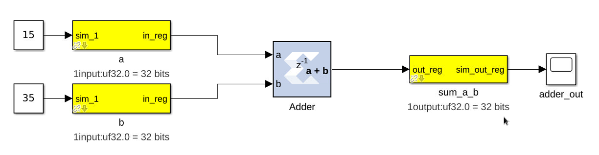

Now the adder is done!

Extra Design Function (RFSoC2x2 only)
^^^^^^^^^^^^^^^^^^^^^^^^^^^^^^^^^^^^^

Make sure to have added the software register and GPIO needed to remove ``RESET``
from the LMK PLL chip so that it can be programmed later on. See the
`clocking <./platforms/rfsoc2x2.md#rf-clocking>`_ section of the RFSoC2x2 platform
page.

Simulating the design
~~~~~~~~~~~~~~~~~~~~~

With all hardware functions configureed and hooked up, we can simulate the
design with Simulink.

Under the simulate section of the simulation tab on the ribbon, set the ``stop
time`` to the number of clock cycles you want to simulate. This example uses
``10.0``.  Note that the stop time is actually clock cycles instead of seconds
because of the way the toolflow and CASPER blocks are configured.

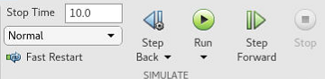

Press ``Run`` to simulate the design. Once the simulation is done (assuming
there are no errors) you can double-click the scopes to view the output signals.
You should see the counter incrementing once every clock cycle and the adder
should show you the result of the addition. You may have to scale the scopes to
see the results properly.

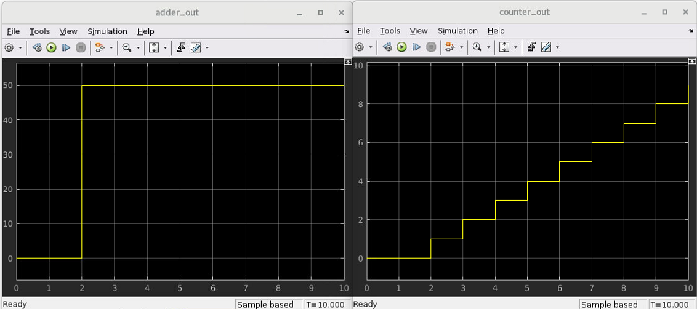

Once everything looks like it should, you're ready to compile for the FPGA!

Compiling
----------

We now have a design with three independent functions all working off the same
FPGA clock. From here, compiling the design is easy, so long as your environment
was set up correctly.

To compile the design, go to the MATLAB command line and enter

.. code-block:: matlab

   >> jasper

Depending on your computing resources, compilation of this design will take
between 10 and 25 mins—though larger designs will take much longer.

The ``jasper`` command will run the various parts of the build process. The first
part uses Xilinx's System Generator to compile any Xilinx blocks in the design
to a circuit that can be implemented on the FPGA, i.e., HDL code.

The second part runs Vivado's synthesis, implementation and place and route
tools, creating the physical hardware design for the FPGA. Then, the toolflow
creates the final output ``.fpg`` and ``.dtbo`` files that are used to program the
FPGA using CASPER software framework. The ``.fpg`` file contains the bitstream
that Vivado created as well as meta-data that describes the yellow blocks from
the Simulink design and their configurations. The ``.dtbo`` is a new output
product of the toolflow targeting SoC platforms like the RFSoC.

Similar to the meta-data that is created for CASPER software, the .``dtbo`` is the
device tree overlay binary containing meta data information but instead targeted at
the software drivers that will be loaded by the processor system
when programming the FPGA. After Vivado syntheis and bitstream generation the
toolflow exports the platform hardware definition to use Xilinx's software tools
(the Vitis flow) to generate software produts that interface with the hardware
design. The ``.dtbo`` is one of those software products. The ``.dtbo`` is now used
in conjunction with the ``.fpg`` file, such that the ``.fpg`` is used to first program
the FPGA followed by application of the device tree overlay. In this design
there are no IP that take advantage of this, so the resulting ``.dtbo`` will be
mostly empty (the MPSoC is always present in the design). Both the ``.fpg`` and
``.dtbo`` file will be placed in an ``outputs`` folder in the working directory of
the Simulink model. The files will be named using the Simulink file name and the
date/time that compilation began.

Note that the ``.dtbo`` must be placed in the same directory as the ``.fpg`` and
have the same name (except for the extension). Thus, if the ``.fgp`` file name
is changed from the compiled default, the ``.dtbo`` must also be updated as well.

Programming the FPGA
--------------------

Reconfiguration on any CASPER platform is typically done using the ``casperfpga``
python library. However, before we use ``casperfpga`` we are going to
manually connect to the board to program the clocks needed for the user design.
This is done to briefly introduce the processing system and idea that as a user
the processor is there to be used if needed.

Programming the onboard clocks for the RFSoC can be done using the ``rfdc`` yellow
block and associated ``RFDC`` ``casperfpga`` object (to be introduced in the next
tutorial). However, this design does not use the ``rfdc`` yellow block, meaning an RFDC
object is not automatically present on the software side. There are other ways
to program these clocks using ``casperfpga`` but instead we can use a basic
software utility that is distributed with each platform to do this.

shell into the board using an ssh client (the default username is
``casper`` with password ``casper``). For example,

.. code-block:: bash

   $ ssh casper@your.ip.address.here

In the home directory there is a ``bin`` directory containing a few utilities for
some of the on-board peripherals. Specifically, each platform will have a
utility to program the PLLs which drive the sample clock or PLL for the
RFDC. Take a look at that directory—it is shown here for all the platforms.

.. code-block:: bash

   casper@alpaca-1:~$ ls bin/
   prg_8a34001  prg_clk104_rfpll  reset_rfpll  zcu216_probe_sfp

The program to configure the LMK/LMX PLLs for the RFDC all accept a ``.txt``
formatted hexdump file from TICS with the commandline switch ``-lmk`` or ``-lmx``
to indicate the target PLL.

.. code-block:: bash

   casper@alpaca-1:~$ ./bin/prg_clk104_rfpll
   must specify -lmk|-lmx
   ./bin/prg_clk104_rfpll -lmk|-lmx <path/to/clk/file.txt>

The distributed clock files for the platform are stored in ``/lib/firmare``. As
mentioned `above <#add-the-xilinx-system-generator-and-casper-platform-blocks>`_,
designs for RFSoC use ``pl_clk`` coming from the on board LMK to generate the User
IP clock. Program the LMK using the corresponding platforms utility (before
proceeding make sure to have reviewed your platform's
`page <./readme.md#platforms>`_ for required clocking configuration and setup):

.. code-block:: bash

   # RFSoC 4x2
   casper@rfsoc4x2:~$ sudo ./bin/prg_rfpll -lmk /lib/firmware/rfsoc4x2_PL_122M88_REF_245M76.txt

   # RFSoC 2x2
   casper@rfsoc2x2:~$ sudo ./bin/prg_rfpll -lmk /lib/firmware/rfsoc2x2_lmk04832_12M288_PL_15M36_OUT_122M88_CLK12_15M36.txt

   # ZCU111
   casper@alpaca-zcu111:~$ sudo ./bin/prg_rfpll -lmk /lib/firmware/122M88_PL_122M88_SYSREF_7M68_clk5_12M8.txt

   # ZCU216
   casper@alpaca-1:~$ sudo ./bin/prg_clk104_rfpll -lmk /lib/firmware/250M_PL_125M_SYSREF_10M.txt

   # ZRF16
   casper@htg-zrf16:~$ sudo ./bin/prg_rfpll -lmk /lib/firmware/zrf16_LMK_CLK1REF_10M_LMXREF_50M_PL_OUT_50M_nosysref.txt

Each platform has an LED connected to the status pin of the LMK that should now
be lit indicating that PLL is locked.

The LMXs could also be programmed in the same way using the ``-lmx`` switch and a
corresponding LMX hexdump file, but this is not needed here as those drive the
sample clock or internal PLL reference clock for the RFDC.

With the clock to drive the user design configured we can now continue to use
``casperfpga`` to program the FPGA and interact with our design.  You should have
installed and used this in the `Getting
Started <./tut_getting_started.md#setup-casperfpga>`_ tutorial to check your
connection to your board.

Step 1: Copy the ``.fpg`` file to where you need it
~~~~~~~~~~~~~~~~~~~~~~~~~~~~~~~~~~~~~~~~~~~~~~~~~~~~

Navigate to the prevously mention 'outputs' folder and copy the ``.fpg`` file to
wherever you are going to be running your ipython session from.

Step 2: Connect to the board
~~~~~~~~~~~~~~~~~~~~~~~~~~~~~

Assuming that your board is on, configured, and on the same network you are
working on, connect to the board the same way demonstrated in the `Getting
Started <./tut_getting_started.md#setup-casperfpga>`_ tutorial. Navigate to 
the directory containing the outputs of your ``jasper`` compilation and begin
an ``ipython`` session:

.. code-block:: bash

   $ ipython

.. code-block:: python

   In [1]: import casperfpga

   In [2]: fpga = casperfpga.CasperFpga('ipaddress.of.board')

   In [3]: fpga.is_connected()
   Out[3]: True

If the output of ``is_connected()`` is true, you're good to go.

We can now program the FPGA with the ``.fpg`` file with the following:

.. code-block:: python

   In [4]: fpga.upload_to_ram_and_program('your_fpgfile.fpg')

Interacting with the board
--------------------------

The design we created is now running on the board! You should see the first
function working by observing the blinking LED on the board. From here we can
check to see if the software registers in the design worked. If you forgot what
the registers were named, you can use ``listdev()`` to get a list of available
registers:

.. code-block:: python

   In [5]: fpga.listdev()
   Out[5]:
   ['a',
    'b',
    'counter_control',
    'counter_value',
    'sum_a_b',
    'sys',
    'sys_board_id',
    'sys_clkcounter',
    'sys_rev',
    'sys_rev_rcs',
    'sys_scratchpad']

Let's test the adder function first. Reading and writing to the registers can be
done with ``write_int()`` and ``read_int()``:

.. code-block:: python

   In [6]: fpga.write_int('a',15)

   In [7]: fpga.write_int('b',35)

   In [8]: fpga.read_int('sum_a_b')
   Out[8]: 50

Finally, let's test the controllable counter:

.. code-block:: python

   In [9]: fpga.read_uint('counter_value')
   Out[9]: 0

   In [10]: fpga.write_int('counter_control',1)

   In [11]: fpga.read_uint('counter_value')
   Out[11]: 1103388123

   In [12]: fpga.read_uint('counter_value')
   Out[12]: 1849175237

   In [13]: fpga.read_uint('counter_value')
   Out[13]: 2590065552

   In [14]: fpga.write_int('counter_control',0)

   In [15]: fpga.read_uint('counter_value')
   Out[15]: 1159837158

   In [16]: fpga.read_uint('counter_value')
   Out[16]: 1159837158

   In [17]: fpga.write_int('counter_control',2)

   In [18]: fpga.read_uint('counter_value')
   Out[18]: 0

We can see that the counter starts at ``0`` and does not start counting until it
receives the proper signal in the proper register.  We can also see that the
counter wraps properly, and stops and resets as expected according to the signals
and registers we designed.  Note that ``read_uint()`` is used here to read the
counter properly (otherwise it would have reported a negative value half the
time).

Conclusion
-----------

In this tutorial, you have gone through the process of using ``./startsg`` to
initiate the toolflow, using Simulink to create a design, calling ``jasper`` to
compile and obtain a ``.fpg`` and ``.dtbo`` file, and using ``casperfpga`` to program
and interact with your RFSoC board. Congratulations!
