# Tutorial 2: The RFDC Interface

## Introduction
In this tutorial we introduce the RFDC Yellow Block and its configuration
interface for dual- and quad-tile RFSoCs with a simple design that captures ADC
samples and places them in a BRAM. Software control of the RFDC through
`casperfgpa` is also demonstrated with captured samples read back and briefly
analyzed. This tutorial assumes you have already setup your CASPER development
environment as described in the [Getting Started](./tut_getting_started.md)
tutorial and are familiar with the fundamentals of starting a CASPER design and
communicating with your rfsoc board using `casperfpga` from the [previous
tutorial](./tut_platform.md).

## The Example Design
In this example we will configure the RFDC for a dual- and quad-tile RFSoC to
sample an RF signals over a bandwidth centered at 1500 MHz. There are a few different
ways this could be accomplished between the two different tile architectures of
the RFSoC on these platforms. However, in this tutorial we target configuration
settings that are as common as possible, use a various number of the RFDC
features, yet still be able to point out a some of the differences between the
quad- and dual- tile architectures of the RFSoC. Where platform specific
settings are required beyond what is needed as a quad- or dual-tile RFSoC those
differences will be identifed.

This design will:
  * Set sample rates appropriate for the different architectures
  * Use the internal PLLs to generate the sample clock
  * Output complex basebanded I/Q samples
  * Use the decimator
  * Use the fine frequency mixer (NCO)
  * Set the target Nyquist zone

To get a picture of where we are headed, the final design will look like this for
quad-tile platforms:


And this for dual-tile platforms:


This design is a "snapshot" capture of raw ADC samples places them in a BRAM and
later read out using `casperfpga` for analysis. The design could easily be
extended with more snapshot blocks to capture outputs from the remaining ports
but what is shown here is sufficient for the scope of this tutorial.

### Step 1: Add the XSG and RFSoC platform yellow block
Add a Xilinx `System Generator` block and a platform yellow block to the design,
as demonstrated in [tutorial 1](../tut_platform.md). While the above example
layouts used the `ZCU111` as the example for a dual-tile RFSoC and the `ZCU216`
as the example for a quad-tile platform, these steps for a design targeting the
other RFSoC platforms is similar for its respective tile architecture.

### Step 2: Place and configure the RFDC yellow block
Add an `rfdc` yellow block, found in `CASPER XPS Blockset->ADCs->rfdc`.

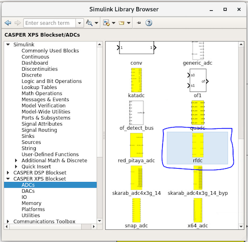

The `rfdc` yellow block automatically understands the target RFSoC part and
derives the corresponding tile architecture, subsequently rendering the correct
configuration view. For both architecutres the first half of the configuration view is
identical. This is the portion of the configuration that sets the enabled tiles,
sample rate, use of internal PLLs, inclusion of multi-tile synchronization
infrastructure, and displays tile clocking information.

For a quad-tile platform configure this section as:

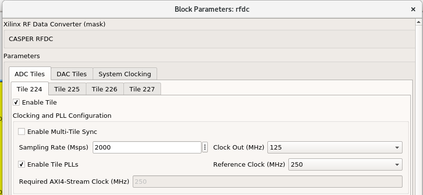

For a dual-tile platform configure this section as:

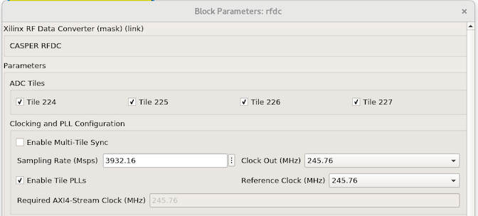

The `ADC Tile` checkboxes will enable or disable the corresponding tile in the
design. The tile numbers are in reference to their respective package placement
designation. Tile 224 through 227 maps to Tile 0 through 3, respectively. The
`rfdc` yellow block will redraw after applying changes when a tile is selected.
The sample rate for each architecture is automatically checked against the min.
and max. sample rates supported for the platform. The `Enable Tile PLLs`
checkbox will enable the internal PLL for all selected tiles. When this option
is enabled the `Reference Clock` drop down provides a list of frequencies
that can be used to drive the PLLs to generate the sample clock for the ADCs. If
`Enable Tile PLLs` is not checked, this will display the same value as the
`Sampling Rate` field indicating the part is expecting an extenral sample clock
to drive the ADCs.

A few behaviors to keep in mind:
  * The sample rate set is currently applied to all enabled tiles.

  * The `Required AXI4-Stream Clock` field indicates what the `User IP Clock
    Rate` of the platform yellow block must be set. There is a DRC within the
    toolflow that checks to make sure the values match. However, this does
    require that the CASPER designer make sure the two fields remain in sync.

  * The RFDC IP has an optional `adc_clk` output for each ADC tile. The
    `Clock Out` value indicates that selected frequency. Currently, this is not a
    selectable clock to drive user logic and is therefore not implemented. RFSoC
    platform blocks can be extended to target this clock.

  * Gen 3 RFSoCs introduce the ability of "clock forwarding" ([PG269 Ch.4,
    Clocking][pg269]) between tiles. The underlying implentation of the `rfdc`
    yellow block is aware of the capability as it is required to do
    DRC checks to validate the design. The framework therefore exists and needs to
    be built out. However, the ability to readily control this from the
    configuration view is not available yet. Instead, the platform configuration
    `.yaml` file currently keys off the `rfdc` for what to expect regarding how a
    tile will resolve receiving its sample clock.

The next configuration section in the GUI configures the operation behavior of
the ADCs within a tile. For a quad-tile platform configure this section as:

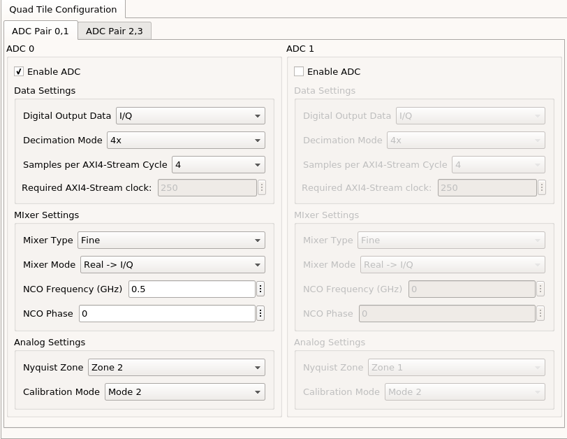

For a dual-tile platform configure this section as:
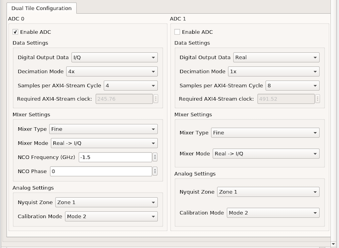

Currently, the selected configuration will be replicated across all enabled
tiles. Meaning, that for right now, different ADCs within a tile can have be
configured differently to the extent that they meet the same required AXI4
stream clock requirment, but it that same behavior will be applied ot all tiles
equally.

The `Enable ADC` checkbox enables the corresponding ADC. Under "Data Settings",
`Digital Output Data` selects the output format of ADC samples where `Real`
bypasses the mixing signal path and `I/Q` will use that mixer providing complex
basebanded samples. In this example we select `I/Q` as the output format using
the `Fine` mixer setting allowing for us to tune the `NCO` frequency. For more
information on the capabilities of both the coarse and fine mixer and NCO
examples see [PG269 Ch.4, RF-ADC Mixer with Numerical Controlled
Oscillator][pg269].

The `Decimation Mode` drop down displays the available decimation rates that can
be applied for the generation platform targeted. `Sample per AXI4-Stream Cycle`
indicate how many `16-bit` ADC words are output per clock cycle. The `Required
AXI4-Stream clock` field here displays the effective User IP clock that would be
required for the configuration of the decimator and number of samples per clock.
These fields are to match for all ADCs within a tile.

The `Nyquist Zone` setting selects either the first (odd, 0 <= f <= fs/2)  or
second (even, fs/2 <= f <= fs). In this example, for the quad-tile we target
`Zone 2` with an `NCO Frequency` of `0.5` and the dual-tile has `Zone 1` with an
`NCO Frequency` of `-1.5`.

With these configurations applied to the `rfdc` yellow block, both the quad- and
dual-tiles are outputting 4 adc words (64-bit) complex basebanded I/Q data
centered at 1500 MHz. In the case of the quad-tile design with a sample rate of
`2000 Msps` and decimation of `4x` the effective bandwidth spans from 1250 to
1750 MHz. For the dual-tile design the effective bandwidth spans approx. from
1008.5 MHz to 1990.5 MHz.

### Step 3: Update the platform yellow block
As mentioned above, when configuring the `rfdc` the yellow block reports the
required AXI4-Stream sample clock. This corresponds to the `User IP Clk Rate` of
the platform block. In this step that field for the platform yellow block would
be updated to match what the `rfdc` reports, along with the `RFPLL PL Clk`
frequency that will be generating the clock used for the user design.

It is possible that for this tutorial nothing is needed to be done here, but it
is a reminder that in general this will need to be done.

### Step 4: Place and configure the Snapshot blocks
Next we want to be able to capture the data the ADCs are producing.  The green
`bitfield_snapshot` block from the CASPER DSP Blockset library can be used to do
this.  Add a `bitfield_snapshot` block to the design, found in CASPER DSP
`Blockset->Scopes->bitfield_snapshot`.

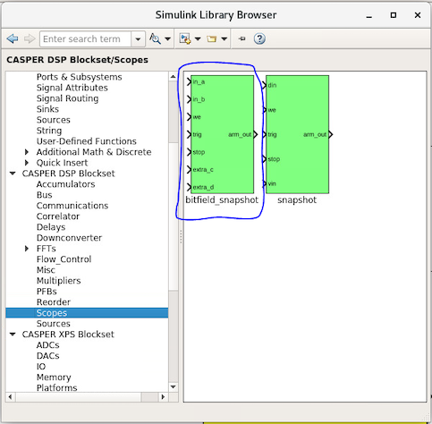

Configure the snapshot block as follows:

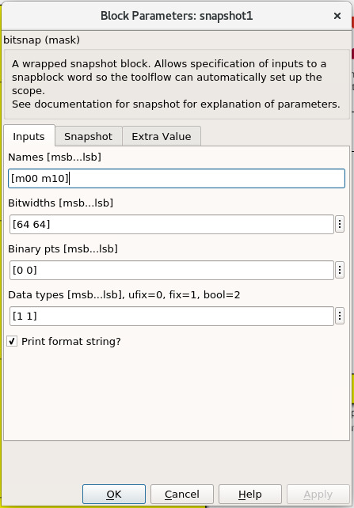
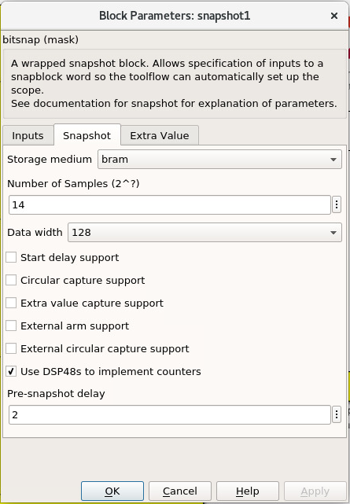
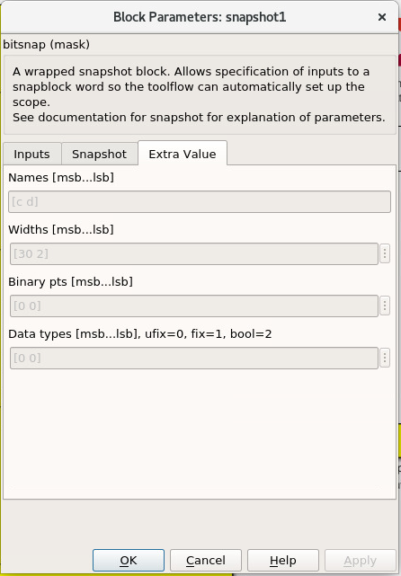

Now we hook up the `bitfield_snapshot` block to our `rfdc` block. In its current
configuration, the snapshot block takes two data inputs, a write enable, and a
trigger. For both quad- and dual-tile platforms, wire the first two data
output streams from the `rfdc` to the two `in_*` ports of the snapshot block.

For the quad-tile platforms this is `m00_axis_tdata` and `m10_axis_tdata`. The
first digit in the signal name corresponds to the tile index, `0` for the first,
`1` for the second, etc. The second digit in the signal name corresponds to the adc
index, in this case `0` is the first ADC input on each tile. In both `Real` and
`I/Q` digital output modes quad-tile platforms output all data bits on the same
bus. So in this example, with `4` samples per clock this results in `2` complex
samples ordered `{I1, Q1, I0, Q0}`. Where in each ADC word, the most recent
sample is at the MSB of the word. With the snapshot block configured to capture
`2^14` `128-bit` words this is a total of `2^15` samples on both ports.

For dual-tile platforms in `I/Q` digital output modes, the inphase and
quadarature data are produced from different ports. In this mode the first digit
of the signal name corresponds ot the tile index just as in the quad-tile. But
the second digit is `0` for inphase and `1` for quadrature data. In this example
then, with `4` sample per clock this is `4` complex samples with the two complex
components coming different ports, `m00_axis_tdata` for inphase data ordered
`{I3, I2, I1, I0}` and  `m01_axis_tdata` with quadrature data ordered
`{Q3, Q2, Q1, Q0}`. When configured in `Real` digital output mode the second
digit is `0` for the first ADC and `2` for the second. With the snapshot block
configured to capture `2^14` `128-bit` words this is a total of `2^16` samples
for the one port.

 Next, we're just going to leave write enable high, so add a blue Xilinx
constant block (`Xilinx Blockset->Basic Elements->Constant`), connect it to the
snapshot `we` port, and configure it as follows:

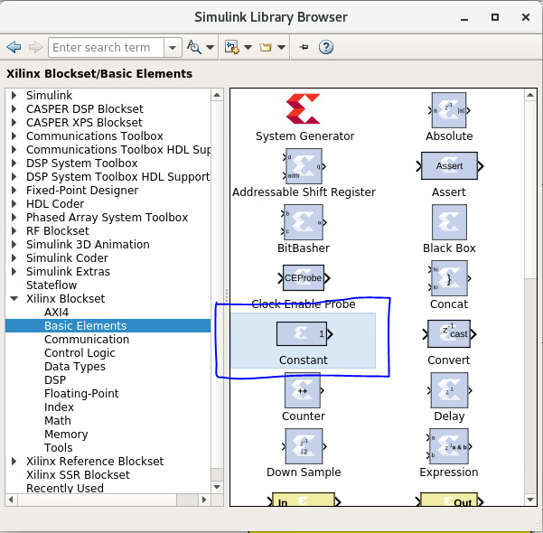
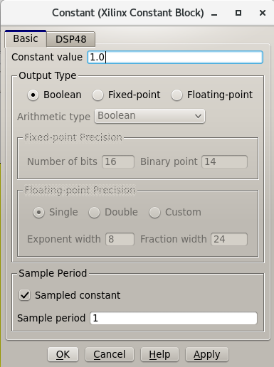

A blue Xilinx block is used here instead of a white simulink block because we
want the constant `1` to exist in the synthesized hardware design.

Lastly, we want to be able to trigger the snapshot block on command in software.
To do this, we will use a yellow `software_register` and a green `edge_detect`
block (`CASPER DSP Blockset->Misc->edge_detect`).

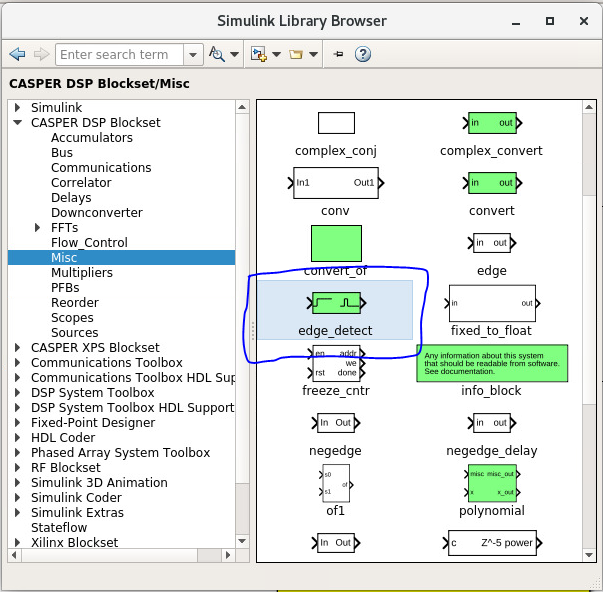


Set the `I/O` direction of the software register to `From Software`, change the
`Bitfield names` to `[start]`, set `Bitfield widths` to `1` and `Bitfield types`
to `2`. Connect this blocks output to the input of the edge detect block. Rename
the register to `snapshot_ctrl`. This is the name for the register that is
visible in software. Remember this name for later should you name it differently.
Connect the output of the edge detect block to the trigger port on the snapshot
block.  Now when we write a `1` to the software register, it will be converted
into a pulse to trigger the snapshot block.

### Step 5: Validate the design

The design is now complete! For a quad-tile platform it should have turned out like:


And this for dual-tile platforms:


You can connect some simulink constant blocks to get rid of simulink unconnected
port warnings, or leave them if they do not bother your. Validate the design by
running the simulation. In this case, there's nothing to see in the simulation,
but can press `ctrl+d` to only update and validate the diagrams connections and
that port widths and data types are consistent. Make sure to save!

### Step 6: Build!
As explained in [tutorial 2](./tut_platform.md), all you have to do to
build the design is run the `jasper` command in the MATLAB command window,
assuming your environment was set up correctly and you started MATLAB by using
the `startsg` command. The toolflow will take over from there and eventually
produce an `.fpg` file. When running this example, depending on your build
machine hardware synthesis could take from 15-30 minutes.

As briefly foreshadowed in the [first tutorial](./tut_platform.md#compiling) the
toolflow will run one extra step that previous users may now notice. In this
step the software platform design is being generated building software products
needed for the software drivers that interact with IP. In the case of the
previous tutorial there was no IP with a corresponding driver (other than the
underlying Zynq processor). However, here we are using the `rfdc` that has a
fully configurable software component that we want to communicate with in
software. The resulting output at this step is the `.dtbo` or `device tree
binary overlay` which is a binary representation of the device tree that is
is dynamically updated at runtime in software when the new bitstream is
programmed.

Note: For the `RFDC` `casperfpga` object and corresponding software driver to
function correctly this `.dtbo` must be created and when programming the board
must reside in the same level with the same name as the `.fpg` (but using the
`.dtbo` extension) when using `casperfpga for programming.

Make sure then that the final bit of output of the toolflow build now reports
`Created tut_rfdc-YYYY-MM-dd-hh-mm.dtbo`.

## Testing the Design
Before starting this segment power-cycle the board. This is to force a hard
reset of the on-board rfpll clocking network. After the board has rebooted,
start IPython and establish a connection to the board using `casperfpga` in the
normal way.

```bash
$ ipython
```

```python
In [1]: import casperfpga

In [2]: zcu216 = casperfpga.CasperFpga('192.168.2.101')

In [3]: zcu216.upload_to_ram_and_program('/path/to/tut_rfdc.fpg')
```

This is our first design with the RFDC in it. When the RFDC is part of a CASPER
design the toolflow automatically includes meta information to indicate to
`casperfpga` that it should instantiate an `RFDC` object that we can use to
manipulate and interact with the software driver components of the RFDC.

```python
In [4]: zcu216.adcs
Out[4]: ['rfdc']
```

We can create a reference to that `RFDC` object and begin to exercise some of
the software components included with the that object.

```python
In [5]: rfdc_zcu216 = zcu216.adcs['rfdc']
```

We first initialize the driver; a doc string is provided for all functions and
so we can always use IPythons help `?` mechanism to get more information of a
methods signature and a brief description of its functionality.

```python
In [6]: rfdc_zcu216.init?
Signature: rfdc.init(lmk_file=None, lmx_file=None, upload=False)
Docstring:
Initialize the rfdc driver, optionally program rfplls if file is present.

Args:
  lmk_file (string, optional): lmk tics hexdump (.txt) register file name
  lmx_file (string, optional): lmx tics hexdump (.txt) register file name
  upload (bool, optional): inidicate that the configuration files are local to the client and
    should be uploaded to the remote, will overwrite if exists on remote filesystem

Returns:
  True if completed successfully

Raises:
  KatcpRequestFail if KatcpTransport encounters an error
```

The `init()` method allows for optional programming of the on-board PLLs but, to
demonstrate some more of the `casperfpga` `RFDC` object functionality run
`init()` without any arguments. This simply initializes the underlying software
driver with configuration parameters for future use.

```python
In [7]: rfdc_zcu216.init()
Out[7]: True
```

We can query the status of the rfdc using `status()`

```python
In [8]: rfdc_zcu216.status()
ADC0: Enabled 1, State: 6 PLL: 0
ADC1: Enabled 1, State: 6 PLL: 0
ADC2: Enabled 1, State: 6 PLL: 0
ADC3: Enabled 1, State: 6 PLL: 0
Out[8]: True
```

the `status()` method displys the enabled ADCs, current "power-up sequence"
state information of the tile and the state of the tile PLL (locked, or not).
This information can be helpful as a first glance in debugging the RFDC should
the behavior not match the expected. The mapping of the `State` value to its
significance is found in [PG269 Ch.4, Power-on Sequence][pg269]. In this case
`6` indicates that the tile is waiting on a valid sample clock.

Note: `RFSoC2x2` only provides a sample clock to tile 0 and 1 and as it uses
a Gen 1 part that does not have the ability to forward sample clocks tiles 1 and
3 for that platform will always halt at `State: 6`.

As the board was power-cycled before programming any configuration of the
on-board PLLs was reset. To advance the power-on sequence state machine to
completion we need to program the PLLs. The `RFDC` object incorporates a few
helper methods to program the PLLs and manage the available register files:
`progpll()`, `show_clk_files()`, `upload_clk_file()`, `del_clk_file()`.

First take a look at `progpll()`:

```python
In [9]: rfdc_zcu216.progpll?
Signature: rfdc.progpll(plltype, fpath=None, upload=False, port=None)
Docstring:
Program target RFPLL named by `plltype` with tics hexdump (.txt) register file named by
`fpath`. Optionally upload the register file to the remote

Args:
  plltype (string): options are 'lmk' or 'lmx'
  fpath (string, optional): local path to a tics hexdump register file, or the name of an
    available remote tics register file, default is that tcpboprphserver will look for a file
    called `rfpll.txt`
  upload (bool): inidicate that the configuration file is local to the client and
    should be uploaded to the remote, this will overwrite any clock file on the remote
    by the same name
  port (int, optional): port to use for upload, default to `None` using a random port.

Returns:
  True if completes successfuly

Raises:
  KatcpRequestFail if KatcpTransport encounters an error
```

To program a PLL we provide the target PLL type and the name of the
configuration file to use. Optionally, we can upload a file for later use. With
upload set to `False` this indicates that the target file already exists on the
remote processor for PLL programming. As the current CASPER supported RFSoC
platforms use various TI LMX/LMX chips as part of the RFPLL clocking
infrastructure the `progpll()` method is able to parse any hexdump export of a
TI TICS Pro file (the .txt formatted file).

`show_clk_files()` will return a list of the available clock files that are
available for reuse; The distributed CASPER image for each platform provides the
clock files needed for this tutorial. We use those clock files with `progpll()`
to initialize the sample clock and finish the RFDC power-on sequence state
machine. Follow the code relevant for your selected target

```python
# clock files for different platforms

# ZCU216
In [10]: c = rfdc_zcu216.show_clk_files()

In [11]: c
Out[11]: ['250M_PL_125M_SYSREF_10M.txt']

In [12]: rfdc_zcu216.progpll('lmk', c[0])
Out[12]: True

# ZCU111
In [13]: c = rfdc_zcu111.show_clk_files()

In [14]: c
Out[14]: 
['122M88_PL_122M88_SYSREF_7M68_clk5_12M8.txt',
 'LMX_REF_122M88_OUT_245M76.txt']

In [15]: rfdc_zcu111.progpll('lmk', c[0])
Out[15]: True

In [16]: rfdc_zcu111.progpll('lmx', c[1])
Out[16]: True

# RFSoC 2x2
In [17]: c = rfdc_2x2.show_clk_files()

In [18]: c
Out[18]: 
['rfsoc2x2_lmk04832_12M288_PL_15M36_OUT_122M88.txt',
 'LMX_REF_122M88_OUT_245M76.txt']

In [19]: rfdc_2x2.progpll('lmk', c[0])
Out[19]: True

In [20]: rfdc_2x2.progpll('lmx', c[1])
Out[20]: True

# ZRF16
In [21]: c = rfdc_zrf16.show_clk_files()

In [22]: c
Out[22]:
['zrf16_LMK_CLK1REF_10M_LMXREF_50M_PL_OUT_50M_nosysref.txt',
 'zrf16_LMX_REF_50M_OUT_250M.txt']

In [23]: rfdc_zrf16.progpll('lmk', c[0])
Out[23]: True

In [24]: rfdc_zrf16.progpll('lmx', c[1])
Out[24]: True
```

With the clocks programmed we can now check the status of the `rfdc` and it
should now report that the tiles have locked their internall PLLs and have
completed the power-on sequence by displaying a state value of `15`.

```python
In [25]: rfdc_zcu216.status()
ADC0: Enabled 1, State: 15 PLL: 1
ADC1: Enabled 1, State: 15 PLL: 1
ADC2: Enabled 1, State: 15 PLL: 1
ADC3: Enabled 1, State: 15 PLL: 1
Out[25]: True
```

The remaning methods, `upload_clk_file()` and `del_clk_file()` are available
methods and used to manage the clock files available for programming.

The ADC is now sampling and we can begin to interface with our design to copy
back samples from the BRAM and take a look at them. The following are a few
helper methods that can be used for this example.

```python
def toSigned(v, bits):
  mask = 1 << (bits-1)
  return -(v & mask) | (v & (mask-1))

def capture_snapshots(fpga):
  snapshot_data = {}
  for ss in fpga.snapshots:
    ss.arm()

  fpga.registers.snapshot_ctrl.write(start='pulse')
  for ss in fpga.snapshots:
    dat = ss.read(arm=False)['data']

    for (k,v) in dat.items():
      snapshot_data[k] = v

  return snapshot_data

def deinterleave_dual(I, Q, bits=16):
  x = []
  for (i, q) in zip(I, Q):
    I0 = toSigned(0xffff & (i >> 0) , bits)
    I1 = toSigned(0xffff & (i >> 16), bits)
    I2 = toSigned(0xffff & (i >> 32), bits)
    I3 = toSigned(0xffff & (i >> 48), bits)
 
    Q0 = toSigned(0xffff & (q >> 0) , bits)
    Q1 = toSigned(0xffff & (q >> 16), bits)
    Q2 = toSigned(0xffff & (q >> 32), bits)
    Q3 = toSigned(0xffff & (q >> 48), bits)
 
    x0 = I0 + 1j*Q0
    x1 = I1 + 1j*Q1
    x2 = I2 + 1j*Q2
    x3 = I3 + 1j*Q3
 
    x.append(x0)
    x.append(x1)
    x.append(x2)
    x.append(x3)
 
  return x

def deinterleave_quad(samples, bits=16):
  x = []
  for s in samples:
    I0 = toSigned(0xffff & (s >> 0) , bits)
    Q0 = toSigned(0xffff & (s >> 16), bits)
    I1 = toSigned(0xffff & (s >> 32), bits)
    Q1 = toSigned(0xffff & (s >> 48), bits)
 
    x0 = I0 + 1j*Q0
    x1 = I1 + 1j*Q1
 
    x.append(x0)
    x.append(x1)
 
  return x
```

The `capture_snapshot()` method help extract data from the snapshot block by
iterating over the snapshot blocks in this design (only one right now) and
arming them to look for a pulse event and then toggles the software register
`snapshot_ctrl` to trigger the capture event. If in the design process this
software register name is different than shown here that would need to be
updated in this method. Same with the `bitfield` name of the software register.
Here it was called `start` when configuring software register yellow block.

Using these methods to capture data for a quad- or dual-tile platform and then
plotting the first few time samples for the real part of the signal would look
something like the following (make sure to replace `fpga` with your `casperfpga`
object instance):

```python
import numpy as np
import matplotlib.pyplot as plt

# quad-tile
def qt_capture(fpga):
  adc_dat = capture_snapshots(fpga)
  m00 = adc_dat['m00']
  m10 = adc_dat['m10']
  x_m00 = np.array(deinterleave_quad(m00, 16))
  x_m10 = np.array(deinterleave_quad(m10, 16))
  return (x_m00, x_m10)

N = 100
n = np.arange(0,N)
x_m00, xm10 = qt_capture(fpga)
fig, ax = plt.subplots(2,1, sharey='row')
ax[0].plot(n, np.real(x_m00[0:N])); ax[0].set_title('Tile 0 Ch.0'); ax[0].grid(True);
ax[1].plot(n, np.real(x_m10[0:N])); ax[1].set_title('Tile 1 Ch.0'); ax[1].grid(True); plt.show();

# dual-tile
def dt_capture(fpga):
  adc_dat = capture_snapshots(fpga)
  I = adc_dat['m00']
  Q = adc_dat['m01']
  x = np.array(deinterleave_dual(I, Q, 16))
  return x

N = 100
n = np.arange(0, N)
x = dt_capture(fpga)
plt.plot(np.real(x[0:N])); plt.title('Tile 0 Ch.0'); plt.grid(); plt.show();
```

# Conclusion
In this tutorial it was shown how to configure and use the `rfdc` yellow block
for both dual- and quad-tile RFSoC platforms. An example design was built for
both architectures sampling an RF signal centered in a band at 1500 MHz. It was
shown how to use `casperfpga` to access the `RFDC` object, initialize the
driver, and use some of the methods provided to program the onboard PLLs. The
example design allowed us to capture samples into a BRAM and read those back
into software for more analysis.

[pg269]: https://www.xilinx.com/support/documentation/ip_documentation/usp_rf_data_converter/v2_4/pg269-rf-data-converter.pdf

