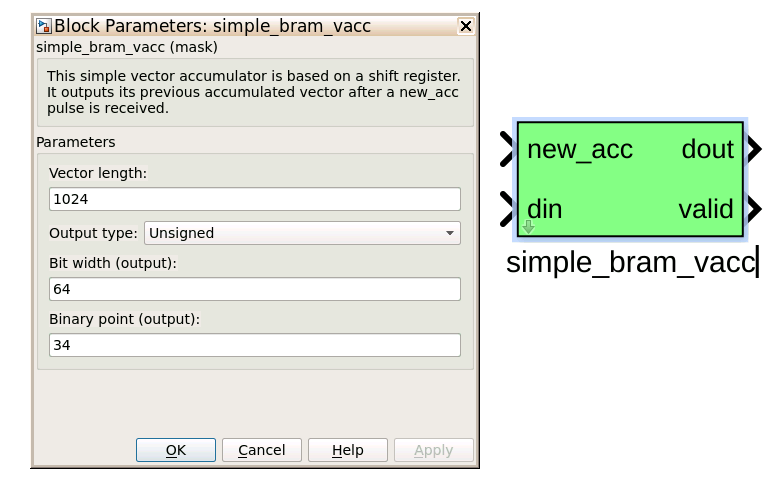

Tutorial 3: Example Spectrometer
==================================

Introduction
-------------
In this tutorial will go over building a simple spectrometer using CASPER DSP and hardware yellow blocks for RFSoC.

This tutorial assumes that the casper-ite is familiar wth the :doc:`RFDC Interface <./tut_rfdc>` tutorial. This also assumes that the CASPER development environment is setup for RFSoC as described in the :doc:`Getting Started <./tut_getting_started>` tutorial. A brief walkthourgh of example of the spectrometer design, software control of the spectrometer will be given in this tutorial. However, it is also benefiical to become learn how to interact with the FPGA using ``casperfpga`` as demonstrated in the :doc:`simulink platform introduction <./tut_platform>`.

A spectrometer is an analysis filterbank that takes for its input a time domain singal and transforms it to a frequency domain representation. In digital systems, this is typically achieved by utilising the FFT (Fast Fourier Transform) algorithm. However, with a modest increase in compute, better spectral bin performance can ber improved by using a Polyphase Filter Bank (PFB) based approach.

When designing a spectrometer for astronomical applications, it is important to consider the target science case. For example, pulsar timing searches typically require a spectrometer that can dump spectra on short timescales. This allows the rate of change of the spectral content to be finely observed. In contrast, a deep field HI survey will accumulate multiple spectra to increase the signal to noise ratio above a detecable threshold. It is important to note that “bigger isn't always better” here; the higher your spectral and time resolution are, the more data your computer (and scientist on the other end) will have to deal with. For now however, we skip the target science case and rather look to more familiarize ourselves with an example spectrometer design.

Setup
-----
This tutorial comes with a completed simulink model file to configured for RFSoC, that file is found `here <https://github.com/casper-astro/tutorials_devel/tree/master/rfsoc/tut_spec>`_.

Spectrometer Basics
-------------------

When designing a spectrometer there are a few main parameters of note:

- **Bandwidth**: The width of your frequency spectrum, in Hz. This depends on the sampling rate; for complex sampled data this is equivalent to:

.. image:: ../../_static/img/tut_spec/bandwidtheq1.png

In contrast, for real or Nyquist sampled data the rate is half this:

.. image:: ../../_static/img/tut_spec/bandwidtheq2.png

as two samples are required to reconstruct a given waveform.

- **Frequency resolution**: The frequency resolution of a spectrometer, Δf, is given by:

.. image:: ../../_static/img/tut_spec/freq_eq.png

and is the width of each frequency bin. This parameter is a measure of how precise you can measure a frequency, or rather its frequency resolution.

- **Time resolution**: Time resolution is simply the spectral dump rate of your instrument. We generally accumulate multiple spectra to average out noise; the more accumulations we do, the lower the time resolution. For looking at short timescale events, such as pulsar bursts, higher time resolution is necessary; conversely, if we want to look at a weak HI signal, a long accumulation time is required, so time resolution is less important.

Simulink / CASPER Toolflow
--------------------------

Simulink Design Overview
^^^^^^^^^^^^^^^^^^^^^^^^^^

If you're reading this, hopefully you've managed to find the model files. Open the model file and have a look around to start to get a vague idea of what's happening. The best way to understand fully is to follow the dataflow arrows starting from the RFDC. Go through what each block is doing and make sure you know why each step is done. To help you through, there's some “blockumentation” in the appendix, which should (hopefully) answer all questions you may have. A brief rundown of some of the details are as follows before you get down and dirty:

- The all-important Xilinx token is placed to allow System Generator to be called to compile the design.

- In the platform yellow block, the hardware Platform is set to the target RFSoC platform (e.g., “ZCU216:xczu49dr”) and the User IP clock rate is specified as 250MHz with the RFPLL clock rate at 125MHz.

- The input signal is digitised by the RFDC, resulting in four parallel time samples of 16-bits each clock cycle. The ADC samples at 2000MHz with a  decimation factor of 2x. This gives a 500MHz nyquist sampled spectrum. The output range is a signed number in the range -1 to +1 (i.e. 15 bits after the decimal point). This is expressed as ``fix_16_0``.

- The four parallel time samples pass through the ``pfb_fir_real`` and ``fft_wideband_real blocks``, which together constitute a polyphase filter bank. We've selected 2\ :sup:`12` = 4096 points, so we'll have a  2\ :sup:`11` = 2048 channel filter bank.

- You may notice Xilinx delay blocks dotted all over the design. It's common practice to add these into the design as it makes it easier to fit the design into the logic of the FPGA. It consumes more resources, but eases signal timing-induced placement restrictions.

- The real and imaginary (sine and cosine value) components of the FFT are plugged into power blocks, to convert from complex values to real power values by squaring. They are also scaled by a gain factor before being quantised.

- The requantized signals then enter the vector accumulators, vacc0 and vacc1, which are ``simple_bram_vacc`` 64-bit vector accumulators. Accumulation length is controlled by the ``acc_cntrl`` block.

- The accumulated signal is then fed into BRAM yellow blocks.

Contiune further to familiarize yourself with the model file. Clicking around, opening configuration windows and refer to the blockumentation as needed.

RFDC
^^^^^

The first step to creating a frequency spectrum is to digitize the signal. This is done with an ADC (analog-to-digital converter). For RFSoC, the ADC is represneted by the RFDC (RF Data Converter) yellow block. Work through the :doc:`RFDC tutorial <./tut_rfdc>` if you not already familiar with this block.

The ADC block converts analog inputs to digital outputs. Every clock cycle, the inputs are sampled and digitized to a 14-bit 2's complement binary number representation. These samples are packed and MSB aligned into 16-bit words and persented on the output interfance. This means we can represent numbers from -32768 through to 32767, including the number 0. Simulink represents such numbers as a ``fix_32_0`` data type. For more information about the output representation of the data of the RFDC refer to `RFDC product guide`_.

ADCs often internally bias themselves to halfway between 0 and -1. This means that you'd typically see the output of an ADC toggling between zero and -1 when there's no input. It also means that unless otherwise calibrated, an ADC will have a negative DC offset.

**INPUTS**

Four input ports for control data, static noise is attached in our implimentation.

**OUTPUTS**

Four 16-bit binary numbers enabled by checking all four ADC tile boxes.

.. image:: ../../_static/img/rfsoc/tut_spec/rfdc_general_config.PNG

The image below visualizes the quad tile input to output datapath through the RFDC.

.. image:: ../../_static/img/rfsoc/tut_spec/rfdc_general_config.PNG

The rest of the configuration is implimented in the following image. The sample rate specificed above is 2 Gsps, and the decimation factor of two indicates our max bandwidth will be around 500MHz respective to the Nyquist sampling theorem for real time samples.

.. image:: ../../_static/img/rfsoc/tut_spec/rfdc_quad_config.PNG

With the RFDC block configured to sample and digitize incoming power data, it is time to move on to the next part of the data path.

`pfb_fir_real <https://casper.berkeley.edu/wiki/Pfb_fir_real>`_
^^^^^^^^^^^^^^^^^^^^^^^^^^^^^^^^^^^^^^^^^^^^^^^^^^^^^^^^^^^^^^^^

.. image:: ../../_static/img/tut_spec/pfb_fir_real_2012.png

There are two main blocks required for a polyphase filter bank. The first is the pfb_fir_real block, which divides the signal into parallel "taps" then applies finite impulse response filters (FIR). The output of this block is still a time-domain signal.  When combined with the FFT_wideband_real block, this constitutes a polyphase filterbank.

**INPUTS/OUTPUTS**

+----------------+-----------+------------------------------------------------------------+
| Port           | Data Type | Description                                                |
+================+===========+============================================================+
| sync           | bool      | A sync pulse should be connected here.                     |
+----------------+-----------+------------------------------------------------------------+
| pol1_in1/2/3/4 | inherited | The (real) time-domain stream(s).                          |
+----------------+-----------+------------------------------------------------------------+

As the ADC has four parallel time sampled outputs: i0, i1, i2 and i3, we need four parallel inputs for this PFB implementation.

**PARAMETERS**

+---------------------------------+-----------------------------------------------------------------------------+
| Parameter                       | Description                                                                 |
+=================================+=============================================================================+
|  Size of PFB                    | | How many points the FFT will have. The number of frequency channels will  |
|                                 | | be half this. We've selected 2^12 = 4096 points, so we'll have a          |
|                                 | | 2^11 = 2048 channel filter bank.                                          |
+---------------------------------+-----------------------------------------------------------------------------+
|  Number of taps                 | | The number of taps in the PFB FIR filter. Each tap uses 2 real multiplier |
|                                 | | cores and requires buffering the real and imaginary streams for 2\*PFBSize|
|                                 | | samples. Generally, more taps means less inter-channel spectral leakage,  |
|                                 | | but more logic is used. There are diminishing returns after about 8 taps  |
|                                 | | or so.                                                                    |
+---------------------------------+-----------------------------------------------------------------------------+
|  Windowing function             | | Which windowing function to use (this allows trading passband ripple for  |
|                                 | | steepness of rolloff, etc). Hamming is the default and best for most      |
|                                 | | purposes.                                                                 |
+---------------------------------+-----------------------------------------------------------------------------+
| | Number of Simultaneous        | | The number of parallel time samples which are presented to the FFT core   |
| | Inputs                        | | each clock. The number of output ports are set to this same value. We have|
|                                 | | four inputs from the ADC, so set this to 2.                               |
+---------------------------------+-----------------------------------------------------------------------------+
|  Make biplex                    | | 0 (not making it biplex) is default. Double up the inputs to match with a |
|                                 | | biplex FFT.                                                               |
+---------------------------------+-----------------------------------------------------------------------------+
|  Input bitwidth                 | | The number of bits in each real and imaginary sample input to the PFB. The|
|                                 | | ADC outputs 16-bit data, so the input bitwidth should be set to 16 in our |
|                                 | | design.                                                                   |
+---------------------------------+-----------------------------------------------------------------------------+
|  Output bitwidth                | | The number of bits in each real and imaginary sample output from the PFB. |
|                                 | | This should match the bit width in the FFT that follows. 18 bits is       |
|                                 | | recommended as a minimum, but this is typically determined by the DSP     |
|                                 | | architecture of the FPGA.                                                 |
+---------------------------------+-----------------------------------------------------------------------------+
|  Coefficient bitwidth           | | The number of bits in each coefficient. This is usually chosen to be less |
|                                 | | than or equal to the input bit width.                                     |
+---------------------------------+-----------------------------------------------------------------------------+
|  Use dist mem for coeffients    | | Store the FIR coefficients in distributed memory (if = 1). Otherwise,     |
|                                 | | BRAMs are used to hold the coefficients. 0 (not using distributed memory) |
|                                 | | is default.                                                               |
+---------------------------------+-----------------------------------------------------------------------------+
|  Add/Mult/BRAM/Convert Latency  | | These values set the number of clock cycles taken by various processes in |
|                                 | | the filter. There's normally no reason to change this unless you're having|
|                                 | | troubles with design timing.                                              |
+---------------------------------+-----------------------------------------------------------------------------+
|  Quantization Behaviour         | | Specifies the rounding behaviour used at the end of each butterfly        |
|                                 | | computation to return to the number of bits specified above. Rounding is  |
|                                 | | strongly suggested to avoid artifacts.                                    |
+---------------------------------+-----------------------------------------------------------------------------+
|  Bin Width Scaling              | | PFBs give enhanced control over the width of frequency channels. By       |
|                                 | | adjusting this parameter, you can scale bins to be wider (for values > 1) |
|                                 | | or narrower (for values \< 1).                                            |
+---------------------------------+-----------------------------------------------------------------------------+
|  Multiplier specification       | | Specifies what type of resources are used by the various multiplications  |
|                                 | | required by the filter.                                                   |
+---------------------------------+-----------------------------------------------------------------------------+
|  Fold adders into DSPs          | | If this option is checked, adding operations will be combined into the    |
|                                 | | FPGAs DSP cores, which have both the multiplying and adding capabilities. |
+---------------------------------+-----------------------------------------------------------------------------+
|  Adder implementation           | | Adders not folded into DSPs can be implemented either using fabric        |
|                                 | | resources (i.e. registers and LUTs in slices) or using DSP cores. Here you|
|                                 | | get to choose which is used. Choosing a behavioural implementation will   |
|                                 | | allow the compiler to choose whichever implementation it thinks is best.  |
+---------------------------------+-----------------------------------------------------------------------------+
|  Share coeff. between           | | Where the pfb block is simultaneously processing more than one            |
|  | polarisations                | | polarization, you can save RAM by using the same set of coefficients for  |
|                                 | | each stream. This may, however, make the timing performance of your design|
|                                 | | worse.                                                                    |
+---------------------------------+-----------------------------------------------------------------------------+

`fft_wideband_real <https://casper.berkeley.edu/wiki/Fft_wideband_real>`_
^^^^^^^^^^^^^^^^^^^^^^^^^^^^^^^^^^^^^^^^^^^^^^^^^^^^^^^^^^^^^^^^^^^^^^^^^^^

.. image:: ../../_static/img/tut_spec/Fft_wideband_real_block_and_parameters.png

The ``fft_wideband_real`` block is the most important part of the design to understand. The cool green of the FFT block hides the complex and confusing FFT butterfly biplex algorithms that are under the hood. You do need to have a working knowledge of it though, so I recommend reading Chapter 8 and Chapter 12 of Smith's free online DSP guide at (http://www.dspguide.com/). Parts of the documentation below are taken from the \[\[Block_Documentation | block documentation\]\] by Aaron Parsons and Andrew Martens.

**INPUTS/OUTPUTS**

+--------+---------------------------------------------------------------------------------------------------------------+
| Port   | Description                                                                                                   |
+========+===============================================================================================================+
| sync   | Like many of the blocks, the FFT needs a heartbeat to keep it sync'd.                                         |
+--------+---------------------------------------------------------------------------------------------------------------+
| shift  | | Sets the shifting schedule through the FFT. Bit 0 specifies the behavior of stage 0, bit 1 of stage 1, and  |
|        | | so on. If a stage is set to shift (with bit = 1), then every sample is divided by 2 at the output of that   |
|        | | stage. In this design, we've set Shift to 2^(13 − 1) − 1, which will shift the data by 1 on every stage to  |
|        | | prevent overflows.                                                                                          |
+--------+---------------------------------------------------------------------------------------------------------------+
| in<#>  |                                                                                                               |
+--------+---------------------------------------------------------------------------------------------------------------+
| out<#> | | This real FFT produces two simultaneous outputs. Because it's a real FFT, the spectrum's left and right     |
|        | | halves are mirror images and so we don't bother to output the imaginary half (negative channel indices).    |
|        | | Thus, for a 1024-point FFT, you get 512 useful channels. That's why there are half the number of parallel   |
|        | | outputs (two complex output paths to four real input paths). Each of these parallel FFT outputs will produce|
|        | | sequential channels on every clock cycle. So, on the first clock cycle (after a sync pulse, which denotes   |
|        | | the start), you'll get frequency channel zero and frequency channel one. Each of those are complex numbers. |
|        | | Then, on the second clock cycle, you'll get frequency channels 2 and 3. These are followed by 4 and 5 etc.  |
+--------+---------------------------------------------------------------------------------------------------------------+

**PARAMETERS**

+------------------------------------------+-----------------------------------------------------------------------------+
| Parameter                                | Description                                                                 |
+==========================================+=============================================================================+
| Size of FFT                              | | How many points the FFT will have. The number of channels will be half    |
|                                          | | this. We've selected 2^12 = 4096 points, so we'll have a 2^11 = 2048      |
|                                          | | channel filter bank. This should match up with the ``pfb_fir`` block.     |
+------------------------------------------+-----------------------------------------------------------------------------+
| Input/output bitwidth                    | | The number of bits in each real and imaginary sample as they are carried  |
|                                          | | through the FFT. Each FFT stage will round numbers back down to this      |
|                                          | | number of bits after performing a butterfly computation. This has to match|
|                                          | | what the `pfb_fir` is throwing out. The default is 18 so this shouldn't   |
|                                          | | need to be changed.                                                       |
+------------------------------------------+-----------------------------------------------------------------------------+
| | Coefficient bitwidth                   | | The amount of bits for each coefficient. 18 is default.                   |
| | Number of simultaneous inputs          | | The number of parallel time samples which are presented to the FFT core   |
|                                          | | each clock. We have 2^2 = 4 parallel data streams, so this should be set  |
|                                          | | to 2.                                                                     |
+------------------------------------------+-----------------------------------------------------------------------------+
| Unscramble output                        | | Some reordering is required to make sure the frequency channels are output|
|                                          | | in canonical frequency order. If you're absolutely desperate to save as   |
|                                          | | much RAM and logic as possible you can disable this processing, but you'll|
|                                          | | have to make sure you account for the scrambling of the channels in your  |
|                                          | | downstream software. For now, because our design will comfortably fit on  |
|                                          | | the FPGA, leave the unscramble option checked.                            |
+------------------------------------------+-----------------------------------------------------------------------------+
| Overflow Behavior                        | | Indicates the behavior of the FFT core when the value of a sample exceeds |
|                                          | | what can be expressed in the specified bit width. Here we're going to use |
|                                          | | Wrap, since Saturate will not make overflow corruption better behaved.    |
+------------------------------------------+-----------------------------------------------------------------------------+
| Add Latency                              | Latency through adders in the FFT. Set this to 2.                           |
+------------------------------------------+-----------------------------------------------------------------------------+
| Mult Latency                             | Latency through multipliers in the FFT. Set this to 3.                      |
+------------------------------------------+-----------------------------------------------------------------------------+
| BRAM Latency                             | Latency through BRAM in the FFT. Set this to 2.                             |
+------------------------------------------+-----------------------------------------------------------------------------+
| Convert Latency                          | | Latency through blocks used to reduce bit widths after twiddle and        |
|                                          | | butterfly stages. Set this to 1.                                          |
+------------------------------------------+-----------------------------------------------------------------------------+
| Input Latency                            | | Here you can register your input data streams in case you run into timing |
|                                          | | issues. Leave this set to 0.                                              |
+------------------------------------------+-----------------------------------------------------------------------------+
| | Latency between biplexes and           | | Here you can add optional register stages between the two major processing|
| | ``fft_direct``                         | | blocks in the FFT. These can help a failing design meet timing. For this  |
|                                          | | tutorial, you should be able to compile the design with this parameter set|
|                                          | | to 0.                                                                     |
+------------------------------------------+-----------------------------------------------------------------------------+
| Architecture                             |                                                                             |
+------------------------------------------+-----------------------------------------------------------------------------+
| | Number of bits above which to store    | | Determines the threshold at which the twiddle coefficients in a stage are |
| | stage's coefficients in BRAM           | | stored in BRAM. Below this threshold distributed RAM is used. By changing |
|                                          | | this, you can bias your design to use more BRAM or more logic. We're going|
|                                          | | to set this to 8.                                                         |
+------------------------------------------+-----------------------------------------------------------------------------+
| | Number of bits above which to store    | | Determines the threshold at which the twiddle coeff. in a stage are stored|
| | stage's delays in BRAM                 | | in BRAM. Below this threshold distributed RAM is used. Set this to 9.     |
+------------------------------------------+-----------------------------------------------------------------------------+
| Multiplier Implementation                | | Determines how multipliers are implemented in the twiddle function at     |
|                                          | | each stage. Using behavioral HDL allows adders following the multiplier to|
|                                          | | be folded into the DSP48Es. Other options choose multiplier cores which   |
|                                          | | allows quicker compile time. You can enter an array of values allowing    |
|                                          | | exact specification of how multipliers are implemented at each stage.     |
|                                          | | Set this to 1, to use embedded multipliers for all FFT stages.            |
+------------------------------------------+-----------------------------------------------------------------------------+
| Hardcode shift schedule                  | | If you wish to save logic, at the expense of being able to dynamically    |
|                                          | | specify your shifting regime using the block's "shift" input, you can     |
|                                          | | check this box. Leave it unchecked for this tutorial.                     |
+------------------------------------------+-----------------------------------------------------------------------------+
| Use DSP48's for adders                   | | The butterfly operation at each stage consists of two adders and two      |
|                                          | | subtracters that can be implemented using DSP48 units instead of logic.   |
|                                          | | Leave this unchecked.                                                     |
+------------------------------------------+-----------------------------------------------------------------------------+

`Power <https://casper.berkeley.edu/wiki/Power>`_
^^^^^^^^^^^^^^^^^^^^^^^^^^^^^^^^^^^^^^^^^^^^^^^^^^^

.. image:: ../../_static/img/tut_spec/power_4.4.png

The power block computes the power of a complex number. The power block typically has a latency of 5 and will compute the power of its input by taking the sum of the squares of its real and imaginary components. The power block is written by Aaron Parsons and online documentation is by Ben Blackman. In our design, there are two power blocks, which compute the power of the odd and even outputs of the FFT. The output of the block is 36.34 bits.

**INPUTS/OUTPUTS**

+-------+-----------+------------------------+--------------------------------------------------------------------------+
| Port  | Direction | Data Type              | Description                                                              |
+=======+===========+========================+==========================================================================+
| c     | IN        | 2*BitWidth Fixed point | A complex number whose higher BitWidth bits are its real part and lower  |
|       |           |                        | BitWidth bits are its imaginary part.                                    |
+-------+-----------+------------------------+--------------------------------------------------------------------------+
| power | OUT       | UFix\_(2*BitWidth)\_(2\*BitWidth-1) | The computed power of the input complex number.             |
+-------+-----------+------------------------+--------------------------------------------------------------------------+

**PARAMETERS**

+-----------+----------+----------------------------------+
| Parameter | Variable | Description                      |
+===========+==========+==================================+
| Bit Width | BitWidth | The number of bits in its input. |
+-----------+----------+----------------------------------+

``simple_bram_vacc``
^^^^^^^^^^^^^^^^^^^^^^

The ``simple_bram_vacc`` block is used in this design for vector accumulation. Vector growth is approximately 28 bits each second. As the name suggests, the ``simple_bram_vacc`` is simpler so it is fine for this demo spectrometer. The FFT block outputs 2048 frequqncy bin values in total. We have four of these bram vacc's in the design, splitting the spectrum up into 4 equal segments. The vector length is thus set to 512 on each.

**PARAMETERS**

+-----------------------+--------------------------------------------------------------------------------------------------+
| Parameter             | Description                                                                                      |
+=======================+==================================================================================================+
| Vector length         | | The length of the input/output vector. The FFT block produces two streams of 1024 length       |
|                       | | (odd and even values), so we set this to 1024.                                                 |
+-----------------------+--------------------------------------------------------------------------------------------------+
| no. output bits       | | As there is bit growth due to accumulation, we need to set this higher than the input bits.    |
|                       | | The input is 6.5 from the quant0 block, we have set this to 32 bits. Note: We could set this to|
|                       | | 64 bits and skip the quant block.                                                              |
+-----------------------+--------------------------------------------------------------------------------------------------+
| Binary point (output) | | Since we are accumulating 6.5 values there should be 5 bits below the binary point of the      |
|                       | | output, so set this to 5.                                                                      |
+-----------------------+--------------------------------------------------------------------------------------------------+

**INPUTS/OUTPUTS**

+----------+---------------------------------------------------------------------------------------------------------------+
| Port     | Description                                                                                                   |
+==========+===============================================================================================================+
| new_acc  | | A boolean pulse should be sent to this port to signal a new accumulation. We can't directly use the sync    |
|          | | pulse, otherwise this would reset after each spectrum. So, Jason has connected this to acc_cntrl, a block   |
|          | | which allows us to set the accumulation period.                                                             |
+----------+---------------------------------------------------------------------------------------------------------------+
| din/dout | Data input and output. The output depends on the no. output bits parameter.                                   |
+----------+---------------------------------------------------------------------------------------------------------------+
| Valid    | | The output of this block will only be valid when it has finished accumulating (signalled by a boolean pulse |
|          | | sent to new_acc). This will output a boolean 1 while the vector is being output, and 0 otherwise.           |
+----------+---------------------------------------------------------------------------------------------------------------+

Shared BRAMs
^^^^^^^^^^^^^^^

.. image:: ../../_static/img/tut_spec/shared_bram_2012.png

The final blocks are shared the BRAMs, which we will read out the values of using the the python script.

**PARAMETERS**

+-------------------+------------------------------------------------------------------------------------------------------+
| Parameter         | Description                                                                                          |
+===================+======================================================================================================+
| Output data type  | Unsigned                                                                                             |
+-------------------+------------------------------------------------------------------------------------------------------+
| Address width     | | 2^(Address width) is the number of 32 bit words of the implemented BRAM. In the this design it must|
|                   | | be set to store at least the number of output bins each shared bram will receive. Timing issues can|
|                   | | be a problem with bitwidths higher than 13.                                                        | 
+-------------------+------------------------------------------------------------------------------------------------------+
| Data Width        | | The Shared BRAM may have a data input/output width of either 8,16,32,64, or 128 bits. Since the    |
|                   | | vector accumulator feeds the shared bram data port with 32 bit wide values, this should be set to  |
|                   | | 32 for this tutorial.                                                                              |
+-------------------+------------------------------------------------------------------------------------------------------+
| Data binary point | | The binary point should be set to zero. The data going to the processor will be converted to a     |
|                   | | value with this binary point and the output data type.                                             |
+-------------------+------------------------------------------------------------------------------------------------------+
| Initial values    | This is a test vector for simulation only. We can leave it as is.                                    |
+-------------------+------------------------------------------------------------------------------------------------------+
| Sample rate       | Set this to 1.                                                                                       |
+-------------------+------------------------------------------------------------------------------------------------------+

**INPUTS/OUTPUTS**

+----------+-------------------------------------------------------------------------------------------------------------+
| Port     | Description                                                                                                 |
+==========+=============================================================================================================+
| Addr     | Address to be written to with the value of data_in, on that clock, if write enable is high.                 |
+----------+-------------------------------------------------------------------------------------------------------------+
| data_in  | The data input.                                                                                             |
+----------+-------------------------------------------------------------------------------------------------------------+
| we       | The write enable port.                                                                                      |
+----------+-------------------------------------------------------------------------------------------------------------+
| data_out | | Writing the data to a register. This is simply terminated in the design, as the data has finally reached  |
|          | | its final form and destination.                                                                           |
+----------+-------------------------------------------------------------------------------------------------------------+

`Software Registers <https://casper.berkeley.edu/wiki/Software_register>`_
^^^^^^^^^^^^^^^^^^^^^^^^^^^^^^^^^^^^^^^^^^^^^^^^^^^^^^^^^^^^^^^^^^^^^^^^^^^^

There are a few `control registers <https://casper.berkeley.edu/wiki/Software_register>`_, led GPIOs, and Snapshot blocks within the design:

- **cnt_rst**: Counter reset control. Pulse this high to reset all counters back to zero.
- **acc_len**: Sets the accumulation length. See python script help string for usage.
- **sync_cnt**: Sync pulse counter. Counts the number of sync pulses issued. Can be used to figure out board uptime and confirm that your design is being clocked correctly.
- **acc_cnt**: Accumulation counter. Keeps track of how many accumulations have been done.
- **led0_sync**: The led0_sync light flashes each time a sync pulse is generated.
- **led1_new_acc**: This lights up led1 each time a new accumulation is triggered.
- **led2_acc_clip**: This lights up led2 whenever clipping is detected.

If you've made it to here, congratulations. Take a break and then come back for part two, which explains the second part of the tutorial – actually getting the spectrometer running, and having a look at some spectra.

Configuration and Control
--------------------------

Hardware Configuration
^^^^^^^^^^^^^^^^^^^^^^^^^^^

Make sure the RFSoC platform board is running the proper linux image and clocks are running (e.g., ZCU216 requires clocking module board be installed). You will also test signals at the inputs of the RFSoC.

The predesigned ``.slx`` files are found `here <https://github.com/casper-astro/tutorials_devel/tree/master/rfsoc/tut_spec>`_. Open one of the example model files and run the ``jasper`` command in the matlab command prompt to build the ``.fpg`` and ``.dtbo`` files (found in model projects ``outputs/`` folder). After this completes, we can now run and configure casperfpga to communicate with the hardware design to readout and plot output spectra!

Python
^^^^^^^^^

If you are seeing the signal you expected, awesome!

Conclusion
------------

If you have followed this tutorial faithfully, you should now know:

* What a spectrometer is and what the important parameters for astronomy are.
* Which CASPER blocks you might want to use to make a spectrometer, and how to connect them up in Simulink.
* How to connect to and control a the RFSoC spectrometer using python scripting.

.. _PG269: https://www.xilinx.com/support/documentation/ip_documentation/usp_rf_data_converter/v2_4/pg269-rf-data-converter.pdf
.. _RFDC product guide: PG269_
