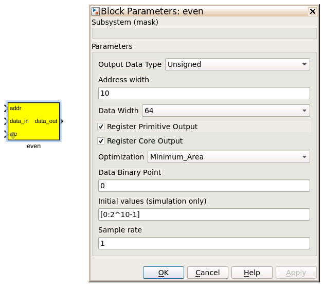

Tutorial 3: Example Spectrometer
==================================

Introduction
-------------
In this tutorial will go over building a simple spectrometer using CASPER DSP and hardware yellow blocks for RFSoC.

This tutorial assumes that the casper-ite is familiar wth the :doc:`RFDC Interface <./tut_rfdc>` tutorial. This also assumes that the CASPER development environment is setup for RFSoC as described in the :doc:`Getting Started <./tut_getting_started>` tutorial. A brief walkthrough of example of the spectrometer design, software control of the spectrometer will be given in this tutorial. However, it is also beneficial to learn how to interact with the FPGA using ``casperfpga`` as demonstrated in the :doc:`simulink platform introduction <./tut_platform>`.

A spectrometer is an analysis filter bank that takes for its input a time domain signal and transforms it to a frequency domain representation. In digital systems, this is typically achieved by utilising the FFT (Fast Fourier Transform) algorithm. However, with a modest increase in compute, better spectral bin performance can be improved by using a Polyphase Filter Bank (PFB) based approach.

When designing a spectrometer for astronomical applications, it is important to consider the target science case. For example, pulsar timing searches typically require a spectrometer that can dump spectra on short timescales. This allows the rate of change of the spectral content to be finely observed. In contrast, a deep field HI survey will accumulate multiple spectra to increase the signal to noise ratio above a detectable threshold. It is important to note that “bigger isn't always better” here; the higher your spectral and time resolution are, the more data your computer (and scientist on the other end) will have to deal with. For now however, we skip the target science case and rather look to more familiarize ourselves with an example spectrometer design.

Setup
-----
This tutorial comes with a completed simulink model files for RFSoC platforms. There are different examples for configuring the RFSoC in different operational modes. Those files can be found `here <https://github.com/casper-astro/tutorials_devel/tree/master/rfsoc/tut_spec>`_.

Spectrometer Basics
-------------------

When designing a spectrometer there are a few main parameters of note:

- **Bandwidth**: The width of your frequency spectrum, in Hz. This depends on the sampling rate; for complex sampled data this is equivalent to:

.. image:: ../../_static/img/tut_spec/bandwidtheq1.png

In contrast, for real or Nyquist sampled data the rate is half this:

.. image:: ../../_static/img/tut_spec/bandwidtheq2.png

as two samples are required to reconstruct a given waveform.

- **Frequency resolution**: The frequency resolution of a spectrometer, Δf, is given by:

.. image:: ../../_static/img/tut_spec/freq_eq.png

and is the width of each frequency bin. This parameter is a measure of how precise you can measure a frequency, or rather its frequency resolution.

- **Time resolution**: Time resolution is simply the spectral dump rate of your instrument. We generally accumulate multiple spectra to average out noise; the more accumulations we do, the lower the time resolution. For looking at short timescale events, such as pulsar bursts, higher time resolution is necessary; conversely, if we want to look at a weak HI signal, a long accumulation time is required, so time resolution is less important.

Simulink / CASPER Toolflow
--------------------------

Simulink Design Overview
^^^^^^^^^^^^^^^^^^^^^^^^^^

If you're reading this, hopefully you've managed to find the model files. Open a model file of your choice and have a look around to start to get a vague idea of what's happening. The best way to understand fully is to follow the dataflow arrows starting from the RFDC. Then read a few of the comment boxes and design annotations. Also, it is worthwhile to go through what each block is doing and make sure you know why each block is configured the way it is. To help you through, there is some “blockumentation” in the following part of the tutorial. That blockumentation will try to highlight some of the important ports and parameters to the blocks and their configuration to help guide to answers for the questions you may have.

A brief rundown of some top-level details are as follows before you get down and dirty:

- There are two styles of spectrometer tutorial model files. One that configures the RFDC data output mode to output in real sample mode. The others configure the RFDC to use the digital down converter and output complex data samples from the RFDC.

- The comment boxes above the ``RFDC`` yellow block in these model spectrometer designs comment on the ``RFDC`` sample rate, output data type, and number of samples per clock on the output interface of the ``RFDC``.

- The all-important Xilinx token is placed to allow System Generator to be called to compile the design.

- In the platform yellow block, the hardware Platform is set to the target RFSoC platform (e.g., “ZCU216:xczu49dr”) and the User IP clock rate must be specified. Recall from the :doc:`RFDC Interface <./tut_rfdc>` that the ``User IP Clock Rate (MHz)`` field must match the reported clock rate in the ``RFDC`` yellow block.

- Input signals are digitized by the RFDC. These samples presented in parallel at the output of the ``RFDC`` each clock cycle. The output data type will be expressed as a simulink fixed point integers (e.g., ``fix_128_0``).

- The parallel time samples pass through the ``pfb_fir_real`` and ``fft_wideband_real blocks`` (``pfb_fir`` and ``fft`` blocks when the ``RFDC`` is configured to output complex data samples). Together these blocks implement a polyphase filter bank.

- When the data output is real from the ``RFDC`` the FFT size is selected to be 2\ :sup:`12` = 4096 points. Because the CASPER wideband FFT outputs only the positive frequency bins we will have a 2\ :sup:`11` = 2048 channel filter bank.

- When the data output is complex from the ``RFDC`` the FFT size is selected to be 2\ :sup:`11` = 2048.

- You may notice Xilinx delay blocks dotted all over the design. It's common practice to add these into the design as helps the design meet timing. It consumes more resources, but eases signal timing-induced placement restrictions.

- The frequency bin outputs of the PFB passed through ``power`` blocks. This block converts from complex-valued outputs to real-valued power.

- The bin power enters the vector accumulators, vacc0 and vacc1. These are ``simple_bram_vacc`` 64-bit vector accumulators. Accumulation length is controlled by the ``acc_cntrl`` block. The accumulation length is set in software controlled by ``casperfpga``.

- The accumulated signal is then fed into a BRAM yellow blocks.

Continue further to familiarize yourself with the model file. Clicking around, opening configuration windows and refer to the blockumentation as needed.

RFDC
^^^^^

The first step to creating a frequency spectrum is to digitize the signal. This is done with an ADC (analog-to-digital converter). For RFSoC, the ADC is represented by the ``RFDC`` (RF Data Converter) yellow block. Work through the :doc:`RFDC tutorial <./tut_rfdc>` if you not already familiar with this block.

The ``RFDC`` converts analog inputs to digital outputs. Every clock cycle, the inputs are sampled and digitized to a 14-bit, 2's complement binary number representation. These samples are packed and MSB aligned into 16-bit words and presented in parallel on the output interface. This means we can represent numbers from -32768 through to 32767, including the number 0. Simulink represents such numbers as a ``fix_32_0`` data type. As an example, when the ``RFDC`` is configured in real mode with 8 samples per clock, the output data type is ``fix_128_0``. For more information about the output data representation of the ``RFDC`` refer to the `RFDC product guide`_.

Recall from the :doc:`RFDC tutorial <./tut_rfdc>` that when the ``RFDC`` is configured in ``real -> I/Q`` output mode quad-tile and dual-tile RFSoCs have differing behavior. For dual-tile platforms, in both ``Real`` and ``I/Q`` digital output modes these platforms output all data bits on the same bus. So for example, with ``4`` samples per clock this results in ``2`` complex samples ordered ``{I1, Q1, I0, Q0}``. Where in each ADC word, the most recent sample is at the MSB of the word.

For dual-tile platforms in ``I/Q`` digital output modes, the inphase and quadarature data are produced from different ports. In this mode the first digit of the signal name corresponds ot the tile index (same for quad-tiles). But, the second digit is ``0`` for inphase and ``1`` for quadrature data from the first ADC on the tile. The second ADC will then have ``2`` for inphase data and ``3`` for quadrature data. For example, with ``4`` sample per clock this is ``4`` complex samples with the two complex components coming from different ports, ``m00_axis_tdata`` for inphase data on tile 0 ADC 0 ordered ``{I3, I2, I1, I0}`` and  ``m01_axis_tdata`` for tile 0 ADC 1 with quadrature data ordered ``{Q3, Q2, Q1, Q0}``. When configured in ``Real`` digital output mode the second digit is ``0`` for the first ADC and ``2`` for the second.

**Block Configuration**
The following configuration examples are for the ``RFDC`` from the ``rfsoc4x2_tut_spec.slx`` model file. Refer to the ``RFDC`` block in each model file for their respective configuration.

For the ``RFSoC 4x2``, each tile tab is configured the same with ``Enable Tile`` selected and clock configuration set as follows.Note that the ``Required AXI4-Stream Clock (MHz)`` field matches the clock of the ``RFSoC 4x2`` platform block.

.. image:: ../../_static/img/rfsoc/tut_spec/rfsoc4x2_rfdc_tile_conf.png

Each of the ADCs are configured as shown in the following following image. The output data mode is ``Real`` with decimation factor set to ``2x`` and ``8`` samples per cycle. This will present an interface with simulink data type ``fix_128_0`` to the design.

.. image:: ../../_static/img/rfsoc/tut_spec/rfsoc4x2_rfdc_adc_conf.png

When operating the ``RFSoC 4x2`` with the complex data mode spectrometer example (``rfsoc4x2_tut_spec_cx.slx``) the ADC tiles are configured as shown in the following image. The output data mode is now ``I/Q`` still with a decimation factor of ``2x`` and ``8`` samples per clock. The ``Mixer Type`` is set to ``Fine`` with ``Real -> I/Q`` mode enabled and the NCO frequency set to ``-0.98304``. Refer again to the :doc:`RFDC tutorial <./tut_rfdc>` and the `RFDC product guide`_ for how these parameters affect the ``RFDC`` operation. But, the result is that with the digital down converter active the input signal is first shifted by the fine frequency mixer and then passed through to the decimation filters.

.. image:: ../../_static/img/rfsoc/tut_spec/rfsoc4x2_rfdc_cx_adc_conf.png

Munge blocks
^^^^^^^^^^^^^^^^

The munge blocks in these designs are responsible for reordering the output data from the ``RFDC``. This is required because the ``RFDC`` outputs time samples with the newest time samples in the MSB and CASPER blocks want the oldest sample in the MSB (top of CASPER blocks, e.g., port ``0``). When the ``RFDC`` is configured to output the ``8`` real samples this just reversing the word order as shown in the following image for the munge block configuration.

.. image:: ../../_static/img/rfsoc/tut_spec/rfsoc4x2_munge_real.png

With quad-tile platforms (e.g., ZCU216) when configured to output complex samples it is the same approach. This is because the samples are interleaved real/imaginary on the same bus. This translates to changes in the munge block to adjust the bitwidths and division sizes.

With the ``RFSoC 4x2`` and other dual-tile platforms, when configured to output complex samples we have to build the interleaved real/imaginary samples before sending them to the ``pfb_fir`` block. To do this, the real and imaginary parts of the samples coming from the output of the ``RFDC`` on their respective interfaces are first combined with a ``bus_create`` block. The munge then reorders the blocks. The following figure graphical shows how the divisions are reordered and their respective index for when the output is 4 samples per clock. Here ``I<#>`` represents the real time sample at sample index ``#`` and the same for ``Q<#>`` but corresponding to the imaginary sample. In these examples, ``I3`` and ``Q3`` correspond to the newest time sample and ``I0`` and ``Q0`` are the oldest.

.. image:: ../../_static/img/rfsoc/tut_spec/rfsoc4x2_munge_reorder_ex.png
  :width: 300 

The colors in this figure are used to track the sample input position relative to the output position. Also note that that the "munge reorder index" column places the ``0-th`` element at the MSB with the highest value at the LSB. The 3rd column top-to-bottom is then what is input to the ``Division Packing Order`` field of the ``munge`` block. The resulting vector used in as the munge block parameter is the reordered column entered top to bottom from this table. In the ``RFSoC 4x2`` design there are ``8`` samples per clock. Take a look at the munge block in the ``rfsoc4x2_tut_spec_cx.slx`` model and this example to see if you can follow how the complex samples are created.

Polyphase FIRs
^^^^^^^^^^^^^^^^^
There are two main blocks required for a polyphase filter bank. The first is a polyphase FIR block and the second is the FFT. Depending on the input data type DSP different blocks can be used to take save hardware resources when possible. For real valued time samples the `pfb_fir_real <pfbRealBlk_>`_ block is used. When the data are complex the `pfb_fir <pfbBlk_>`_ is used instead. A polyphase FIR works by dividing the input time signal into parallel "taps" then applies finite impulse response filters (FIR). The output of this block is still a time-domain signal.  When combined with an FFT, this constitutes a polyphase filter bank. The `fft_wideband_real <fftRealBlk_>`_ block is used following the `pfb_fir <pfbBlk_>`_. The `fft <fftBlk_>`_ block is follows the `pfb_fir <pfbBlk_>`_. The complex valued inputs are the generalized implementation of these DSP algorithms. Review the real-valued and complex-valued RFSoC example designs to see more of the differences.

The following descriptions are for the `pfb_fir_real <pfbRealBlk_>`_ block but the general `pfb <pfbBlk_>`_ is configured similar.

.. image:: ../../_static/img/rfsoc/tut_spec/pfb_fir_real.png
  :width: 600

**INPUTS/OUTPUTS**

+----------------+-----------+------------------------------------------------------------+
| Port           | Data Type | Description                                                |
+================+===========+============================================================+
| sync           | bool      | A sync pulse should be connected here.                     |
+----------------+-----------+------------------------------------------------------------+
| pol<#>_in<#>   | inherited | The (real) time-domain stream(s).                          |
+----------------+-----------+------------------------------------------------------------+

**PARAMETERS**

+---------------------------------+-----------------------------------------------------------------------------+
| Parameter                       | Description                                                                 |
+=================================+=============================================================================+
|  Size of PFB                    | | This parameter is to match the FFT size we are to have.                   |
+---------------------------------+-----------------------------------------------------------------------------+
|  Number of taps                 | | The number of taps in the PFB FIR filter. Each tap uses 2 real multiplier |
|                                 | | cores and requires buffering the data streams for 2\*PFBSize samples.     |
|                                 | | Generally, more taps means less inter-channel spectral leakage, but more  |
|                                 | | logic is used. There are diminishing returns after about 8 taps or so.    |
+---------------------------------+-----------------------------------------------------------------------------+
|  Windowing function             | | Which windowing function to use (this allows trading passband ripple for  |
|                                 | | steepness of rolloff, etc). Hamming is the default and best for most      |
|                                 | | purposes.                                                                 |
+---------------------------------+-----------------------------------------------------------------------------+
| | Number of Simultaneous        | | The number of parallel time samples which are presented to the core       |
| | Inputs                        | | each clock.                                                               |
+---------------------------------+-----------------------------------------------------------------------------+
|  Make biplex                    | | 0 (not making it biplex) is default. Double up the inputs to match with a |
|                                 | | biplex FFT.                                                               |
+---------------------------------+-----------------------------------------------------------------------------+
|  Input bitwidth                 | | The number of bits in each real and imaginary sample input to the PFB. The|
|                                 | | ADC outputs 16-bit data.                                                  |
+---------------------------------+-----------------------------------------------------------------------------+
|  Output bitwidth                | | The number of bits in each real and imaginary sample output from the PFB. |
|                                 | | This should match the bit width in the FFT that follows. 18 bits is       |
|                                 | | recommended as a minimum. Recommended values depend on the DSP            |
|                                 | | architecture for the FPGA.                                                |
+---------------------------------+-----------------------------------------------------------------------------+
|  Coefficient bitwidth           | | The number of bits in each coefficient. This is usually chosen to be less |
|                                 | | than or equal to the input bit width.                                     |
+---------------------------------+-----------------------------------------------------------------------------+
|  Use dist mem for coefficients  | | Store the FIR coefficients in distributed memory (if = 1). Otherwise,     |
|                                 | | BRAMs are used to hold the coefficients. 0 (not using distributed memory) |
|                                 | | is default.                                                               |
+---------------------------------+-----------------------------------------------------------------------------+
|  Add/Mult/BRAM/Convert Latency  | | These values set the number of clock cycles taken by various processes in |
|                                 | | the filter. There's normally no reason to change this unless you're having|
|                                 | | troubles with design timing.                                              |
+---------------------------------+-----------------------------------------------------------------------------+
|  Quantization Behaviour         | | Specifies the rounding behaviour used at the end of each butterfly        |
|                                 | | computation to return to the number of bits specified above. Rounding is  |
|                                 | | strongly suggested to avoid artifacts.                                    |
+---------------------------------+-----------------------------------------------------------------------------+
|  Bin Width Scaling              | | PFBs give enhanced control over the width of frequency channels. By       |
|                                 | | adjusting this parameter, you can scale bins to be wider (for values > 1) |
|                                 | | or narrower (for values \< 1).                                            |
+---------------------------------+-----------------------------------------------------------------------------+
|  Multiplier specification       | | Specifies what type of resources are used by the various multiplications  |
|                                 | | required by the filter.                                                   |
+---------------------------------+-----------------------------------------------------------------------------+
|  Fold adders into DSPs          | | If this option is checked, adding operations will be combined into the    |
|                                 | | FPGAs DSP cores, which have both the multiplying and adding capabilities. |
+---------------------------------+-----------------------------------------------------------------------------+
|  Adder implementation           | | Adders not folded into DSPs can be implemented either using fabric        |
|                                 | | resources (i.e. registers and LUTs in slices) or using DSP cores. Here you|
|                                 | | get to choose which is used. Choosing a behavioural implementation will   |
|                                 | | allow the compiler to choose whichever implementation it thinks is best.  |
+---------------------------------+-----------------------------------------------------------------------------+
|  Share coeff. between           | | Where the PFB block is simultaneously processing more than one            |
|  | polarisations                | | polarization, you can save RAM by using the same set of coefficients for  |
|                                 | | each stream. This may, however, make the timing performance of your design|
|                                 | | worse.                                                                    |
+---------------------------------+-----------------------------------------------------------------------------+

CASPER FFTs
^^^^^^^^^^^^
The FFT block you use is is the most important part of the design to understand. The cool green of the FFT blocks hide the complex and confusing FFT butterfly biplex algorithms that are under the hood. You do need to have a working knowledge of it though, so I recommend reading Chapter 8 and Chapter 12 of Smith's free online DSP guide at (http://www.dspguide.com/). Parts of the documentation below are taken from the ``fft_wideband_real`` `block documentation <fftRealBlk_>`_. When the ``RFDC`` outputs complex time samples the `fft <fftBlk_>`_ block needs to be used instead. Similarly, see the ``fft`` `block documentation <fftBlk_>`_ for more information.

.. image:: ../../_static/img/rfsoc/tut_spec/fft_wideband_real.png
  :width: 600

**INPUTS/OUTPUTS**

+--------+---------------------------------------------------------------------------------------------------------------+
| Port   | Description                                                                                                   |
+========+===============================================================================================================+
| sync   | Like many of the blocks, the FFT needs a heartbeat to keep it sync'd.                                         |
+--------+---------------------------------------------------------------------------------------------------------------+
| shift  | | Sets the shifting schedule through the FFT. Bit 0 specifies the behavior of stage 0, bit 1 of stage 1, and  |
|        | | so on. If a stage is set to shift (with bit = 1), then every sample is divided by 2 at the output of that   |
|        | | stage. This strategy will always prevent overflow. This is the strategy chosen in these deigns.             |
+--------+---------------------------------------------------------------------------------------------------------------+
| in<#>  | Input data (real for wideband fft, complex for general fft)                                                   |
+--------+---------------------------------------------------------------------------------------------------------------+
| out<#> | | The number of ports is the number of simultaneous bin outputs produces. For a real input signal, the outputs|
|        | | FFTs spectrum's left and right halves are mirror images (complex conjugate symmetric). The block does not   |
|        | | output the imaginary (negative channel) indices.                                                            |
|        | | Thus, for a 4096-point FFT, 2048 channels are output. This is why there are half the number of parallel     |
|        | | outputs. Each of these parallel FFT outputs will produce sequential channels on every clock cycle. On the   |
|        | | first clock cycle (after a sync pulse, which denotes the start), frequency channel zero is on port 0,       |
|        | | frequency channel one is on port 1 and so forth. Each of those are now complex-valued numbers. Then on the  |
|        | | clock cycle this process repeats where the previous bin count left off.                                     |
+--------+---------------------------------------------------------------------------------------------------------------+

**PARAMETERS**

+------------------------------------------+-----------------------------------------------------------------------------+
| Parameter                                | Description                                                                 |
+==========================================+=============================================================================+
| Size of FFT                              | | How many points the FFT will have. The number of output channels will be  |
|                                          | | half this when the wideband real fft if used as previously explained.     |
+------------------------------------------+-----------------------------------------------------------------------------+
| Input/output bitwidth                    | | The number of bits in each real and imaginary sample as they are carried  |
|                                          | | through the FFT. Each FFT stage will round numbers back down to this      |
|                                          | | number of bits after performing a butterfly computation. This has to match|
|                                          | | what the `pfb_fir` is throwing out.                                       |
+------------------------------------------+-----------------------------------------------------------------------------+
| Number of simultaneous inputs            | | The number of parallel time samples which are presented to the FFT core   |
|                                          | | each clock.                                                               |
+------------------------------------------+-----------------------------------------------------------------------------+
| Coefficient bitwidth                     | | The amount of bits for each coefficient. 18 is default.                   |
+------------------------------------------+-----------------------------------------------------------------------------+
| Unscramble output                        | | Some reordering is required to make sure the frequency channels are output|
|                                          | | in canonical frequency order. If you're absolutely desperate to save as   |
|                                          | | much RAM and logic as possible you can disable this processing, but you'll|
|                                          | | have to make sure you account for the scrambling of the channels in your  |
|                                          | | downstream software. For now, because our design will comfortably fit on  |
|                                          | | the FPGA, leave the unscramble option checked.                            |
+------------------------------------------+-----------------------------------------------------------------------------+
| Overflow Behavior                        | | Indicates the behavior of the FFT core when the value of a sample exceeds |
|                                          | | what can be expressed in the specified bit width. Here we're going to use |
|                                          | | Wrap, since Saturate will not make overflow corruption better behaved.    |
+------------------------------------------+-----------------------------------------------------------------------------+
| Add Latency                              | Latency through adders in the FFT.                                          |
+------------------------------------------+-----------------------------------------------------------------------------+
| Mult Latency                             | Latency through multipliers in the FFT.                                     |
+------------------------------------------+-----------------------------------------------------------------------------+
| BRAM Latency                             | Latency through BRAM in the FFT.                                            |
+------------------------------------------+-----------------------------------------------------------------------------+
| Convert Latency                          | | Latency through blocks used to reduce bit widths after twiddle and        |
|                                          | | butterfly stages.                                                         |
+------------------------------------------+-----------------------------------------------------------------------------+
| Input Latency                            | | Here you can register your input data streams in case you run into timing |
|                                          | | issues.                                                                   |
+------------------------------------------+-----------------------------------------------------------------------------+
| | Latency between internal biplexes and  | | Here you can add optional register stages between the two major processing|
| | ``fft_direct`` blocks                  | | blocks in the FFT. These can help a failing design meet timing. For this  |
|                                          | | tutorial, you should be able to compile the design with this parameter set|
|                                          | | to 0.                                                                     |
+------------------------------------------+-----------------------------------------------------------------------------+
| Architecture                             |                                                                             |
+------------------------------------------+-----------------------------------------------------------------------------+
| | Number of bits above which to store    | | Determines the threshold at which the twiddle coefficients in a stage are |
| | stage's coefficients in BRAM           | | stored in BRAM. Below this threshold distributed RAM is used. By changing |
|                                          | | this, you can bias your design to use more BRAM or more logic.            |
+------------------------------------------+-----------------------------------------------------------------------------+
| | Number of bits above which to store    | | Determines the threshold at which the twiddle coeff. in a stage are stored|
| | stage's delays in BRAM                 | | in BRAM. Below this threshold distributed RAM is used.                    |
+------------------------------------------+-----------------------------------------------------------------------------+
| Multiplier Implementation                | | Determines how multipliers are implemented in the twiddle function at     |
|                                          | | each stage. Using behavioral HDL allows adders following the multiplier to|
|                                          | | be folded into the DSP48Es. Other options choose multiplier cores which   |
|                                          | | allows quicker compile time. You can enter an array of values allowing    |
|                                          | | exact specification of how multipliers are implemented at each stage.     |
+------------------------------------------+-----------------------------------------------------------------------------+
| Hardcode shift schedule                  | | If you wish to save logic, at the expense of being able to dynamically    |
|                                          | | specify your shifting regime using the block's "shift" input, you can     |
|                                          | | check this box. Leave it unchecked for this tutorial.                     |
+------------------------------------------+-----------------------------------------------------------------------------+
| Use DSP48's for adders                   | | The butterfly operation at each stage consists of two adders and two      |
|                                          | | subtracters that can be implemented using DSP48 units instead of logic.   |
|                                          | | Leave this unchecked.                                                     |
+------------------------------------------+-----------------------------------------------------------------------------+

Power
^^^^^^^

.. image:: ../../_static/img/tut_spec/power_4.4.png

The `power <https://casper.berkeley.edu/wiki/Power>`_ block computes the power of a complex number. The power block typically has a latency of 5 and will compute the power of its input by taking the sum of the squares of its real and imaginary components.

**INPUTS/OUTPUTS**

+-------+-----------+------------------------+---------------------------------------------------------------------------+
| Port  | Direction | Data Type              | Description                                                               |
+=======+===========+========================+===========================================================================+
| c     | IN        | 2*BitWidth Fixed point | | A complex number whose higher BitWidth bits are its real part and lower |
|       |           |                        | | BitWidth bits are its imaginary part.                                   |
+-------+-----------+------------------------+---------------------------------------------------------------------------+
| power | OUT       | UFix\_(2*BitWidth)\_(2\*BitWidth-1) | The computed power of the input complex number.              |
+-------+-----------+------------------------+---------------------------------------------------------------------------+

**PARAMETERS**

+-----------+----------+----------------------------------+
| Parameter | Variable | Description                      |
+===========+==========+==================================+
| Bit Width | BitWidth | The number of bits in its input. |
+-----------+----------+----------------------------------+

Sync Gen
^^^^^^^^^^
CASPER DSP blocks require a sync pulse as a periodic heartbeat to keep the data path flowing. This can be either a 1 PPS pulse or something generated internal to the design. We use an internal approach in this design with the ``sync gen`` block. For more information about configuring this block please refer to the `CASPER Sync Memo <https://github.com/casper-astro/publications/blob/master/Memos/files/sync_memo_v1.pdf>`_ for how the reorders are to be setup for this block if the FFT size were to change in your designs.

Vector Accumulator
^^^^^^^^^^^^^^^^^^^^

The ``simple_bram_vacc`` block is used in this design for vector accumulation. Vector growth is approximately 28 bits each second. As the name suggests, the ``simple_bram_vacc`` is simpler so it is fine for this demo spectrometer. Each vector accumulator will capture a fraction of the total output bandwidth in parallel. This means that the frequency bins will need to be interleaved to reconstruct the output spectrum when read back out. With ``N`` parallel output frequency bins we will have ``N`` vector accumulators, each containing, 2\ :sup:`FFT_SIZE`/N bins.

.. image:: ../../_static/img/tut_spec/vacc_4.6.png

**PARAMETERS**

+-----------------------+--------------------------------------------------------------------------------------------------+
| Parameter             | Description                                                                                      |
+=======================+==================================================================================================+
| Vector length         | The length of the input/output vector. Set to store the fraction of spectrum as explained above. |
+-----------------------+--------------------------------------------------------------------------------------------------+
| no. output bits       | | As there is bit growth due to accumulation, we need to set this higher than the input bits.    |
+-----------------------+--------------------------------------------------------------------------------------------------+
| Binary point (output) | | Where the binary point is placed in the accumulated output.                                    |
+-----------------------+--------------------------------------------------------------------------------------------------+

**INPUTS/OUTPUTS**

+----------+---------------------------------------------------------------------------------------------------------------+
| Port     | Description                                                                                                   |
+==========+===============================================================================================================+
| new_acc  | | A boolean pulse should be sent to this port to signal a new accumulation. We can't directly use the sync    |
|          | | pulse, otherwise this would reset after each spectrum. The ``acc_cntrl`` keeps track of the accumulation    |
|          | | to send this pulse.                                                                                         |
+----------+---------------------------------------------------------------------------------------------------------------+
| din/dout | Data input and output. The output depends on the no. output bits parameter.                                   |
+----------+---------------------------------------------------------------------------------------------------------------+
| valid    | | The output of this block will only be valid when it has finished accumulating (signaled by a boolean pulse  |
|          | | sent to ``new_acc``). This will output a boolean 1 while the vector is being output, and 0 otherwise.       |
+----------+---------------------------------------------------------------------------------------------------------------+

Shared BRAMs
^^^^^^^^^^^^^^^

The final blocks are shared the BRAMs, which we will read out the values of using the python script.

**PARAMETERS**

+-------------------+------------------------------------------------------------------------------------------------------+
| Parameter         | Description                                                                                          |
+===================+======================================================================================================+
| Output data type  | Unsigned                                                                                             |
+-------------------+------------------------------------------------------------------------------------------------------+
| Address width     | | 2^(Address width) is the number of ``Data Width`` words of the implemented BRAM. In the this design|
|                   | | it must be set to store at least the number of output bins each shared bram will receive. Timing   |
|                   | | issues can be a problem with bitwidths higher than 13.                                             | 
+-------------------+------------------------------------------------------------------------------------------------------+
| Data Width        | | The Shared BRAM may have a data input/output width of either 8, 16, 32, 64, or 128 bits. This is   |
|                   | | set to match the vector accumulator output.                                                        |
+-------------------+------------------------------------------------------------------------------------------------------+
| Data binary point | | The binary point should be set to zero. The data going to the processor will be converted to a     |
|                   | | value with this binary point and the output data type.                                             |
+-------------------+------------------------------------------------------------------------------------------------------+
| Initial values    | This is a test vector for simulation only.                                                           |
+-------------------+------------------------------------------------------------------------------------------------------+
| Sample rate       | Set this to 1.                                                                                       |
+-------------------+------------------------------------------------------------------------------------------------------+

**INPUTS/OUTPUTS**

+----------+-------------------------------------------------------------------------------------------------------------+
| Port     | Description                                                                                                 |
+==========+=============================================================================================================+
| Addr     | Address to be written to with the value of data_in, on that clock, if write enable is high.                 |
+----------+-------------------------------------------------------------------------------------------------------------+
| data_in  | The input data.                                                                                             |
+----------+-------------------------------------------------------------------------------------------------------------+
| we       | The write enable port.                                                                                      |
+----------+-------------------------------------------------------------------------------------------------------------+
| data_out | | Writing the data to a register. This is simply terminated in the design, as the data has finally reached  |
|          | | its final form and destination.                                                                           |
+----------+-------------------------------------------------------------------------------------------------------------+

Software Registers
^^^^^^^^^^^^^^^^^^

There are a few `control registers <https://casper.berkeley.edu/wiki/Software_register>`_, led GPIOs, and snapshot blocks within the design:

- **cnt_rst**: Counter reset control. Pulse this high to reset all counters back to zero.
- **acc_len**: Sets the accumulation length. See python script help string for usage.
- **sync_cnt**: Sync pulse counter. Counts the number of sync pulses issued. Can be used to figure out board uptime and confirm that your design is being clocked correctly.
- **acc_cnt**: Accumulation counter. Keeps track of how many accumulations have been done.
- **led0_sync**: The led0_sync light flashes each time a sync pulse is generated.
- **led1_new_acc**: This lights up led1 each time a new accumulation is triggered.
- **led2_acc_clip**: This lights up led2 whenever clipping is detected.

If you've made it to here, congratulations. Take a break and then come back for part two, which explains the second part of the tutorial – actually getting the spectrometer running, and having a look at some spectra.

Configuration and Control
--------------------------

Hardware Configuration
^^^^^^^^^^^^^^^^^^^^^^^^^^^

Make sure the RFSoC platform board is running the proper Linux image as explained in the :doc:`Getting Started tutorial <./tut_getting_started>` and that clocks are running (e.g., ZCU216 requires clocking module board be installed). You will also need test signals at the inputs of the RFSoC.

The tutorial ``.slx`` model files for different platforms are found `here <https://github.com/casper-astro/tutorials_devel/tree/master/rfsoc/tut_spec>`_. Extending the files to a different platform not yet provided is possible following this tutorial. Open one of the example model files and run the ``jasper`` command in the matlab command prompt to build the ``.fpg`` and ``.dtbo`` files (found in model projects ``outputs/`` folder). After this completes, we can now run and configure ``casperfpga`` to communicate with the hardware design to readout and plot output spectra!

Python
^^^^^^^^^
We assume here working with the ``RFSoC 4x2`` and provided ``rfsoc4x2_tut_spec.py`` script for reading output. But, these instructions and files can be extended to other platforms. 

There are two prebuilt model files: one using the ``RFDC`` configured to output real time samples and the other enabling the digital down converter to output complex time samples. For the real spectrometer design the RFDC is set to sample at 3932.16 MHz with a decimation rate of ``2x``. The spectrometer uses the ``fft_wideband_real`` set to a transform size of 4096. The number of output bins is only the positive frequency with a a size of 2048. This is an effective bandwidth from 0 to 983.04 MHz. The complex spectrometer design is also set to sample at 3932.16 MHz with a decimation rate of ``2x``. However, in this design the fine mixer is used with the NCO set to ``-983.04 MHz``. The FFT is set to transform to a size of 2048. With sufficient anti-alias filtering the effective bandwidth of this design is from 0 to 1966.08 MHz.

It may be helpful to first run the python script in the two operating modes before going through the script. This can help identify what the script does by knowing before what is being presented.

To get help information from the script you can run:

.. code:: bash

  python rfsoc4x2_tut_spec.py -h

The general syntax to run the script is as follows. Either an IP address or hostname can be given to connect to the board. The string ``real`` or ``cx`` must be provided. This is to setup how to read out and display the spectra. The ``-b`` option is used to program the board with a specified ``.fpg`` file. If no file is provided the prebuilt ``.fpg`` files are used. The ``-a`` option is used to specify which adc input to plot. The value can be ``0, 1, 2``, or ``3``. The default is ``0``. The ``-l`` option is used to specify the accumulation length. The ``-s`` option can be used if you know the design has already been previously programmed and is running. If not, it will be expected to a problem.

Run in real mode using the prebuilt model. I am assuming here a hostname of ``rfsoc4x2`` for the board:

.. code:: bash

  python rfsoc4x2_tut_spec.py rfsoc4x2 real
  
Assuming all goes well and with a plot window should appear updating the spectrum periodically, with the spectrum accumulation count displayed in the title. An example is shown in the following figure. Here a tone at 800 MHz is present on the input of the RFSoC and appears as expected 800 MHz.

.. image:: ../../_static/img/rfsoc/tut_spec/rfsoc4x2_python_real.png
  :width: 420

Now run the complex mode design:

.. code:: bash

  python rfsoc4x2_tut_spec.py rfsoc4x2 cx

Similar to the real mode, a plot should shortly appear. As an example, the same 800 MHz tone is present as shown.

.. image:: ../../_static/img/rfsoc/tut_spec/rfsoc4x2_python_cx.png
  :width: 420

As an example of something more interesting, the following output is from the complex version of the design with wideband noise filtered to a passband from about 1280-1780 MHz and a tone present in that passband at 1520 MHz.

.. image:: ../../_static/img/rfsoc/tut_spec/rfsoc4x2_python_cx_wideband.png

Conclusion
------------

If you have followed this tutorial faithfully, you should now know:

* What a spectrometer is and what the important parameters for astronomy are.
* Which CASPER blocks you might want to use to make a spectrometer, and how to connect them up in Simulink.
* How to connect to and control a the RFSoC spectrometer using python scripting.

.. _pfbRealBlk: https://casper-toolflow.readthedocs.io/en/latest/src/blockdocs/Pfb_fir_real.html
.. _pfbBlk: https://casper-toolflow.readthedocs.io/en/latest/src/blockdocs/Pfb_fir.html
.. _fftRealBlk: https://casper-toolflow.readthedocs.io/en/latest/src/blockdocs/Fft_wideband_real.html
.. _fftBlk: https://casper-toolflow.readthedocs.io/en/latest/src/blockdocs/Fft.html
.. _RFDC product guide: PG269_
.. _PG269: https://www.xilinx.com/support/documentation/ip_documentation/usp_rf_data_converter/v2_4/pg269-rf-data-converter.pdf
