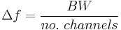
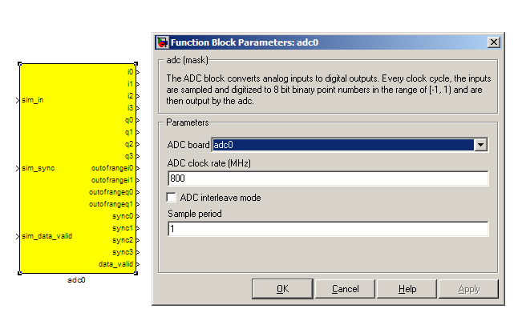
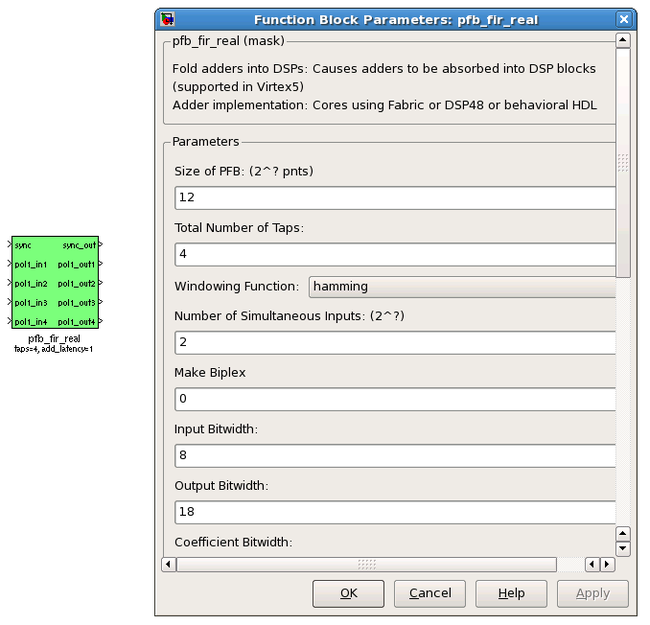
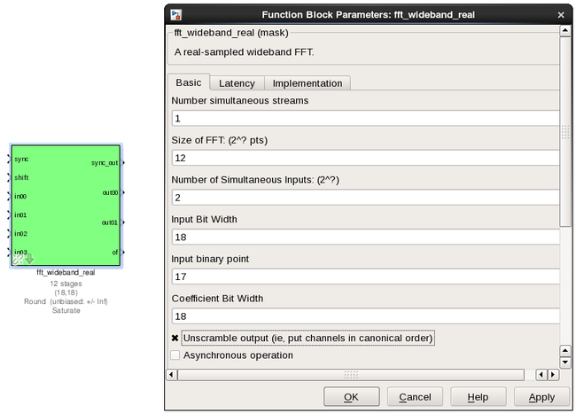
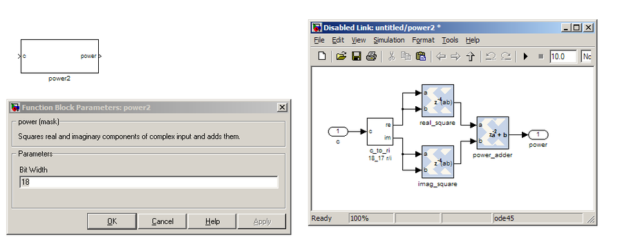
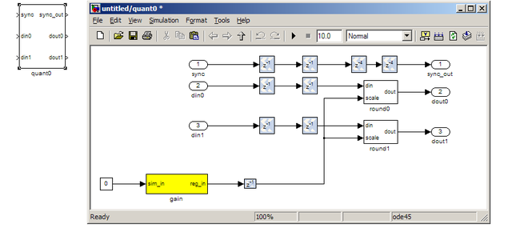
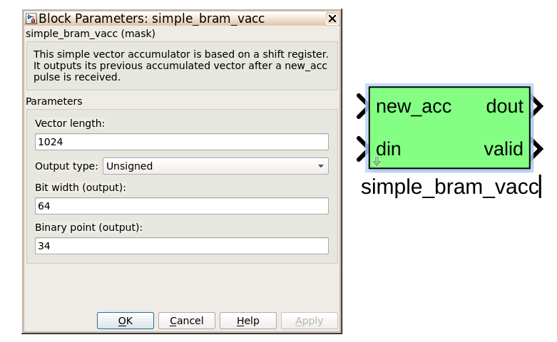
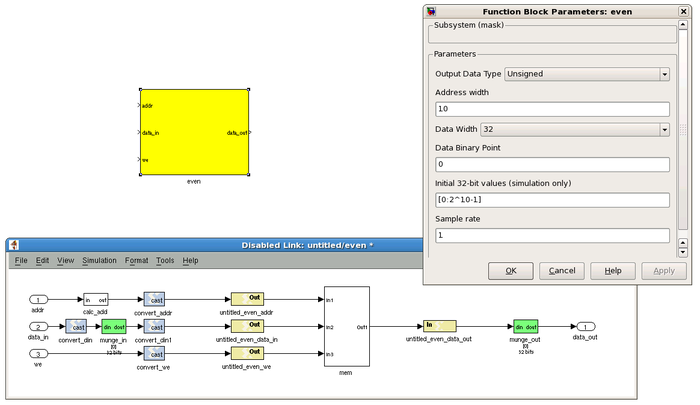
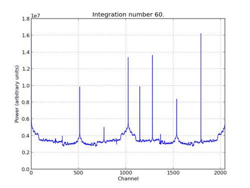

.. role:: raw-html-m2r(raw)
   :format: html

Tutorial 3: Wideband Spectrometer
=================================

Introduction
------------

A spectrometer is something that takes a signal in the time domain and converts it to the frequency domain. In digital systems, this is generally achieved by utilising the FFT (Fast Fourier Transform) algorithm. However, with a little bit more effort, the signal to noise performance can be increased greatly by using a Polyphase Filter Bank (PFB) based approach.

When designing a spectrometer for astronomical applications, it's important to consider the     science case behind it. For example, pulsar timing searches will need a spectrometer which can  dump spectra on short timescales, so the rate of change of the spectra can be observed. In contrast,    a deep field HI survey will accumulate multiple spectra to increase the signal to noise ratio. It's also    important to note that “bigger isn't always better”; the higher your spectral and time resolution are, the  more data your computer (and scientist on the other end) will have to deal with. For now, let's skip the    science case and familiarize ourselves with an example spectrometer.

Setup
-----

This tutorial comes with a completed model file, 
a compiled bitstream, ready for execution on ROACH, as well as a Python script to configure the ROACH and make plots. `Here <https://github.com/casper-astro/tutorials_devel/tree/master/ise/roach2/tut_spec>`_

Spectrometer Basics
-------------------

When designing a spectrometer there are a few main parameters of note:

* **Bandwidth**\ : The width of your frequency spectrum, in Hz. This depends on the sampling rate; for complex sampled data this is equivalent to:

.. image:: ../../_static/img/tut_spec/bandwidtheq1.png
   :target: ../../_static/img/tut_spec/bandwidtheq1.png
   :alt: 

In contrast, for real or Nyquist sampled data the rate is half this:

.. image:: ../../_static/img/tut_spec/bandwidtheq2.png
   :target: ../../_static/img/tut_spec/bandwidtheq2.png
   :alt: 

as two samples are required to reconstruct a given waveform .

* **Frequency resolution**\ : The frequency resolution of a spectrometer, Δf, is given by

,

and is the width of each frequency bin. Correspondingly, Δf is a measure of how precise you can measure a frequency.

* **Time resolution**\ : Time resolution is simply the spectral dump rate of your instrument. We generally accumulate multiple spectra to average out noise; the more accumulations we do, the lower the time resolution. For looking at short timescale events, such as pulsar bursts, higher time resolution is necessary; conversely, if we want to look at a weak HI signal, a long accumulation time is required, so time resolution is less important.

Simulink / CASPER Toolflow
--------------------------

Simulink Design Overview
^^^^^^^^^^^^^^^^^^^^^^^^

If you're reading this, then you've already managed to find all the tutorial files.  Jason has gone to great effort to create an easy to follow simulink model that compiles and works.  By now, I presume you can open the model file and have a vague idea of what's happening.
The best way to understand fully is to follow the arrows, go through what each block is doing and make sure you know why each step is done. To help you through, there's some “blockumentation” in the appendix, which should (hopefully) answer all questions you may have. A brief rundown before you get down and dirty:

* 
  The all important Xilinx token is placed to allow System Generator to be called to compile the design.

* 
  In the MSSGE block, the hardware type is set to “ROACH:sx95t” and clock rate is specified as 200MHz.

* 
  The input signal is digitised by the ADC, resulting in four parallel time samples of 8 bits each clock cycle. The ADC runs at 800MHz, which gives a 400MHz nyquist sampled spectrum. The output range is a signed number in the range -1 to +1 (ie 7 bits after the decimal point). This is expressed as fix_8_7.

* 
  The four parallel time samples pass through the pfb_fir_real and fft_wideband_real blocks, which together constitute a polyphase filter bank. We've selected 2\ :raw-html-m2r:`12`\ =4096 points, so we'll have a  2\ :raw-html-m2r:`11`\ =2048 channel filter bank.

* 
  You may notice Xilinx delay blocks dotted all over the design. It's common practice to add these into the design as it makes it easier to fit the design into the logic of the FPGA. It consumes more resources, but eases signal timing-induced placement restrictions.

* 
  The real and imaginary (sine and cosine value) components of the FFT are plugged into power blocks, to convert from complex values to real power values by squaring. They are also scaled by a gain factor before being quantised...

* 
  These power values are then requantized by the quant0 block, from 36.34 bits to 6.5 bits, in preparation for accumulation. This is done to limit bit growth.

* 
  The requantized signals then enter the vector accumulators, vacc0 and vacc1, which are simple_bram_vacc 32 bit vector accumulators. Accumulation length is controlled by the acc_cntrl block.

* 
  The accumulated signal is then fed into software registers, odd and even.

Without further ado, open up the model file and start clicking on things, referring the blockumentation as you go.

`adc <https://casper.berkeley.edu/wiki/Adc>`_
^^^^^^^^^^^^^^^^^^^^^^^^^^^^^^^^^^^^^^^^^^^^^^^^^

The first step to creating a frequency spectrum is to digitize the signal. This is done with an ADC – an Analogue to Digital Converter. In Simulink, the ADC daughter board is represented by a yellow block. Work through the “iADC tutorial” if you're not familiar with the iADC card.

The ADC block converts analog inputs to digital outputs. Every clock cycle, the inputs are sampled and digitized to 8 bit binary point numbers in the range of -1 to 1 and are then output by the ADC. This is achieved through the use of two's-compliment representation with the binary point placed after the seven least significant bits. This means we can represent numbers from -128/128 through to 127/128 including the number 0. Simulink represents such numbers with a fix_8_7 moniker.

ADCs often internally bias themselves to halfway between 0 and -1. This means that you'd typically see the output of an ADC toggling between zero and -1 when there's no input. It also means that unless otherwise calibrated, an ADC will have a negative DC offset.

The ADC has to be clocked to four times that of the FPGA clock. In this design the ADC is clocked to 800MHz, so the ROACH will be clocked to 200MHz . This gives us a bandwidth of 400MHz, as Nyquist sampling requires two samples (or more) each second.

**INPUTS**

.. list-table::
   :header-rows: 1

   * - Port
     - Description
   * - sim_in (interleave mode) / sim_q, sim_i
     - Input for simulated data. It's useful to connect up a simulink source, such as “band-limited white noise” or a sine wave.
   * - sim_sync
     - Simulated sync pulse input. In this design, we've connected up a constant with value '1'
   * - sim_data_valid
     - Can be set to either 0 (not valid) or 1 (valid).

**OUTPUTS**

The ADC outputs two main signals: i and q, which correspond to the coaxial inputs of the ADC board. In this tutorial, we'll only be using input i. As the ADC runs at 4x the FPGA rate, there are four parallel time sampled outputs: i0, i1, i2 and i3. As mentioned before, these outputs are 8.7 bit.

`pfb_fir_real <https://casper.berkeley.edu/wiki/Pfb_fir_real>`_
^^^^^^^^^^^^^^^^^^^^^^^^^^^^^^^^^^^^^^^^^^^^^^^^^^^^^^^^^^^^^^^^^^^

There are two main blocks required for a polyphase filter bank. The first is the pfb_fir_real block, which divides the signal into parallel 'taps' then applies finite impulse response filters (FIR). The output of this block is still a time-domain signal.  When combined with the FFT_wideband_real block, this constitutes a polyphase filterbank.

**INPUTS/OUTPUTS**

.. list-table::
   :header-rows: 1

   * - Port
     - Data Type
     - Description
   * - sync
     - bool
     - A sync pulse should be connected here (see iADC tutorial).
   * - pol1_in1/2/3/4
     - inherited
     - The (real) time-domain stream(s).

As the ADC has four parallel time sampled outputs: i0, i1, i2 and i3, we need four parallel inputs for this PFB implementation.

**PARAMETERS**

.. list-table::
   :header-rows: 1

   * - Parameter
     - Description
   * - Size of PFB
     - How many points the FFT will have. The number of frequency channels will be half this. We've selected  2^12 = 4096 points, so we'll have a 2^11 = 2048 channel filter bank.
   * - Number of taps
     - The number of taps in the PFB FIR filter. Each tap uses 2 real multiplier cores and requires buffering the real and imaginary streams for 2*PFBSize samples. Generally, more taps means less inter-channel spectral leakage, but more logic is used. There are diminishing returns after about 8 taps or so.
   * - Windowing function
     - Which windowing function to use (this allows trading passband ripple for steepness of rolloff, etc). Hamming is the default and best for most purposes.
   * - Number of Simultaneous Inputs (2?)
     - The number of parallel time samples which are presented to the FFT core each clock. The number of output ports are set to this same value. We have four inputs from the ADC, so set this to 2.
   * - Make biplex
     - 0 (not making it biplex) is default. Double up the inputs to match with a biplex FFT.
   * - Input bitwidth.
     - The number of bits in each real and imaginary sample input to the PFB. The ADC outputs 8.7 bit data, so the input bitwidth should be set to 8 in our design.
   * - Output bitwidth
     - The number of bits in each real and imaginary sample output from the PFB. This should match the bit width in the FFT that follows. 18 bits is recommended for the ROACH (18x25 multipliers) and iBOB/BEE2 (18x18 multipliers).
   * - Coefficient bitwidth
     - The number of bits in each coefficient. This is usually chosen to be less than or equal to the input bit width.
   * - Use dist mem for coeffients
     - Store the FIR coefficients in distributed memory (if = 1). Otherwise, BRAMs are used to hold the coefficients. 0 (not using distributed memory) is default
   * - Add/Mult/BRAM/Convert Latency
     - These values set the number of clock cycles taken by various processes in the filter. There's normally no reason to change this unless you're having troubles fitting the design into the fabric.
   * - Quantization Behaviour
     - Specifies the rounding behaviour used at the end of each butterfly computation to return to the number of bits specified above. Rounding is strongly suggested to avoid artifacts.
   * - Bin Width Scaling
     - PFBs give enhanced control over the width of frequency channels. By adjusting this parameter, you can scale bins to be wider (for values > 1) or narrower (for values < 1).
   * - Multiplier specification
     - Specifies what type of resources are used by the various multiplications required by the filter.
   * - Fold adders into DSPs
     - If this option is checked, adding operations will be combined into the FPGAs DSP cores, which have the both multiplying and adding capabilities.
   * - Adder implementation
     - Adders not folded into DSPs can be implemented either using fabric resources (i.e. registers and LUTs in slices) or using DSP cores. Here you get to choose which is used. Choosing a behavioural implementation will allow the compiler to choose whichever implementation it thinks is best.
   * - Share coefficients between polarisations
     - Where the pfb block is simultaneously processing more than one polarization, you can save RAM by using the same set of coefficients for each stream. This may, however, make the timing performance of your design worse.

`fft_wideband_real <https://casper.berkeley.edu/wiki/Fft_wideband_real>`_
^^^^^^^^^^^^^^^^^^^^^^^^^^^^^^^^^^^^^^^^^^^^^^^^^^^^^^^^^^^^^^^^^^^^^^^^^^^^^

The FFT_wideband_real block is the most important part of the design to understand. The cool green of the FFT block hides the complex and confusing FFT butterfly biplex algorithms that are under the hood. You do need to have a working knowledge of it though, so I recommend reading Chapter 8 and Chapter 12 of Smith's free online DSP guide at (http://www.dspguide.com/).
Parts of the documentation below are taken from the [[Block_Documentation | block documentation]] by Aaron Parsons and Andrew Martens.

**INPUTS/OUTPUTS**

.. list-table::
   :header-rows: 1

   * - Port
     - Description
   * - shift
     - Like many of the blocks, the FFT needs a heartbeat to keep it sync'd
   * - in0-3
     - Sets the shifting schedule through the FFT. Bit 0 specifies the behavior of stage 0, bit 1 of stage 1, and so on. If a stage is set to shift (with bit = 1), then every sample is divided by 2 at the output of that stage.   In this design, we've set Shift to 2^(13 − 1) − 1, which will shift the data by 1 on every stage to prevent overflows.
   * - out0-1
     - This real FFT produces two simultaneous outputs. Because it's a real FFT, the spectrum's left and right halves are mirror images and so we don't bother to output the imaginary half (negative channel indices). Thus, for a 1024-point FFT, you get 512 useful channels. That's why there are half the number of parallel outputs (two complex output paths to four real input paths). Each of these parallel FFT outputs will produce sequential channels on every clock cycle. So, on the first clock cycle (after a sync pulse, which denotes the start), you'll get frequency channel zero and frequency channel one. Each of those are complex numbers. Then, on the second clock cycle, you'll get frequency channels 2 and 3. These are followed by 4 and 5 etc etc. So we chose to label these output paths "even" and "odd", to differentiate the path outputting channels 0,2,4,6,8...N-1 from the channel doing 1,3,5,7...N. As you can see, in order to recreate the full spectrum, we need to interleave these paths to produce 0,1,2,3,4,5...N. Following the lines you'll see that these two inputs end up in an “odd” and “even” shared BRAMs. These are then interleaved in the tut3.py script to form a complete spectrum.

**PARAMETERS**

.. list-table::
   :header-rows: 1

   * - Parameter
     - Description
   * - Size of FFT
     - How many points the FFT will have. The number of channels will be half this. We've selected 2^12 = 4096 points, so we'll have a 2^11 = 2048 channel filter bank. This should match up with the pfb_fir block.
   * - Input/output bitwidth
     - The number of bits in each real and imaginary sample as they are carried through the FFT. Each FFT stage will round numbers back down to this number of bits after performing a butterfly computation. This has to match what the pfb_fir is throwing out. The default is 18 so this shouldn't need to be changed.
   * - Coefficient bitwidth
     - The amount of bits for each coefficient. 18 is default.
   * - Number of simultaneous inputs
     - The number of parallel time samples which are presented to the FFT core each clock. We have 2^2 = 4 parallel data streams, so this should be set to 2.
   * - Unscramble output
     - Some reordering is required to make sure the frequency channels are output in canonical frequency order. If you're absolutely desperate to save as much RAM and logic as possible you can disable this processing, but you'll have to make sure you account for the scrambling of the channels in your downstream software. For now, because our design will comfortably fit on the FPGA, leave the unscramble option checked.
   * - Overflow Behavior
     - Indicates the behavior of the FFT core when the value of a sample exceeds what can be expressed in the specified bit width. Here we're going to use Wrap, since Saturate will not make overflow corruption better behaved.
   * - Add Latency
     - Latency through adders in the FFT. Set this to 2.
   * - Mult Latency
     - Latency through multipliers in the FFT. Set this to 3.
   * - BRAM Latency
     - Latency through BRAM in the FFT. Set this to 2.
   * - Convert Latency
     - Latency through blocks used to reduce bit widths after twiddle and butterfly stages. Set this to 1.
   * - Input Latency
     - Here you can register your input data streams in case you run into timing issues. Leave this set to 0.
   * - Latency between biplexes and fft_direct
     - Here you can add optional register stages between the two major processing blocks in the FFT. These can help a failing design meet timing. For this tutorial, you should be able to compile the design with this parameter set to 0.
   * - Architecture
     - Set to Virtex5, the architecture of the FPGA on the ROACH. This changes some of the internal logic to better optimise for the DSP slices. If you were using an older iBOB board, you would need to set this to Virtex2Pro.
   * - Use less
     - This affects the implementation of complex multiplication in the FFT, so that they either use fewer multipliers or less logic/adders. For the complex multipliers in the FFT, you can use 4 multipliers and 2 adders, or 3 multipliers and a bunch or adders. So you can trade-off DSP slices for logic or vice-versa. Set this to Multipliers.
   * - Number of bits above which to store stage's coefficients in BRAM
     - Determines the threshold at which the twiddle coefficients in a stage are stored in BRAM. Below this threshold distributed RAM is used. By changing this, you can bias your design to use more BRAM or more logic. We're going to set this to 8.
   * - Number of bits above which to store stage's delays in BRAM
     - Determines the threshold at which the twiddle coefficients in a stage are stored in BRAM. Below this threshold distributed RAM is used. Set this to 9.
   * - Multiplier Implementation
     - Determines how multipliers are implemented in the twiddle function at each stage. Using behavioral HDL allows adders following the multiplier to be folded into the DSP48Es in Virtex5 architectures. Other options choose multiplier cores which allows quicker compile time. You can enter an array of values allowing exact specification of how multipliers are implemented at each stage. Set this to 1, to use embedded multipliers for all FFT stages.
   * - Hardcode shift schedule
     - If you wish to save logic, at the expense of being able to dynamically specify your shifting regime using the block's "shift" input, you can check this box. Leave it unchecked for this tutorial.
   * - Use DSP48's for adders
     - The butterfly operation at each stage consists of two adders and two subtracters that can be implemented using DSP48 units instead of logic. Leave this unchecked.

`power <https://casper.berkeley.edu/wiki/Power>`_
^^^^^^^^^^^^^^^^^^^^^^^^^^^^^^^^^^^^^^^^^^^^^^^^^^^^^

The power block computes the power of a complex number. The power block typically has a latency of 5 and will compute the power of its input by taking the sum of the squares of its real and imaginary components.  The power block is written by Aaron Parsons and online documentation is by Ben Blackman.
In our design, there are two power blocks, which compute the power of the odd and even outputs of the FFT. The output of the block is 36.34 bits; the next stage of the design re-quantizes this down to a lower bitrate.

**INPUTS/OUTPUTS**

.. list-table::
   :header-rows: 1

   * - Port
     - Direction
     - Data Type
     - Description
   * - c
     - IN
     - 2*BitWidth Fixed point
     - A complex number whose higher BitWidth bits are its real part and lower BitWidth bits are its imaginary part.
   * - power
     - OUT
     - UFix\ *(2*BitWidth)*\ (2*BitWidth-1)
     - The computed power of the input complex number.

**PARAMETERS**

.. list-table::
   :header-rows: 1

   * - Parameter
     - Variable
     - Description
   * - Bit Width
     - BitWidth
     - The number of bits in its input.

quant
^^^^^

The quant0 was written by Jason Manley for this tutorial and is not part of the CASPER blockset. The block re-quantizes from 36.34 bits to 6.5 unsigned bits, in preparation for accumulation by the 32 bit bram_vacc block. This block also adds gain control, via a software register. The tut3.py script sets this gain control. You would not need to re-quantize if you used a larger vacc block, such as the 64bit one, but it's illustrative to see a simple example of re-quantization, so it's in the design anyway.
Note that the sync_out port is connected to a block, acc_cntrl, which provides accumulation control.

**INPUTS/OUTPUTS**

.. list-table::
   :header-rows: 1

   * - Port
     - Description
   * - Sync
     - Input/output for the sync heartbeat pulse.
   * - din0-1
     - Data inputs – odd is connected to din0 and even is connected to din1. In our design, data in is 36.34 bits.
   * - dout0-1
     - Data outputs. In this design, the quant0 block requantizes from the 36.34 input to 6.5 bits, so the output on both of these ports is 6.5 unsigned bits.

**PARAMETERS**

None.

simple_bram_vacc
^^^^^^^^^^^^^^^^

The simple_bram_vacc block is used in this design for vector accumulation. Vector growth is approximately 28 bits each second, so if you wanted a really long accumulation (say a few hours), you'd have to use a block such as the qdr_vacc or dram_vacc. As the name suggests, the simple_bram_vacc is simpler so it is fine for this demo spectrometer.
The FFT block outputs 1024 cosine values (odd) and 1024 sine values, making 2048 values in total. We have two of these bram vacc's in the design, one for the odd and one for the even frequency channels. The vector length is thus set to 1024 on both.

**PARAMETERS**

.. list-table::
   :header-rows: 1

   * - Parameter
     - Description
   * - Vector length
     - The length of the input/output vector. The FFT block produces two streams of 1024 length (odd and even values), so we set this to 1024.
   * - no. output bits
     - As there is bit growth due to accumulation, we need to set this higher than the input bits. The input is 6.5 from the quant0 block, we have set this to 32 bits. Note: We could set this to 64 bits and skip the quant block.
   * - Binary point (output)
     - Since we are accumulating 6.5 values there should be 5 bits below the binary point of the output, so set this to 5.

**INPUTS/OUTPUTS**

.. list-table::
   :header-rows: 1

   * - Port
     - Description
   * - new_acc
     - A boolean pulse should be sent to this port to signal a new accumulation. We can't directly use the sync pulse, otherwise this would reset after each spectrum. So, Jason has connected this to acc_cntrl, a block which allows us to set the accumulation period.
   * - din/dout
     - Data input and output. The output depends on the no. output bits parameter.
   * - Valid
     - The output of this block will only be valid when it has finished accumulating (signalled by a boolean pulse sent to new_acc). This will output a boolean 1 while the vector is being output, and 0 otherwise.

Even and Odd BRAMs
^^^^^^^^^^^^^^^^^^

The final blocks, odd and even, are shared BRAMs, which we will read out the values of using the tut3.py script.

**PARAMETERS**

.. list-table::
   :header-rows: 1

   * - Parameter
     - Description
   * - Output data type
     - Unsigned
   * - Address width
     - 2^(Address width) is the number of 32 bit words of the implemented BRAM. There is no theoretical maximum for the Virtex 5, but there will be significant timing issues at bitwidths of 13. QDR or DRAM can be used for larger address spaces. Set this value to 11 for our design.
   * - Data Width
     - The Shared BRAM may have a data input/output width of either 8,16,32,64 or 128 bits. Since the vector accumulator feeds the shared bram data port with 32 bit wide values, this should be set to 32 for this tutorial.
   * - Data binary point
     - The binary point should be set to zero. The data going to the processor will be converted to a value with this binary point and the output data type.
   * - Initial values
     - This is a test vector for simulation only. We can leave it as is.
   * - Sample rate
     - Set this to 1.

**INPUTS/OUTPUTS**

.. list-table::
   :header-rows: 1

   * - Port
     - Description
   * - Addr
     - Address to be written to with the value of data_in, on that clock, if write enable is high.
   * - data_in
     - The data input
   * - we
     - Write enable port
   * - data_out
     - Writing the data to a register. This is simply terminated in the design, as the data has finally reached its final form and destination.

`Software Registers <https://casper.berkeley.edu/wiki/Software_register>`_
^^^^^^^^^^^^^^^^^^^^^^^^^^^^^^^^^^^^^^^^^^^^^^^^^^^^^^^^^^^^^^^^^^^^^^^^^^^^^^

There are a few `control registers <https://casper.berkeley.edu/wiki/Software_register>`_\ , led blinkers, and `snap <https://casper.berkeley.edu/wiki/Snap>`_ block dotted around the design too:

* 
  **cnt_rst**\ : Counter reset control. Pulse this high to reset all counters back to zero.

* 
  **acc_len**\ : Sets the accumulation length. Have a look in tut3.py for usage.

* 
  **sync_cnt**\ : Sync pulse counter. Counts the number of sync pulses issued. Can be used to figure out board uptime and confirm that your design is being clocked correctly.

* 
  **acc_cnt**\ : Accumulation counter. Keeps track of how many accumulations have been done.

* 
  **led0_sync**\ : Back on topic: the led0_sync light flashes each time a sync pulse is generated. It lets you know your ROACH is alive.

* 
  **led1_new_acc**\ : This lights up led1 each time a new accumulation is triggered.

* 
  **led2_acc_clip**\ : This lights up led2 whenever clipping is detected.

There are also some `snap <https://casper.berkeley.edu/wiki/Snap>`_ blocks, which capture data from the FPGA fabric and makes it accessible to the Power PC. This tutorial doesn't go into these blocks (in its current revision, at least), but if you have the inclination, have a look at their `documentation <https://casper.berkeley.edu/wiki/Snap>`_.
In this design, the snap blocks are placed such that they can give useful debugging information. You can probe these through `KATCP <https://casper.berkeley.edu/wiki/KATCP>`_\ , as done in `Tutorial 1 <tut_intro.html>`_\ , if interested.
If you've made it to here, congratulations, go and get yourself a cup of tea and a biscuit, then come back for part two, which explains the second part of the tutorial – actually getting the spectrometer running, and having a look at some spectra.

Configuration and Control
-------------------------

Hardware Configuration
^^^^^^^^^^^^^^^^^^^^^^

The tutorial comes with a pre-compiled bof file, which is generated from the model you just went through (tut3.bof)
Copy this over to you ROACH boffiles directory, chmod it to a+x as in the other tutorials, then load up your ROACH. You don't need to telnet in to the ROACH; all communication and configuration will be done by the python control script called tut3.py. 

Next, you need to set up your ROACH. Switch it on, making sure that:

•   You have your ADC in ZDOK0, which is the one nearest to the power supply.

•   You have your clock source connected to clk_i on the ADC, which is the second on the right. It should be generating an 800MHz sine wave with 0dBm power.

The tut3.py spectrometer script
^^^^^^^^^^^^^^^^^^^^^^^^^^^^^^^

Once you've got that done, it's time to run the script. First, check that you've connected the ADC to ZDOK0, and that the clock source is connected to clk_i of the ADC.
Now, if you're in linux, browse to where the tut3.py file is in a terminal and at the prompt type

.. code-block:: bash

    ./tut3.py <roach IP or hostname> -b <boffile name>

replacing :raw-html-m2r:`<roach IP or hostname>` with the IP address of your ROACH and :raw-html-m2r:`<boffile name>` with your boffile. You should see a spectrum like this:

In the plot, there should be a fixed DC offset spike; and if you're putting in a tone, you should also see a spike at the correct input frequency.  If you'd like to take a closer look, click the icon that is below your plot and third from the right, then select a section you'd like to zoom in to. The digital gain (-g option) is set to maximum (0xffff_ffff) by default to observe the ADC noise floor. Reduce the gain (decrease the value (for a -10dBm input 0x100)) when you are feeding the ADC with a tone, as not to saturate the spectrum.

Now you've seen the python script running, let's go under the hood and have a look at how the FPGA is programmed and how data is interrogated. To stop the python script running, go back to the terminal and press ctrl + c a few times.

iPython walkthrough
^^^^^^^^^^^^^^^^^^^

The tut3.py script has quite a few lines of code, which you might find daunting at first. Fear not though, it's all pretty easy. To whet your whistle, let's start off by operating the spectrometer through iPython. Open up a terminal and type:

.. code-block:: bash

   ipython

and press enter. You'll be transported into the magical world of iPython, where we can do our scripting line by line, similar to MATLAB. Our first command will be to import the python packages we're going to use:

.. code-block:: python

   import corr,time,numpy,struct,sys,logging,pylab

Next, we set a few variables:

.. code-block:: python

   katcp_port = 7147
   roach = 'enter IP address or hostname here'
   timeout = 10

Which we can then use in FpgaClient() such that we can connect to the ROACH and issue commands to the FPGA:

.. code-block:: python

   fpga = corr.katcp_wrapper.FpgaClient(roach,katcp_port, timeout)

We now have an fpga object to play around with. To check if you managed to connect to your ROACH, type:

.. code-block:: python

   fpga.is_connected()

Let's set the bitstream running using the progdev() command:

.. code-block:: python

   fpga.progdev('tut3.bof')

Now we need to configure the accumulation length and gain by writing values to their registers. For two seconds and maximum gain: accumulation length,  2*(2^28)/2048, or just under 2 seconds:

.. code-block:: python

   fpga.write_int('acc_len',2*(2**28)/2048)
   fpga.write_int('gain',0xffffffff)

Finally, we reset the counters:

.. code-block:: python

   fpga.write_int('cnt_rst',1)
   fpga.write_int('cnt_rst',0)

To read out the integration number, we use fpga.read_uint():

.. code-block:: python

   acc_n = fpga.read_uint('acc_cnt')

Do this a few times, waiting a few seconds in between. You should be able to see this slowly rising. Now we're ready to plot a spectrum. We want to grab the even and odd registers of our PFB:

.. code-block:: python

   a_0=struct.unpack('>1024l',fpga.read('even',1024*4,0))
   a_1=struct.unpack('>1024l',fpga.read('odd',1024*4,0))

These need to be interleaved, so we can plot the spectrum. We can use a for loop to do this:

.. code-block:: python

   interleave_a=[]

   for i in range(1024):
       interleave_a.append(a_0[i])
       interleave_a.append(a_1[i])

This gives us a 2048 channel spectrum. Finally, we can plot the spectrum using pyLab:

.. code-block:: python

   pylab.figure(num=1,figsize=(10,10))
   pylab.plot(interleave_a)
   pylab.title('Integration number %i.'%acc_n)
   pylab.ylabel('Power (arbitrary units)')
   pylab.grid()
   pylab.xlabel('Channel')
   pylab.xlim(0,2048)
   pylab.show()

Voila! You have successfully controlled the ROACH spectrometer using python, and plotted a spectrum. Bravo! You should now have enough of an idea of what's going on to tackle the python script. Type exit() to quit ipython.
tut3.py notes ==

Now you're ready to have a closer look at the tut3.py script. Open it with your favorite editor. Again, line by line is the only way to fully understand it, but to give you a head start, here's a few notes:

Connecting to the ROACH

To make a connection to the ROACH, we need to know what port to connect to, and the IP address or hostname of our ROACH. The connection is made on line 96:

.. code-block:: python

   fpga = corr.katcp_wrapper.FpgaClient(...)

The katcp_port variable is set on line 16, and the roach variable is passed to the script at the terminal (remember that you typed python tut3.py roachname). We can check if the connection worked by using fpga.is_connected(), which returns true or false:

.. code-block:: python

   if fpga.is_connected():

The next step is to get the right bitstream programmed onto the FPGA fabric. The bitstream is set on line 15:

.. code-block:: python

   bitstream = 'tut3.bof'

Then the progdev command is issued on line 108:

.. code-block:: python

   fpga.progdev(bitstream)

Passing variables to the script

Starting from line 64, you'll see the following code:

.. code-block:: python

   from optparse import OptionParser

   p = OptionParser()
   p.set_usage('tut3.py <ROACH_HOSTNAME_or_IP> [options]')
   p.set_description(__doc__)

   p.add_option('-l','—acc_len',dest='acc_len',
   type='int', default=2*(2**28)/2048,
   help='Set the number of vectors to accumulate between dumps. default is 2*(2^28)/2048, or just under 2 seconds.')

   p.add_option('-g', '--gain', dest='gain',
   type='int',default=0xffffffff,
   help='Set the digital gain (6bit quantisation scalar). Default is 0xffffffff (max), good for wideband noise. Set lower for CW tones.')

   p.add_option('-s', '--skip', dest='skip', action='store_true',
   help='Skip reprogramming the FPGA and configuring EQ.')

   opts, args = p.parse_args(sys.argv[1:])

    if args==[]:
        print 'Please specify a ROACH board. Run with the -h flag to see   all options.\nExiting.'
        exit()
    else:
        roach = args[0]

What this code does is set up some defaults parameters which we can pass to the script from the command line. If the flags aren't present, it will default to the values set here.

Conclusion
----------

If you have followed this tutorial faithfully, you should now know:

•   What a spectrometer is and what the important parameters for astronomy are.

•   Which CASPER blocks you might want to use to make a spectrometer, and how to connect them up in Simulink.

•   How to connect to and control a ROACH spectrometer using python scripting.

In the following tutorials, you will learn to build a correlator, and a polyphase filtering spectrometer using an FPGA in conjunction with a Graphics Processing Unit (GPU).
