# Tutorial 2: 40GbE Interface

## Introduction ##
In this tutorial, you will create a simple Simulink design which uses the SKARAB's 40GbE ports to send data at high speeds to another port. This could just as easily be another SKARAB board or a computer with a 40GbE network interface card. In addition, you will learn to control the design remotely using a supplied Python library for KATCP. The UDP packets sent by the SKARAB will be recorded to disk.

This tutorial essentially implements the transmission of a counter through one QSFP+ port and back into another. This allows for a test of the communications link in terms of performance and reliability. This test can be used to test the link between boards and the effect of different cable lengths on communications quality.

## Background ##
For more info on the SKARAB please follow this link to the [SKARAB](https://github.com/casper-astro/casper-hardware/wiki/SKARAB) hardware platform. Of particular interest for this tutorial is the section on the [QSFP+ Mezzanine Card](https://github.com/casper-astro/casper-hardware/wiki/SKARAB#QSFP_Mezzanine_Card).

The maximum payload length of the 40GbE core is 8192 bytes (implemented in BRAM) plus another 512 bytes (implemented in distributed RAM) - which is useful for an application header. These ports (and hence part of the 40 GbE cores) run at 156.25MHz, while the interface to your design runs at the FPGA clock rate (sys_clk, etc). The interface is asynchronous and buffers are required at the clock boundary. For this reason, even if you send data between two SKARAB boards which are running off the same hard-wired clock, there will be jitter in the data. A second consideration is how often you clock values into the core when you try to send data. If your FPGA is running faster than the core, and you attempt to clock data in on every clock cycle, the buffers will eventually overflow. Likewise for receiving, if you send too much data to a board and cannot clock it out of the receive buffer fast enough, the receive buffers will overflow and you will lose data. In our design we are clocking the FPGA at 200MHz with the cores running at 156.25MHz. We will therefore not be able to clock data into the Tx buffer continuously for very long before it overflows. If this doesn't make much sense to you now don't panic, it will become clear after you've tried it.

## Tutorial Outline ##
This tutorial will be run in an explain-and-explore kind of way. There are too many blocks for us to run through each one and its respective configuration. Hence, each section will be generally explained and it is up to you to explore the design and understand the detail. Please don't hesitate to ask any questions during the tutorial session. If you are doing these tutorials outside of the CASPER workshop please email any questions to the [CASPER email list](mailto:casper@lists.berkeley.edu
).

This tutorial consists of 2 designs: a transmitter and a receiver. We will look at the transmitting design first.

## Tx Design ##

As with the previous tutorial, drop down a Xilinx XSG Block and then the SKARAB platform yellow block. Configure the clock frequency to 170Mhz. Firstly, we use a software register to control our system. In this design we are using a single 32-bit register with the lower 6 bits being used for the following logic signals:
- 40GbE core reset,
- Debug logic reset,
- Packet reset,
- Transmit enable,
- Packet enable, and
- Snap block arming.

This software register also takes in some simulation stimuli. Try playing with these and stimulate the design using the play button on the top of the window. It is advisable to use a short simulation time as more complex designs can take ages to simulate.

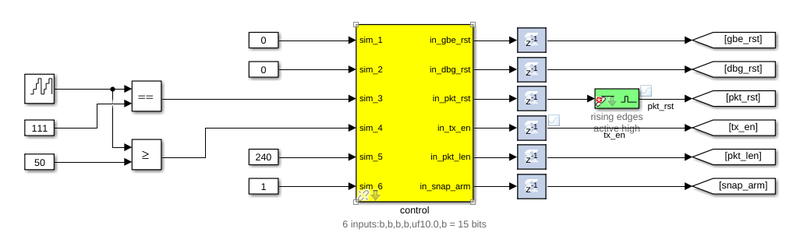


Each packet that is sent from the FPGA fabric can be sent to a specified IP and port. These values are configurable and, in this case, are set via software registers. These could also be set dynamically from the fabric as required.

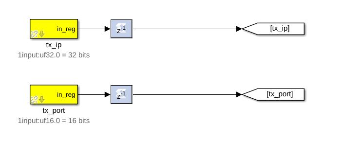


This is the start of the logic to build up our payload. The decimation register is used to control the rate at which packets are sent. Have a look at lines 307-312 of the [Tx python script](https://github.com/casper-astro/tutorials_devel/blob/master/vivado/skarab/tut_40gbe/tut_40gbe_tx.py#L307) to see how this value is calculated and used.

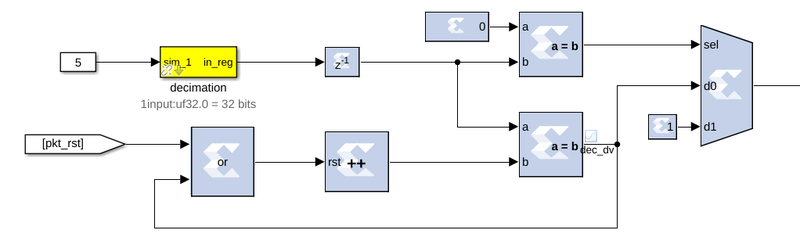

Here is the rest of the payload generation logic. We are creating 2 ramps and a walking-1 pattern. The payload is generated using a combination of counters, slice blocks, delays, adders and comparators. The ramps and walking-1 are concatenated together and put into the payload buffer by toggling the `tx_valid` signal on the 40GbE core. The `tx_data` bus is 256 bits wide so only 256 bits can be clocked in on a clock cycle. The buffer can accept a payload of up to 8192 bytes. Once all the data we require is in the payload buffer we toggle the `tx_end_of_frame` signal to send the packet into the ether. 

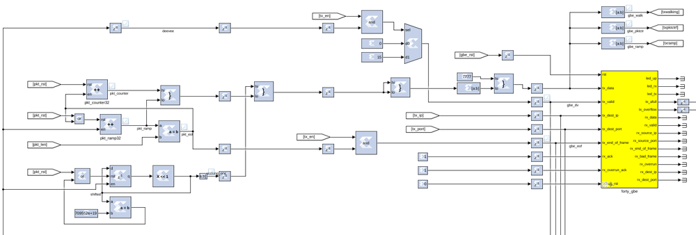

As a method of debugging, the transmit side also as some data snapshot (snap, not [SNAP](https://github.com/casper-astro/casper-hardware/wiki/SNAP)) blocks which can capture data as it is sent to the core. The snap block is a BRAM which can be triggered to capture data on a particular signal and then read out from software. They are very useful for debugging and checking the data at particular stages through your design. 

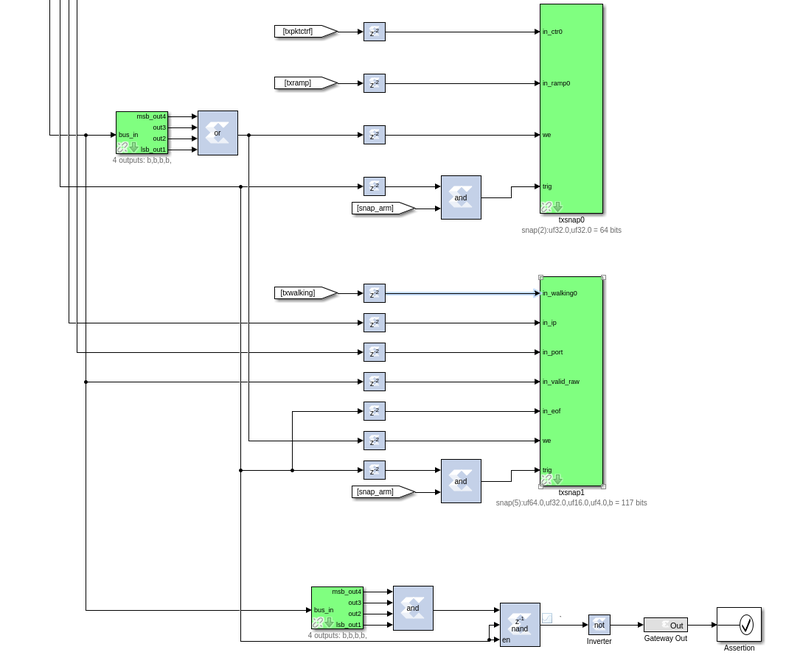

The design also has a counter that keeps track of each time the overflow or almost-full lines are driven high by the core. This will tell us if we have any overflow or almost-overflowing buffers.

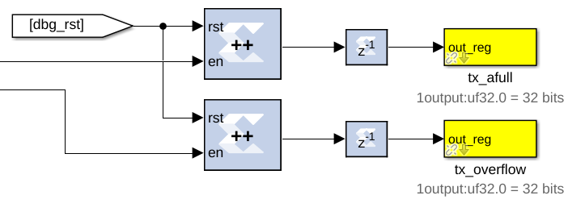

Now take a look through the Tx python script to see how the registers are being set and the debug snap blocks are used to validate the data being sent. This should be well commented, but please ask questions where things aren't clear.

## Rx Design ##

For the receiver design do the same as the previous design by dropping down an XSG block and the SKARAB platform block. Configure the clock rate to 230Mhz. We want this to be well above the clock rate of the transmit design so that we can handle the variable rate from the transmitter and not overflow our buffers.

Again we have a control register which manages resets, enables and snap block triggering.

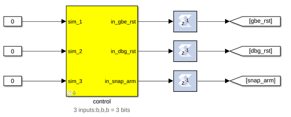

This is the receiving 40GbE. If the Tx-side is all tied to zero (0) this interface is not used. The Rx side is connected up to labels which are used to reduce the wires running around the design. 

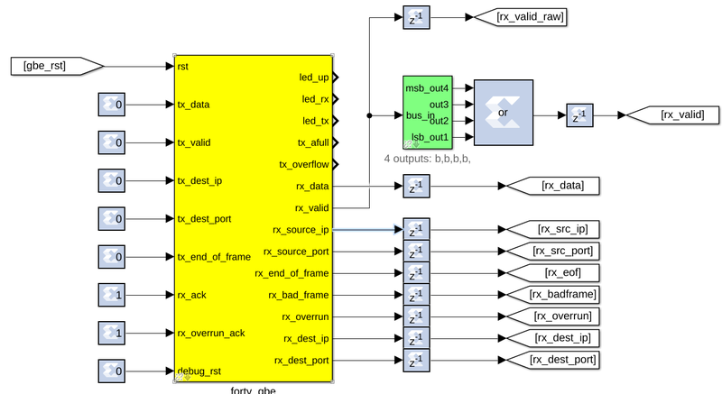

The following blocks split out the walking 1 and the ramps from the received data.

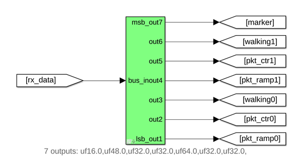

Here each of the split data are written into snap blocks. The snap blocks are triggered by the end-of-frame signal and the write enable is driven by the rx_valid signal.

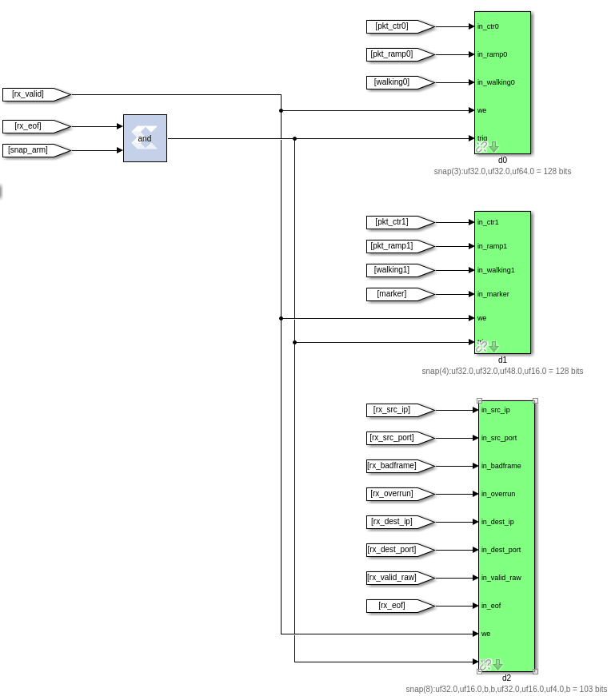

Here we have counters used to count any errors on the receiver's side. They are fed into software registers for access from software.

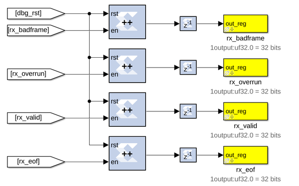

Here are more registers used for debugging; they count any errors in the expected data, the ramps and the walking 1.

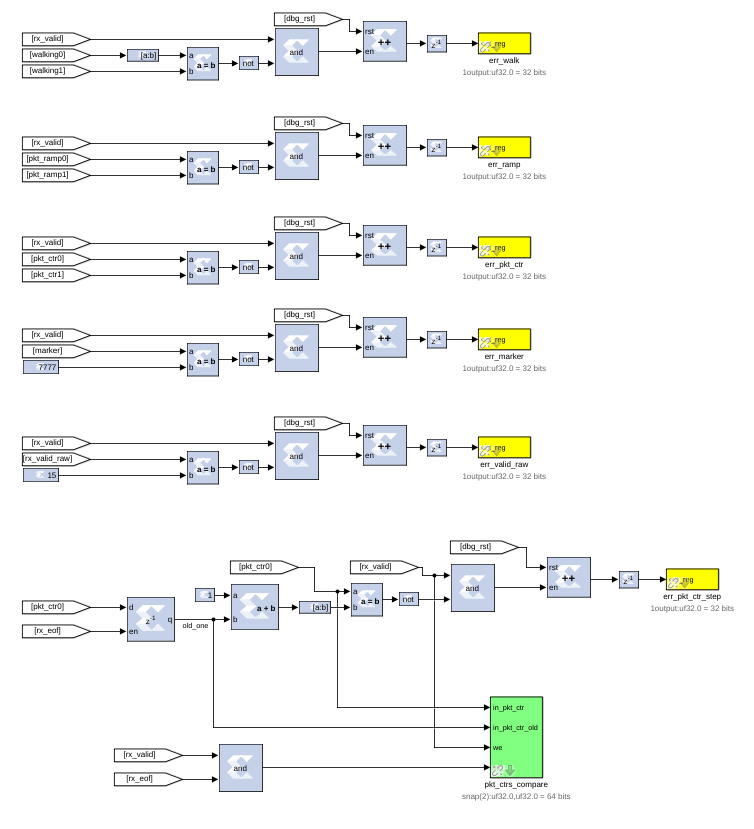

This writes the packet header data into a snap block just to provide more debugging data.

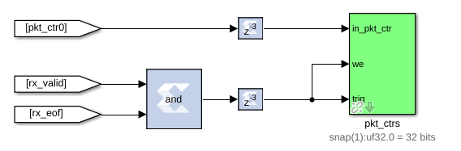

## Running the python script ##

Once you are finished examining the designs and feel that you have a good handle on them. Look through the python tx script. Try to figure out how to call the script with the correct parameters and files. You might have to [scp](http://www.hypexr.org/linux_scp_help.php) the files to the control server, then run it and see what data you can get out. You can also start an ipython session to manually connect and run each of the commands. If you are running the tutorial during the workshop the facilitators should have the control server information up to view, or look [here](https://github.com/casper-astro/tutorials_devel/blob/master/workshop_setup.md). If you are running the tutorials elsewhere please familiarise yourself with your local setup/server(s) in order to run the tutorial.

The python script, `tut_40gbe.py`, does all the heavy lifting for the communication aspect of the tutorial. The script allows you to specify a few parameters and subsequently programs the boards, transmits and receives the test data.

### Script arguments ###

Much like most python scripts, you can query the arguments via:
```bash
$ python tut_40gbe.py --help
usage: tut_40gbe_tx.py [-h] [--txhost TXHOST] [--rxhost RXHOST]
                       [--txfpg TXFPG] [--rxfpg RXFPG] [--pktsize PKTSIZE]
                       [--rate RATE] [--decimate DECIMATE] [-p] [-i]
                       [--loglevel LOG_LEVEL]

Script and classes for SKARAB Tutorial 2

optional arguments:
  -h, --help            show this help message and exit
  --txhost TXHOST       Hostname or IP for the TX SKARAB. (default: )
  --rxhost RXHOST       Hostname or IP for the RX SKARAB. (default: )
  --txfpg TXFPG         Programming file for the TX SKARAB. (default: )
  --rxfpg RXFPG         Programming file for the RX SKARAB. (default: )
  --pktsize PKTSIZE     Packet length to send (in words). (default: 160)
  --rate RATE           TX bitrate, in Gbps. (default: 2.0)
  --decimate DECIMATE   Decimate the datarate by this much. (default: -1)
  -p, --program         Program the SKARABs (default: False)
  -i, --ipython         Start IPython at script end. (default: False)
  --loglevel LOG_LEVEL  log level to use, default None, options INFO, DEBUG,
                        ERROR (default: INFO)
```

As per the info above, we can see that running the 40GbE tutorial script requires the following (compulsory) parameters:
- The IPs or Hostnames of SKARABs assigned to do the Transmitting and Receiving of data.
  - It is also worth mentioning that the SKARABs you intend on using to carry out this tutorial **must** have at least one QSFP+ cable plugged in to each board.
- Programming files for the Tx and Rx SKARABs. These fpg-files will be output after the build process is executed on Tx and Rx simulink models.
  - There are already-built versions of these images available in the working directory, namely `tut_40gbe_tx.fpg` and `tut_40gbe_rx.fpg`. Feel free to use these if you don't want to wait for the build process to complete.
- The **-p** or **--program** flag dictates whether the programming files specified in the `-txfpg` and `-rxfpg` flags will be programmed to the board (using the method you learnt in the [previous tutorial](https://casper-tutorials.readthedocs.io/en/latest/tutorials/skarab/tut_intro.html#programming-the-fpga))
  - I would suggest specifying this flag purely to minimise the 'setup' work you need to do to get the tutorial running.
  - You could run the tutorial script without specifying this flag, however that would require programming the two SKARABs with the associated fpg-files before running the script. Nothing major.

The other flags already have default values and don't need to be specified unless you want to, for example, test how different parameters change the behaviour of the system. An example of the script execution is show below:

```bash
$ python tut_40gbe.py --txhost skarab020201-01 --rxhost skarab020202-01 --txfpg tut_40gbe_tx.fpg --rxfpg tut_40gbe_rx.fpg -p
```

Of course, please do make sure you are in the correct directory holding the `tut_40gbe.py` script. Equally, substitute `tut_40gbe_tx.fpg` and `tut_40gbe_rx.fpg` for the paths to your generated fpg-files in the event you ran through the build process. These files should be in `tut_40gbe_tx/outputs/` and `tut_40gbe_rx/outputs/`. After executing the script as above you should see something resembling the following being printed to your terminal window:

```bash
INFO:root:Connecting to SKARABs
*
*
INFO:root:Programming SKARABs
*
*
INFO:root:  Done programming TXer
*
*
INFO:root:  Done programming RXer
skarab020202-01
INFO:root:Setting TX destination to 10.0.0.2.
INFO:root:Sending data at 1.970Gbps (0.177Ghz * 256 / 23)
INFO:root:Setting RX port.
INFO:root:Starting TX.
INFO:root:Some RX stats:
INFO:root:	valid: 7432640
INFO:root:	eof: 221779039
INFO:root:	badframe: 0
INFO:root:	overrun: 0
------------------------- pkt_000 -------------------------
  ctr mark              walking_one   pkt_ctr      ramp
    0 7777                       32     47491         1
    1 7777                       64     47491         2
    2 7777                      128     47491         3
    3 7777                      256     47491         4
    4 7777                      512     47491         5
*
*
*
*
*

```

If you see any errors do make a note of them! Regardless, please ask if you have any questions, of which I am sure there will be many.
