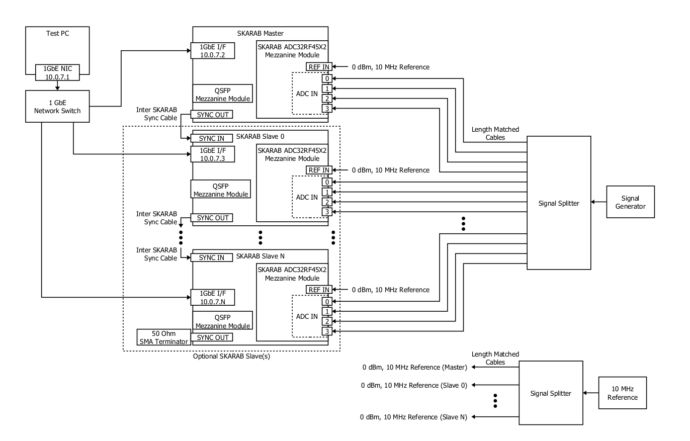

# Tutorial 5: 2.8 GSPS, N-channel, Synchronous Data Acquisition

## Introduction ##
This tutorial explains how to capture synchronised ADC sampled data from one or more SKARABS, each of which is populated with a single PI-12533.02G SKARAB ADC32RF45X2 Mezzanine Module. In this tutorial, the internal DDCs of the ADC32RF45 dual ADCs are bypassed.

The PI-12533.02G SKARAB ADC32RF45X2 Mezzanine Module contains four ADCs which by default sample at 2.8 GSPS (other sample rates are possible using the on-board sample rate generator).

This tutorial comes with the following:
- A Simulink design model, from which an fpg file will be created.
- A Python test script (which uses the casperfpga library) to upload the fpg file to the SKARABs and then control them to perform synchronized sampling.
- An ADC data plotting Matlab script which overlays the captured ADC data from all sampled channels.

The directories for these files can be accessed via the following links:
- [Simulink design model](https://github.com/ska-sa/mlib_devel/tree/peralex_adc/jasper_library/test_models/test_skarab_adc_byp.slx)
- [Python test script](https://github.com/ska-sa/mlib_devel/tree/peralex_adc/jasper_library/test_models/scripts/test_skarab_adc4x3g_14_byp/test_skarab_adc4x3g_14_byp.py)
- [ADC data plotting script](https://github.com/ska-sa/mlib_devel/tree/peralex_adc/jasper_library/test_models/scripts/test_skarab_adc4x3g_14_byp/plot_adc_data.m)

## Simulink Design Overview ##
The Simulink design consists of the following:
- The SKARAB_ADC4X3G14_BYP Yellow Block which is used to synchronise a SKARAB ADC32RF45X2 Mezzanine Module to others and to recover synchronized ADC sample data from it.
- Multiple Snapshot Yellow Blocks which are used to capture the ADC sample data recovered by the SKARAB_ADC4X3G14_BYP Yellow Block.
- Several components which are used to provide a GbE and a 40 GbE interface to the design so that the design can be controlled from the Python test script. 
- The Xilinx System Generator, which is a plug-in to Simulink that enables designers to develop high-performance DSP systems for Xilinx FPGAs such as the Virtex 7 FPGA on the SKARAB.
- The SKARAB Yellow Block, which is used to create the Simulink design for the SKARAB platform.

## SKARAB_ADC4X3G14_BYP Yellow Block Description ##
The SKARAB_ADC4X3G14_BYP provides sixteen 12-bit samples from each of the four ADCs of the module in parallel as output. For a 2.8 GSPS sampling frequency, the sixteen samples are provided at a rate of 175 (2800/16) MSPS from the Yellow Block.

The SKARAB_ADC4X3G14_BYP Yellow Block parameters are as follows:
- Mezzanine slot: Mezzanine slot (0 to 3) of the SKARAB where the SKARAB ADC32RF45X2 Mezzanine Module is installed.
- Clock Master/Slave: Determines if the Yellow Block is generating the "adc_clk" or not. If only one SKARAB_ADC4X3G14_BYP Yellow Block is used in the Simulink design, this should be set to "Master". If more than one is used in the design, the parameter of one should be set to "Master" while the parameter of the rest should be set to "Slave".

The SKARAB_ADC4X3G14_BYP Yellow Block outputs are as follows:
- adc0_data_out &lt;X&gt; (where X: 0 to 15): Sixteen successive 12-bit samples from ADC 0
- adc1_data_out &lt;X&gt; (where X: 0 to 15): Sixteen successive 12-bit samples from ADC 1
- adc2_data_out &lt;X&gt; (where X: 0 to 15): Sixteen successive 12-bit samples from ADC 2
- adc3_data_out &lt;X&gt; (where X: 0 to 15): Sixteen successive 12-bit samples from ADC 3
- adc0_data_val_out: ADC 0 sample data valid signal
- adc1_data_val_out: ADC 1 sample data valid signal
- adc2_data_val_out: ADC 2 sample data valid signal
- adc3_data_val_out: ADC 3 sample data valid signal

## SKARAB Yellow Block Clocking ##
Please note the User IP Clock source parameter of the SKARAB Yellow Block. In this Simulink design example, either sys_clk or adc_clk can be selected to clock the User IP. The implications of choosing either clock source follows:
- adc_clk is a clock generated by the SKARAB_ADC4X3G14_BYP Yellow Block with a frequency that matches its output clock rate of 175 MHz when operating at a 2.8 GSPS sample rate ([2.8 GSPS]/[16 samples per output clock cycle]=175 MHz). As a result the valid signal of SKARAB_ADC4X3G14_BYP Yellow Block is permanently asserted, and therefore does not need to be monitored after initial assertion.
- sys_clk is a free running clock which has no relation to the sampling rate of the ADCs. By necessity, the selected sys_clk frequency must be greater than the SKARAB_ADC4X3G14_BYP Yellow Block’s output clock rate of 175 MHz. The sixteen output samples are then being generated at a lower clock rate (175 MHz) than the user clock rate (sys_clk). As a result, the user needs to respect the data valid signal of the SKARAB_ADC4X3G14_BYP Yellow Block on subsequent processing blocks. This clocking scheme allows subsequent signal processing to run at a higher clock rate than the SKARAB_ADC4X3G14_BYP Yellow Block output clock rate. However, not all Yellow Blocks support clock gating (data valid) signals.

## Usage Instructions ##
1. Create an fpg file from the provided Simulink design.
2. Set up the hardware test configuration as described in the figure below.

3. Allow a DHCP or BOOTP server on the network to allocate IP addresses to the SKARABs.
Example:
>> 06:50:02:0D:03:00: 10.0.7.2  
>> 06:50:02:0D:04:00: 10.0.7.3  
>> 06:50:03:0D:01:00: 10.0.7.4  
>> 06:50:02:0D:02:00: 10.0.7.5
4. Power on the SKARABs and confirm that their IP address allocation was successful (e.g. PING).
5. Edit the Python test script configuration (under the section "1. SCRIPT CONFIG") to point to the created fpg file, specify the allocated IPs of the SKARABs, etc.
6. Run the Python test script which will upload the created fpg file to them, perform synchronised ADC data sampling, and then write the sample data to text files.
7. Run the ADC data plotting script to plot the captured ADC sample data from the text files.

The design files and documentation for this tutorial were supplied by Peralex. However, please feel free, as always, to contact the [CASPER email list](mailto:casper@lists.berkeley.edu) with questions/issues and we will do our best to help (or find someone who can). 
