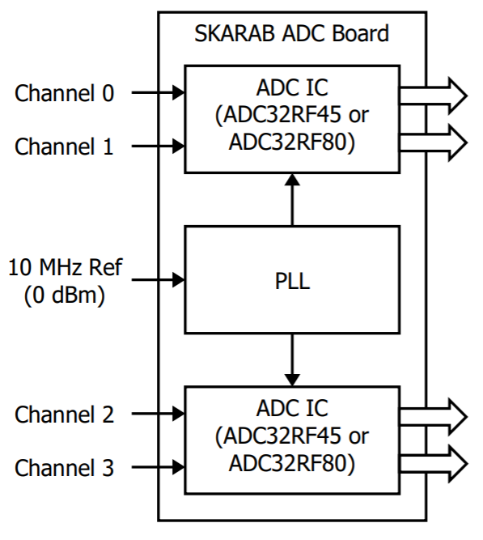
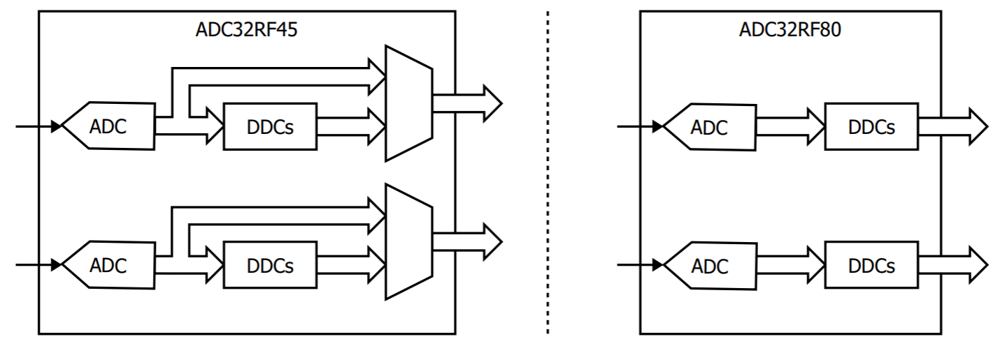
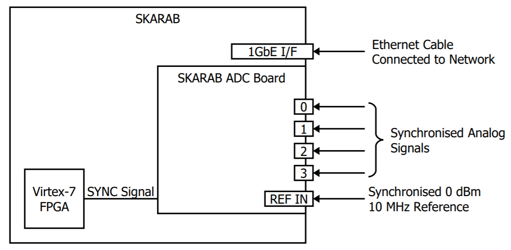
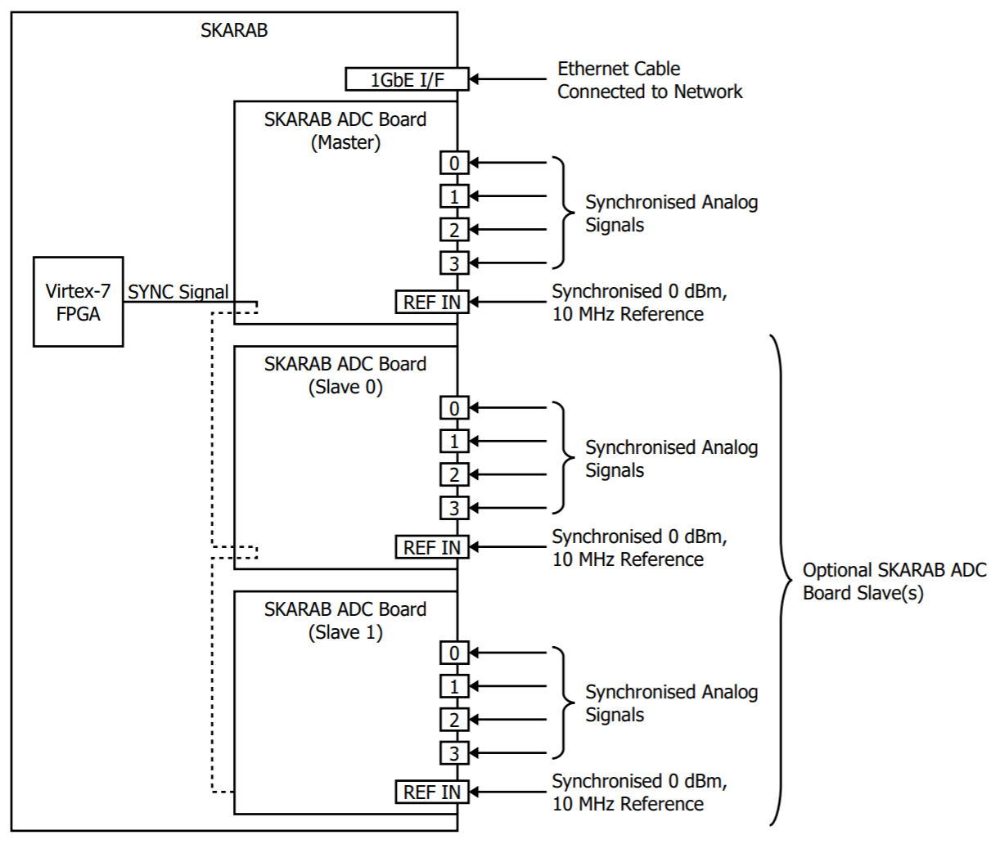
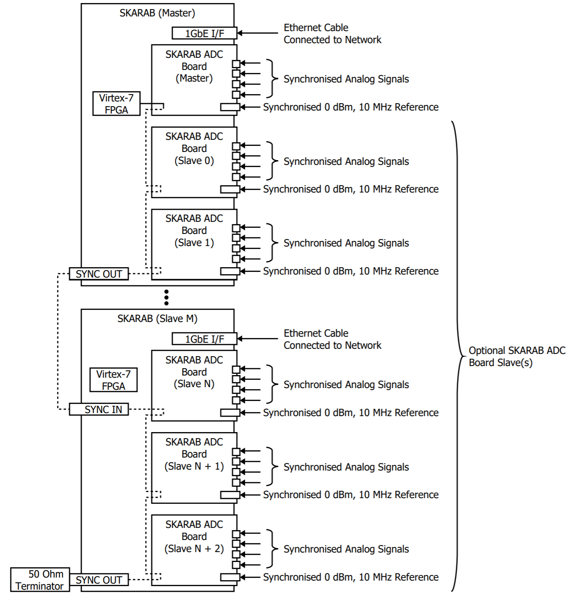
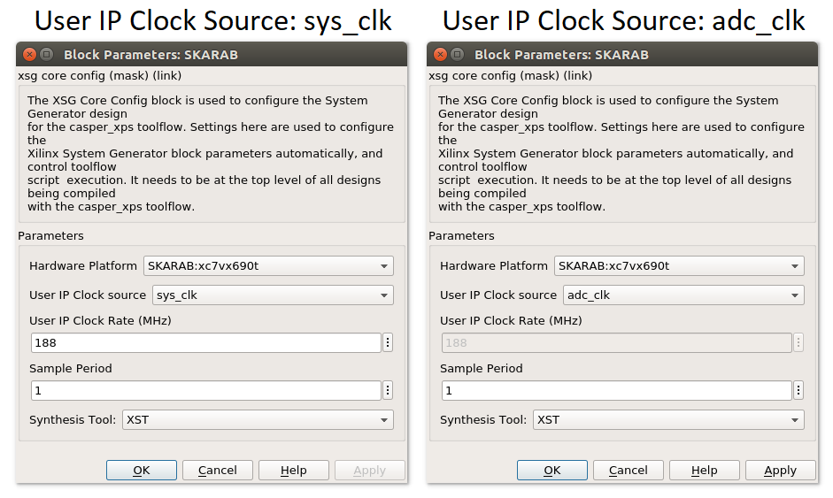
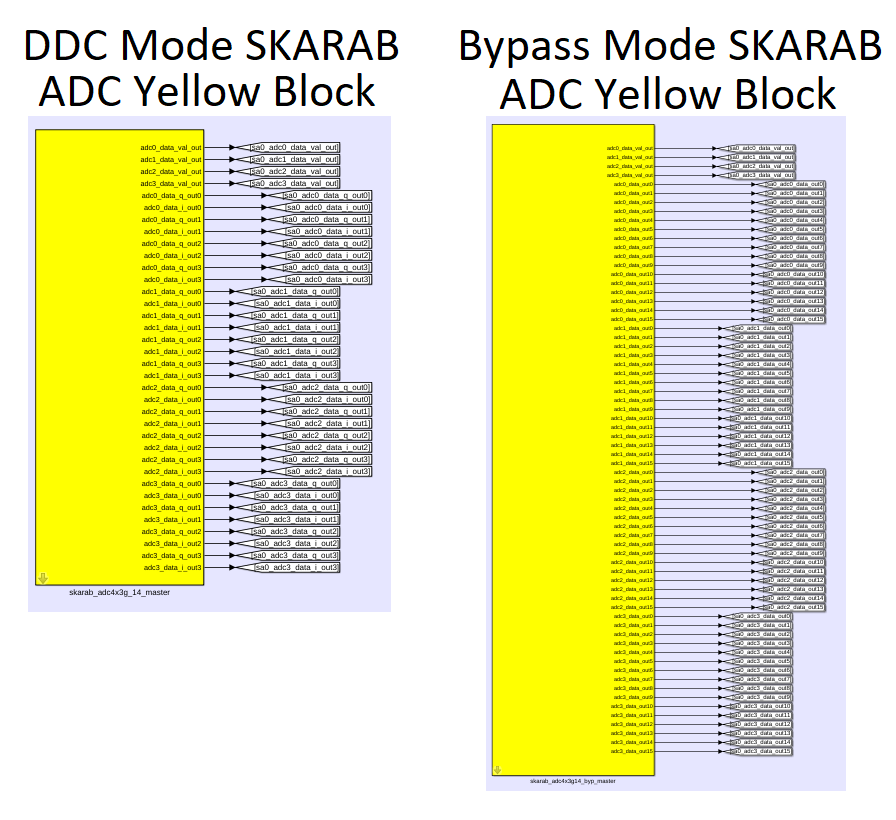
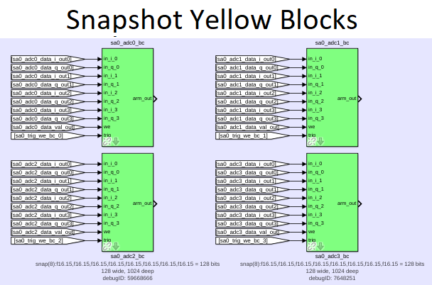
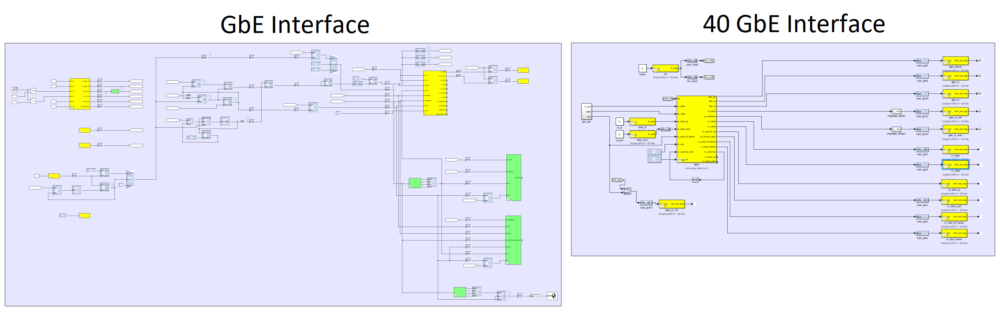
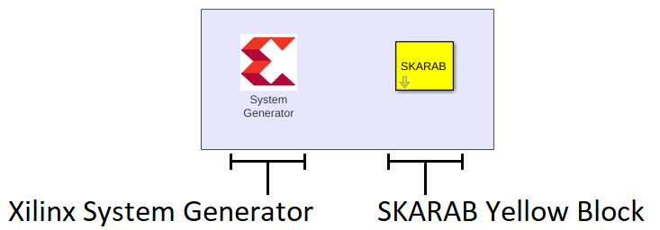

# Tutorial 5 [latest]: SKARAB ADC Synchronous Data Acquisition

## Introduction ##
This tutorial explains how a Simulink design can be created and controlled to perform synchronised ADC sampling among the channels of one or more SKARAB ADC boards that are installed in one or more SKARAB systems. The Simulink design is created using the CASPER Toolflow and the software control of the synchronised sampling is performed using the casperfpga Python library.

## SKARAB ADC Board Overview ##
The SKARAB ADC board has four analogue channels which can each be sampled at a maximum rate of 3 GSPS. The sampling is either performed by two dual-channel TI ADC32RF80 ADC ICs or two dual-channel TI ADC32RF45 ADC ICs. The board also contains a PLL which locks to a reference clock to derive and provide sampling clocks to the ADC ICs. Both the ADC32RF45 and ADC32RF80 include DDCs, but only the ADC32RF45 allows the DDCs to be bypassed to provide the full bandwidth.

There are two different bandwidth modes in which the SKARAB ADC board can be used: "Bypass Mode" and "DDC Mode". The differences between these modes are summarised in the following table:

Bandwidth Mode | Sampling Frequency | Decimation Factor | SKARAB ADC Board Support
--- | --- | --- | --- 
DDC Mode | 3 GSPS | 4 | All SKARAB ADC Board Types
Bypass Mode | 2.8 GSPS | None (bypassed) | Only SKARAB ADC Boards with ADC32RF45

Note that other sampling frequencies are available using the PLL of the SKARAB ADC board and that other decimation factors are provided by the ADC ICs. Please contact Peralex Electronics for more information.

The SKARAB ADC board is available in three ordering variants. These ordering variants are summarised in the table below:

Ordering Variant | ADC ICs | PGA Support
--- | --- | ---
12533.02C | Two ADC32RF45 ICs | No 
12533.02E | Two ADC32RF80 ICs | Yes 
12533.02G | Two ADC32RF45 ICs | Yes 

Please contact Peralex Electronics for more information.

## SKARAB ADC Hardware Setup ##

It is possible to, not only perform synchronised sampling among the four channels of a single SKARAB ADC board, but also to perform synchronised sampling among all the channels of multiple SKARAB ADC boards.

In cases where synchronised sampling among only four channels are required, a single SKARAB ADC board will be installed in a SKARAB system. During operation, a synchronisation signal is sent from the Virtex-7 FPGA to a SKARAB ADC board to allow synchronised sampling among the four channels.

In cases where synchronised sampling among more than four channels is required, one option is to install more SKARAB ADC boards in a SKARAB system. In this case, the synchronistaion signal is daisy chained. Up to three SKARAB ADC boards can be installed in a system.  The first SKARAB ADC board in the chain is referred to as the "Master" while the rest are referred to as the "Slaves".

Another option to allow synchronised sampling among more than four channels is to use more than one SKARAB system. This allows the number of SKARAB ADC boards in the hardware setup to extend beyond three. In this case, the synchronisation signal is daisy chained from the SKARAB ADC board Master to the the rest of the SKARAB ADC board Slaves among the SKARAB systems. Similarly, the SKARAB system containing the Master SKARAB ADC board is referred to as the "Master", while the remaining SKARAB systems are referred to as the "Slaves". The connections inside the SKARAB systems are made by Peralex Electronics while the connections outside will be made by the user of the hardware setup. The user will also terminate the synchronisation signal at the last system with 50 Ohm.

As the number of channels that need to be synchronised increases (for example 80), the length of the daisy chained synchronisation signal increases as well, and may become too long. In these cases, the SKARAB SYNC multiplier is used.

Contact Peralex Electronics for more details of these, and potentially other, hardware setups.

## SKARAB ADC Yellow Block ##
### Overview ###
Each SKARAB ADC board installed in a SKARAB system needs a corresponding Yellow Block in a Simulink design so that synchronised ADC sample data can be captured. There are two types of Yellow Blocks, namely: the DDC Mode SKARAB ADC Yellow Block and the Bypass Mode SKARAB ADC Yellow Block. The DDC Mode SKARAB ADC Yellow Block (named "skarab_adc4x3g_14" in the CASPER Toolflow) can be used along with any SKARAB ADC board variant since they all support the DDC bandwidth mode. The Bypass Mode SKARAB ADC Yellow Block (named "skarab_adc4x3g_14_byp" in the CASPER Toolflow) can only be used along with a SKARAB ADC board that supports the Bypass bandwidth mode.

### Master and Slaves ###
The clocking and synchronisation functions can only be performed by one of the SKARAB ADC Yellow Blocks in a Simulink design. The SKARAB ADC Yellow Block that performs these functions are known as the "Master" while the others are known as the "Slaves". If only one SKARAB ADC Yellow Block is used in the Simulink design, it needs to be set as the "Master". If there are more than one SKARAB ADC Yellow Blocks in the design, one needs to be set as the Master while the remaining ones are set as the Slaves. Also, if a SKARAB ADC board needs to be used as a Master in a hardware setup, its corresponding SKARAB ADC Yellow Block needs to be set as the Master too.

### Description of DDC Mode SKARAB ADC Yellow Block (skarab_adc4x3g_14) ###
This Yellow Block provides four 16-bit I/Q sample pairs from each of the four channels of the SKARAB ADC board as output (in parallel). For a 3 GSPS sampling frequency that is decimated by 4, the four sample pairs are provided at a rate of 187.5 MSPS:

[3 GSPS]/[decimate by 4 × 4 sample pairs per output clock cycle] = 187.5 MSPS

The Yellow Block parameters are as follows:
- Mezzanine slot: Mezzanine slot (0 to 3) of the SKARAB where the SKARAB ADC board is installed.
- Master/Slave: The Master performs clocking (generates adc_clk) and synchronisation functions. There should only be one Master SKARAB ADC Yellow Block in a Simulink design while the remaining (if any) need to be Slaves.

The Yellow Block outputs are as follows:
- adc0_data_i_out&lt;X&gt; (where X: 0 to 3): Four successive 16-bit I samples from channel 0
- adc0_data_q_out&lt;X&gt; (where X: 0 to 3): Four successive 16-bit Q samples from channel 0
- adc1_data_i_out&lt;X&gt; (where X: 0 to 3): Four successive 16-bit I samples from channel 1
- adc1_data_q_out&lt;X&gt; (where X: 0 to 3): Four successive 16-bit Q samples from channel 1
- adc2_data_i_out&lt;X&gt; (where X: 0 to 3): Four successive 16-bit I samples from channel 2
- adc2_data_q_out&lt;X&gt; (where X: 0 to 3): Four successive 16-bit Q samples from channel 2
- adc3_data_i_out&lt;X&gt; (where X: 0 to 3): Four successive 16-bit I samples from channel 3
- adc3_data_q_out&lt;X&gt; (where X: 0 to 3): Four successive 16-bit Q samples from channel 3
- adc0_data_val_out: Channel 0 sample data valid signal
- adc1_data_val_out: Channel 1 sample data valid signal
- adc2_data_val_out: Channel 2 sample data valid signal
- adc3_data_val_out: Channel 3 sample data valid signal

### Description of Bypass Mode SKARAB ADC Yellow Block (skarab_adc4x3g_14_byp) ###
This Yellow Block provides sixteen 12-bit samples from each of the four channels of the SKARAB ADC board as output (in parallel). For a 2.8 GSPS sampling frequency, the sixteen samples are provided at a rate of 175 MSPS:

[2.8 GSPS]/[16 samples per output clock cycle] = 175 MSPS

The Yellow Block parameters are as follows:
- Mezzanine slot: Mezzanine slot (0 to 3) of the SKARAB where the SKARAB ADC board is installed.
- Master/Slave: The Master performs clocking (generates adc_clk) and synchronisation functions. There should only be one Master SKARAB ADC Yellow Block in a Simulink design while the remaining (if any) need to be Slaves.

The Yellow Block outputs are as follows:
- adc0_data_out&lt;X&gt; (where X: 0 to 15): Sixteen successive 12-bit samples from channel 0
- adc1_data_out&lt;X&gt; (where X: 0 to 15): Sixteen successive 12-bit samples from channel 1
- adc2_data_out&lt;X&gt; (where X: 0 to 15): Sixteen successive 12-bit samples from channel 2
- adc3_data_out&lt;X&gt; (where X: 0 to 15): Sixteen successive 12-bit samples from channel 3
- adc0_data_val_out: Channel 0 sample data valid signal
- adc1_data_val_out: Channel 1 sample data valid signal
- adc2_data_val_out: Channel 2 sample data valid signal
- adc3_data_val_out: Channel 3 sample data valid signal
  
## Simulink Design Clocking Considerations ##

Please note the User IP Clock source parameter of the SKARAB Yellow Block. Either sys_clk or adc_clk can be selected to clock the User IP. The implications of choosing either clock source follows:
-	adc_clk is a clock generated by a SKARAB ADC Yellow Block with a frequency that matches its output clock rate. As a result, the valid signals of the SKARAB ADC Yellow Block are permanently asserted, and therefore does not need to be monitored after initial assertion. The frequency of adc_clk is 187.5 or 175 MHz depending on whether the DDC or Bypass Mode SKARAB ADC Yellow Block is used, respectively. Also, when using adc_clk, the Simulink Design User IP will not be clocked until initialisation of the SKARAB ADC board along with its corresponding SKARAB ADC Yellow Block.
-	sys_clk is a free running clock which has no relation to the sampling rate of the SKARAB ADC board. By necessity, the selected sys_clk frequency must be greater than the SKARAB ADC Yellow Block sample data output rate (175 MHz or 187.5 MHz). Thus, the user needs to respect the data valid signals of the SKARAB ADC Yellow Block on subsequent processing blocks. This clocking scheme allows subsequent signal processing to run at a higher clock rate than the SKARAB ADC Yellow Block data output rate. However, not all Yellow Blocks support clock gating (data valid) signals. Also, an advantage of sys_clk is that the clocking of the Simulink Design User IP is independent of the initialisation of any of the SKARAB ADC boards or their corresponding SKARAB ADC Yellow Blocks.

## Example Designs ##

The following example designs are provided to demonstrate synchronised ADC sampling in a hardware setup that contains one or more SKARAB ADC boards (installed in a set of one or more SKARAB systems):
- Four Simulink design models, one of which will be used to create an fpg file to upload to each of the SKARAB systems. The design model to use depends on the number of SKARAB ADC boards per SKARAB (one or two) as well as the bandwidth mode in which they need to be used (DDC or Bypass).
- A Python test script (using the casperfpga library) which uploads the fpg file (created from any of the four Simulink design models) to the SKARABs and then controls them to perform synchronised sampling. The usage of this script is described in its comments.
- Two ADC data plotting Matlab scripts which overlays the captured ADC data from all sampled channels. The usage of these scripts are described in their comments.

Each of the four Simulink design models consists of the following components:
- One or two SKARAB ADC Yellow Blocks used to perform synchronised sampling among several SKARAB ADC boards (in DDC or Bypass mode).
  

- Multiple Snapshot Yellow Blocks which are used to capture the ADC sample data recovered by the SKARAB ADC Yellow Blocks.

- Several components which are used to provide a GbE and a 40 GbE interface to the design so that the design can be controlled from the Python test script. 

- The Xilinx System Generator, which is a plug-in to Simulink that enables designers to develop high-performance DSP systems for Xilinx FPGAs such as the Virtex-7 FPGA on the SKARAB.
- The SKARAB Yellow Block, which is used to create the Simulink design for the SKARAB platform. 

The user of the Simulink design needs to do the following before creating an fpg file from it:
- Set the Mezzanine Slot of each SKARAB ADC Yellow Block to indicate where its corresponding
SKARAB ADC board is installed.
- Set the User IP Clock Source of the design.
- Ensure that there is only one Master SKARAB ADC Yellow Block in the design.

The links to the Simulink design models are:
- [Simulink design model with one DDC mode SKARAB ADC Yellow Block](https://github.com/ska-sa/mlib_devel/tree/peralex_adc/jasper_library/test_models/test_skarab_adc.slx)

- [Simulink design model with one Bypass mode SKARAB ADC Yellow Block](https://github.com/ska-sa/mlib_devel/tree/peralex_adc/jasper_library/test_models/test_skarab_adc_byp.slx)

- [Simulink design model with two DDC mode SKARAB ADC Yellow Blocks](https://github.com/ska-sa/mlib_devel/tree/peralex_adc/jasper_library/test_models/test_skarab_adc_x2.slx)

- [Simulink design model with two Bypass mode SKARAB ADC Yellow Blocks](https://github.com/ska-sa/mlib_devel/tree/peralex_adc/jasper_library/test_models/test_skarab_adc_byp_x2.slx)

The link to the Python test script is:

- [Python test script](https://github.com/ska-sa/mlib_devel/tree/peralex_adc/jasper_library/test_models/scripts/skarab_adc_test/skarab_adc_test.py)

The links to the ADC data plotting MATLAB scripts are:

- [DDC mode ADC data plotting MATLAB script](https://github.com/ska-sa/mlib_devel/tree/peralex_adc/jasper_library/test_models/scripts/skarab_adc_test/plot_adc_data_ddc.m)

- [Bypass mode ADC data plotting MATLAB script](https://github.com/ska-sa/mlib_devel/tree/peralex_adc/jasper_library/test_models/scripts/skarab_adc_test/plot_adc_data_byp.m)

## SKARAB ADC Firmware Version Requirements ##
A SKARAB ADC board needs to be programmed with firmware version 2.0 to be compatible with casperfgpa functions and the SKARAB ADC Yellow Blocks. The skarab_adc_reconfig.py Python script can be used to update the SKARAB ADC board firmware to this version. Please read the comments in the header of this script for an explanation of how to use it.

Two bin file variants of the SKARAB ADC firmware version 2.0 are provided: EMB124901U8R2_DDC.bin and EMB124901U8R2_BYP.bin. The only difference between them is the default bandwidth mode in which they configure the SKARAB ADC board on startup. EMB124901U8R2_DDC.bin configures it in DDC mode on startup, while EMB124901U8R2_BYP.bin configures it in Bypass mode on startup. When only using a SKARAB ADC board in a single bandwidth mode, the appropriate bin file can be chosen so that it is not required to configure the SKARAB ADC board after startup using a casperfpga function.

The skarab_adc_reconfig.py Python script and the two bin files can be found here:
[SKARAB ADC FW](https://github.com/ska-sa/mlib_devel/tree/peralex_adc/jasper_library/test_models/scripts/skarab_adc_reconfig)

WARNING: Please ensure that the power and network connection to the SKARAB is stable before using this script. There is a possibility that the SKARAB ADC board can be bricked if the firmware update process is interrupted by a power or network failure. In this case, the SKARAB ADC board will need to be returned to Peralex Electronics so that its firmware can be restored to a working state.

## CASPER Toolflow and casperfpga Library Requirements ##
Please install the following versions of the CASPER Toolflow and casperfpga library:

[peralex_adc branch of the CASPER Toolflow](https://github.com/ska-sa/mlib_devel/tree/peralex_adc)

[peralex_adc branch of the casperfpga library](https://github.com/ska-sa/casperfpga/tree/peralex_adc)

## Test Procedure ##
1. Open one of the provided Simulink design models and modify it as required (as described in the "Example Designs" section)
2. Build an fpg file from the modified Simulink design model
3. Set up the hardware test configuration according to the information described in the "SKARAB ADC Hardware Setup" section
4. Allow a DHCP or BOOTP server on the network to allocate IP addresses to the SKARABs.
An example of the IP address allocation is listed in the table below:

SKARAB MAC Address | IP Address
--- | ---
06:50:02:0D:03:00 | 10.0.7.2
06:50:02:0D:04:00 | 10.0.7.3
06:50:03:0D:01:00 | 10.0.7.4
06:50:02:0D:02:00 | 10.0.7.5

4.	Power on the SKARAB Systems and confirm that their IP address allocation was successful (e.g. PING)
5.	Read the Python test script comments and set the script configuration as required
6.	Run the Python test script which will upload the created fpg file to the SKARAB systems, perform synchronised ADC data sampling, and then write the sample data to text files
7.	Run one of the ADC data plotting Matlab scripts to plot the captured ADC sample data from the text files

The design files and documentation for this tutorial were supplied by Peralex Electronics. However, please feel free, as always, to contact the [CASPER email list](mailto:casper@lists.berkeley.edu) with questions/issues and we will do our best to help (or find someone who can). 
