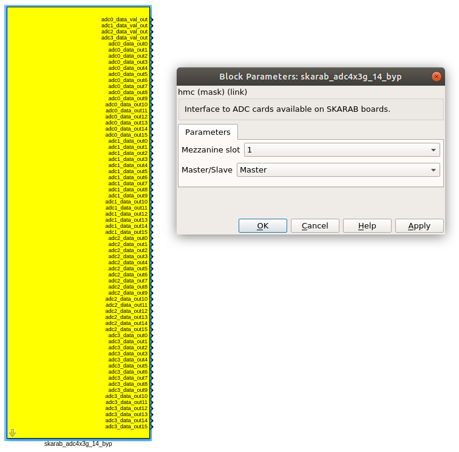
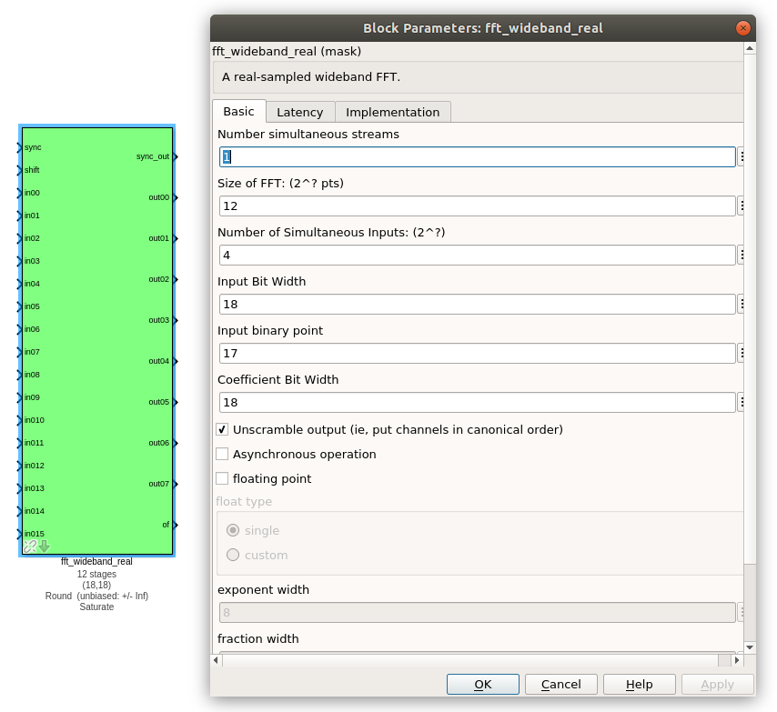
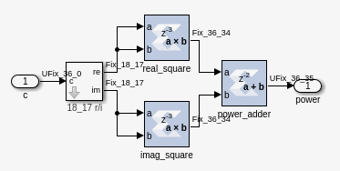
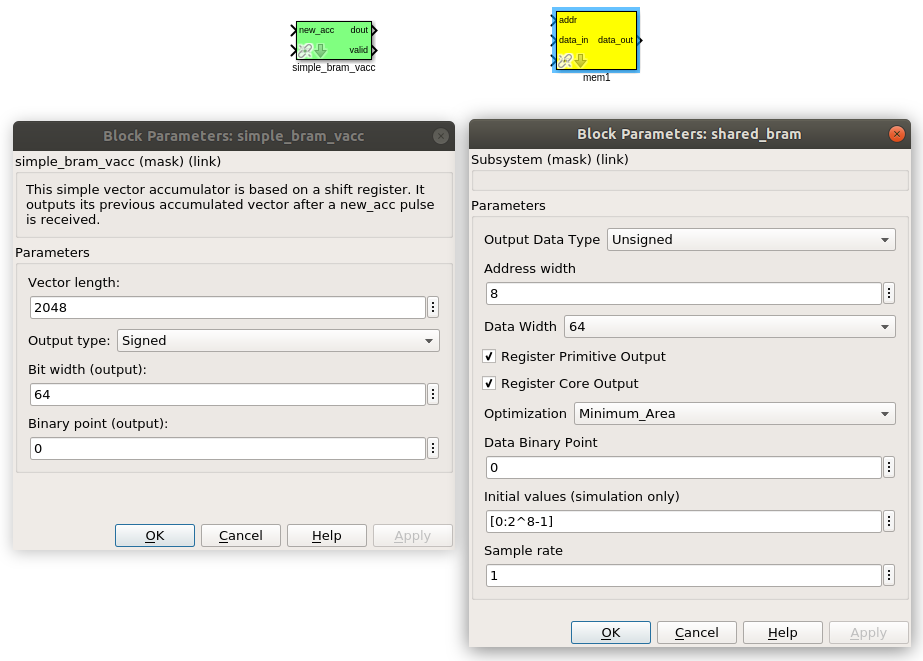
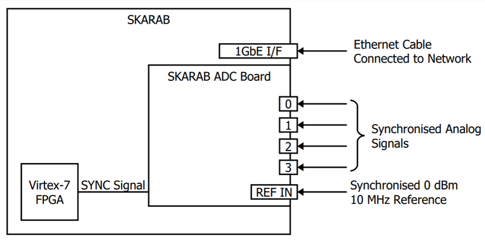
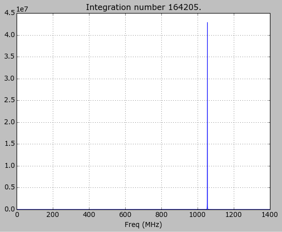

# Tutorial 4: [Latest] Wideband Spectrometer

## Preface ##
This tutorial is adapted from the original one found [Here](https://casper-toolflow.readthedocs.io/projects/tutorials/en/latest/tutorials/skarab/tut_spec.html). It is now leveraged to support ADC operating in Digital Down Convereter (DDC) Bypass bandwidth mode. The ADC modules based on ADC32RF45 chips which support both DDC and DDC Bypass bandwidth modes are applicable in this tutorial while focussing only on the DDC Bypass mode.

## Introduction ##
A spectrometer is something that takes a signal in the time domain and converts it to the frequency domain. In digital systems, this is generally achieved by utilising the FFT (Fast Fourier Transform) algorithm.

When designing a spectrometer for astronomical applications, it's important to consider the science case behind it. For example, pulsar timing searches will need a spectrometer which can 	dump spectra on short timescales, so the rate of change of the spectra can be observed. In contrast, a deep field HI survey will accumulate multiple spectra to increase the signal to noise ratio. It's also important to note that “bigger isn't always better”; the higher your spectral and time resolution are, the more data your computer (and scientist on the other end) will have to deal with. For now, let's skip the science case and familiarize ourselves with an example spectrometer.

## Setup ##

This tutorial comes with completed model files, compiled bitstreams, ready for execution on Skarab, as well as Python scripts to configure the Skarab and make plots. [Here](https://github.com/casper-astro/tutorials_devel/tree/master/skarab/tut_spec/tut_spec_byp)

## Spectrometer Basics ##

When designing a spectrometer there are a few main parameters of note:

- **Bandwidth**: The width of your frequency spectrum, in Hz. This depends on the sampling rate; for complex sampled data this is equivalent to:


In contrast, for real or Nyquist sampled data the rate is half this:


as two samples are required to reconstruct a given waveform .

- **Frequency resolution**: The frequency resolution of a spectrometer, Δf, is given by

,

and is the width of each frequency bin. Correspondingly, Δf is a measure of how precise you can measure a frequency.

- **Time resolution**: Time resolution is simply the spectral dump rate of your instrument. We generally accumulate multiple spectra to average out noise; the more accumulations we do, the lower the time resolution. For looking at short timescale events, such as pulsar bursts, higher time resolution is necessary; conversely, if we want to look at a weak HI signal, a long accumulation time is required, so time resolution is less important.

## Simulink / CASPER Toolflow ##

### Simulink Design Overview ###
If you're reading this, then you've already managed to find all the tutorial files.  By now, I presume you can open the model files and have a vague idea of what's happening.
The best way to understand fully is to follow the arrows, go through what each block is doing and make sure you know why each step is done. To help you through, there's some “blockumentation” in the appendix, which should (hopefully) answer all questions you may have. A brief rundown before you get down and dirty:

In the **Main Blocks** section, you'll notice that:
- the Xilinx token is placed to allow System Generator to be called to compile the design.
- In the SKARAB platform block, the hardware type is set to “SKARAB:xc7vx690t” and clock rate is specified as 176MHz when the *sys_clk* user IP clock is selected.  This frequency is specially chosen to avoid overflows on the ADC.  Implementing other clock frequencies will require you to use the data valid port leaving the ADC yellow block. When the *adc_clk* user IP clock is selected, the clock rate defaults to 175MHz.

At the bottom of the design you will find the **GbE Interface** and the **40GbE Interface** blocks.
The GbE Interface or the 40GbE Interface is required in the Skarab design for communication purposes, particularly to enable the design to be controlled from the python test script.

In the **ADC Data Capture** block, there are several components which are responsible for the capturing and processing the input signal. A brief run down is outlined below:
- The input signal is digitised by the ADC, resulting in sixteen parallel time samples of 12 bits each clock cycle. The ADC runs at 2.8 GHz. The sixteen samples are provided at a rate of 175MHz: [(2.8 GHz]/[16 samples per output clock cycles]) = 175MHz. Note that the ADC is operated in DDC bypass mode and provides the full bandwidth of 1.4 GHz.The output range is a signed number in the range -1 to +1 (ie 15 bits after the decimal point). This is expressed as fix_16_15
- In this tutorial we use the fft_wideband_real FFT block. The Skarab ADC yellow block produces demultiplexed real channels that are fed to the FFT block. This FFT block outputs only positive frequencies (negative frequencies are the mirror images of their positive counterparts), so the number of output ports (8) is half the number of input ports (16)
- You may notice Xilinx delay blocks dotted all over the design. It's common practice to add these into the design as it makes it easier to fit the design into the logic of the FPGA. It consumes more resources, but eases signal timing-induced placement restrictions
- The real and imaginary (sine and cosine value) components of the FFT are plugged into power blocks, to convert from complex values to real power values by squaring
- The requantized signals then enter the vector accumulators, simple_bram_vacc1 through simple_bram_vacc8, which are 64 bit vector accumulators. Accumulation length is controlled by the acc_cntrl block
- The accumulated signal is then fed into bram memory blocks, mem1 through mem8

Without further ado, open up the model file and start clicking on things, referring to the blockumentation as you go.

### [adc](https://casper.berkeley.edu/wiki/Adc) ###



The first step to creating a frequency spectrum is to digitize the signal. This is done with an ADC – an Analogue to Digital Converter.

The ADC block converts analog inputs to digital outputs. Every clock cycle, the inputs are sampled and digitized to 12 bit binary point numbers in the range of -1 to 1 and are then output by the ADC. This is achieved through the use of two's-compliment representation with the binary point placed after the seven least significant bits. This means we can represent numbers from -4096 through to 4095 including the number 0. Simulink represents such numbers with a fix_12_11 moniker.

ADCs often internally bias themselves to halfway between 0 and -1. This means that you'd typically see the output of an ADC toggling between zero and -1 when there's no input. It also means that unless otherwise calibrated, an ADC will have a negative DC offset.

The Skarab ADC is clocked at 2.8 GHz.  It is operated in DDC bypass mode while outputting sixteen parallel samples, so the FPGA is clocked at 175 MHz. The bandwidth for a 2.8 GHz sample rate is 1.4 GHz, as Nyquist sampling requires two samples (or more) each second.

**PARAMETERS**
The Yellow Block parameters are as follows:

- Mezzanine slot: Mezzanine slot (0 to 3) of the SKARAB where the SKARAB ADC board is installed.
- Master/Slave: The Master performs clocking (generates adc_clk) and synchronisation functions. There should only be one Master SKARAB ADC Yellow Block in a Simulink design while the remaining (if any) need to be Slaves.


**OUTPUTS**

The Yellow Block outputs are as follows:

| Port       | Description |
| --- | --- |
| adc0_data_out(X) | (where X: 0 to 15): Sixteen successive 12-bit samples from channel 0 |
| adc1_data_out(X) | (where X: 0 to 15): Sixteen successive 12-bit samples from channel 1 |
| adc2_data_out(X) | (where X: 0 to 15): Sixteen successive 12-bit samples from channel 2 |
| adc3_data_out(X) | (where X: 0 to 15): Sixteen successive 12-bit samples from channel 3 |
| adc0_data_val_out | Channel 0 sample data valid signal |
| adc1_data_val_out | Channel 1 sample data valid signal |
| adc2_data_val_out| Channel 2 sample data valid signal |
| adc3_data_val_out| Channel 3 sample data valid signal |


### [fft](https://casper.berkeley.edu/wiki/fft) ###



The FFT block is the most important part of the design to understand. The cool green of the FFT block hides the complex and confusing FFT butterfly biplex algorithms that are under the hood. You do need to have a working knowledge of it though, so I recommend reading Chapter 8 and Chapter 12 of Smith's free online DSP guide at [The Scientist and Engineer's Guide to Digital Signal Processing](http://www.dspguide.com/). Parts of the documentation below are taken from the [[Block_Documentation | block documentation]] by Aaron Parsons and Andrew Martens.

**INPUTS/OUTPUTS**

| Port   | Description |
| --- | --- |
| sync  | Like many of the blocks, the FFT needs a heartbeat to keep it sync'd. |
| shift  | Sets the shifting schedule through the FFT. Bit 0 specifies the behavior of stage 0, bit 1 of stage 1, and so on. If a stage is set to shift (with bit = 1), then every sample is divided by 2 at the output of that stage. We've set Shift to 2^(13 − 1) − 1, which will shift the data by 1 on every stage to prevent overflows. |
| in00-015  | Real-valued inputs. |
| out00-07 | This real FFT produces eight simultaneous outputs. Each of these parallel FFT outputs will produce sequential channels of complex samples on every clock cycle. Frequency bins: bin0, bin8, bin16 etc are output on out00. Frequency bins: bin1, bin9, bin17 on out01 etc. Frequency bins: bin0, bin1, ... bin7 are output on the first clock sample after sync goes high. bin8-bin15 on the next clock sample and so on. As you can see, in order to recreate the full spectrum, we need to interleave these frequency channels (bins) to produce frequency points 0,1,2,3,4,5...N. The interleaving is performed in the tut_spec_byp.py script to form a complete spectrum. |

**PARAMETERS**

| Parameter | Description |
|------------------------------------------------------------------|---------------------------------------------------------------------------------------------------------------------------------------------------------------------------------------------------------------------------------------------------------------------------------------------------------------------------------------------------------------------------------------------------------------------------------------------------------------|
| Size of FFT | The number of channels computed in the complex FFT core. We've selected 2^12 = 4096 points. The number of channels output for each real stream is half of this. |
| Input/output bitwidth | The number of bits in each real and imaginary sample as they are carried through the FFT. Each FFT stage will round numbers back down to this number of bits after performing a butterfly computation. This has to match what the pfb_fir is throwing out. The default is 18 so this shouldn't need to be changed. |
| Coefficient bitwidth | The amount of bits for each coefficient. 18 is default. |
| Number of simultaneous inputs | The number of parallel time samples which are presented to the FFT core each clock. We have 2^4 = 16 parallel data streams, so this should be set to 4. The number of output ports is half of this value.|
| Unscramble output | Some reordering is required to make sure the frequency channels are output in canonical frequency order. If you're absolutely desperate to save as much RAM and logic as possible you can disable this processing, but you'll have to make sure you account for the scrambling of the channels in your downstream software. For now, because our design will comfortably fit on the FPGA, leave the unscramble option checked. |
| Overflow Behavior | Indicates the behavior of the FFT core when the value of a sample exceeds what can be expressed in the specified bit width. Here we're going to use Wrap, since Saturate will not make overflow corruption better behaved. |
| Add Latency | Latency through adders in the FFT. Set this to 4. |
| Mult Latency | Latency through multipliers in the FFT. Set this to 2.  |
| BRAM Latency | Latency through BRAM in the FFT. Set this to 2. |
| Convert Latency | Latency through blocks used to reduce bit widths after twiddle and butterfly stages. Set this to 1. |
| Input Latency | Here you can register your input data streams in case you run into timing issues. Leave this set to 0. |
| Latency between biplexes and fft_direct | Here you can add optional register stages between the two major processing blocks in the FFT. These can help a failing design meet timing. For this tutorial, you should be able to compile the design with this parameter set to 0. |
| Number of bits above which to store stage's coefficients in BRAM | Determines the threshold at which the twiddle coefficients in a stage are stored in BRAM. Below this threshold distributed RAM is used. By changing this, you can bias your design to use more BRAM or more logic. We're going to set this to 8. |
| Number of bits above which to store stage's delays in BRAM | Determines the threshold at which the twiddle coefficients in a stage are stored in BRAM. Below this threshold distributed RAM is used. Set this to 9. |
| Multiplier Implementation | Determines how multipliers are implemented in the twiddle function at each stage. Using behavioral HDL allows adders following the multiplier to be folded into the DSP48Es in Virtex5 architectures. Other options choose multiplier cores which allows quicker compile time. You can enter an array of values allowing exact specification of how multipliers are implemented at each stage. Set this to 2, to use behavioural multipliers for all FFT stages. |
| Hardcode shift schedule | If you wish to save logic, at the expense of being able to dynamically specify your shifting regime using the block's "shift" input, you can check this box. Leave it unchecked for this tutorial. |
| Use DSP48's for adders | The butterfly operation at each stage consists of two adders and two subtracters that can be implemented using DSP48 units instead of logic. Leave this unchecked. |

### [power](https://casper.berkeley.edu/wiki/Power) ###



The power block computes the power of a complex number. The power block typically has a latency of 5 and will compute the power of its input by taking the sum of the squares of its real and imaginary components.  The power block is written by Aaron Parsons and online documentation is by Ben Blackman.

The output of the block is 36.35 bits; the next stage of the design re-quantizes this down to a lower bitrate.

**INPUTS/OUTPUTS**

| Port | Direction | Data Type | Description |
|-------|-----------|----------------------------------|---------------------------------------------------------------------------------------------------------------|
| c | IN | 2*BitWidth Fixed point | A complex number whose higher BitWidth bits are its real part and lower BitWidth bits are its imaginary part. |
| power | OUT | UFix_(2*BitWidth)_(2*BitWidth-1) | The computed power of the input complex number. |

**PARAMETERS**

| Parameter | Variable | Description |
|-----------|----------|----------------------------------|
| Bit Width | BitWidth | The number of bits in its input. |


### simple_bram_vacc ###



The simple_bram_vacc block is used in this design for vector accumulation. Vector growth is approximately 28 bits each second, so if you wanted a really long accumulation (say a few hours), you'd have to use a block such as the qdr_vacc or dram_vacc. As the name suggests, the simple_bram_vacc is simpler so it is fine for this demo spectrometer.
The FFT block demultiplexed frequency bins directly applied to the accumulator and memory blocks.  These streams are multiplexed in softawre using the tut_spec_byp.py script.

**PARAMETERS**

| Parameter | Description |
|-----------------------|-------------------------------------------------------------------------------------------------------------------------------------------------------------------------------------------------------------------------------|
| Vector length | The length of the input/output vector. The FFT block produces eight streams of 2048 length, so we set this to 2048. |
| no. output bits | As there is bit growth due to accumulation, we need to set this higher than the input bits. The input is 36.35 from the FFT block, so we have set this to 64 bits. |
| Binary point (output) | Since we are accumulating 36.35 values there should be 35 bits below the binary point of the output, so set this to 35. |

**INPUTS/OUTPUTS**

| Port | Description |
|----------|--------------------------------------------------------------------------------------------------------------------------------------------------------------------------------------------------------------------------------------------------------------------|
| new_acc | A boolean pulse should be sent to this port to signal a new accumulation. We can't directly use the sync pulse, otherwise this would reset after each spectrum. So, Jason has connected this to acc_cntrl, a block which allows us to set the accumulation period. |
| din/dout | Data input and output. The output depends on the no. of output bits parameter. |
| Valid | The output of this block will only be valid when it has finished accumulating (signalled by a boolean pulse sent to new_acc). This will output a boolean 1 while the vector is being output, and 0 otherwise. |

The simple bram blocks labelled mem1 to mem8 are used to store the accumulated signal. The address width of the blocks is set at 8 to allow 256 (2^8) values to be stored in each of the eight blocks.

### [Software Registers](https://casper.berkeley.edu/wiki/Software_register) ###

There are a few [control registers](https://casper.berkeley.edu/wiki/Software_register), led blinkers, and [snap](https://casper.berkeley.edu/wiki/Snap) block dotted around the design too:

- **cnt_rst**: Counter reset control. Pulse this high to reset all counters back to zero

- **acc_len**: Sets the accumulation length. Have a look in tut_spec_byp.py for usage

- **sync_cnt**: Sync pulse counter. Counts the number of sync pulses issued. Can be used to figure out board uptime and confirm that your design is being clocked correctly

- **acc_cnt**: Accumulation counter. Keeps track of how many accumulations have been done

- **led0_sync**: Back on topic: the led0_sync light flashes each time a sync pulse is generated. It lets you know your SKARAB is alive

- **led1_new_acc**: This lights up led1 each time a new accumulation is triggered
- **clr_bc**: Generates a pulse necessary to arm the snapshot blocks in the design


There are some [snap](https://casper.berkeley.edu/wiki/Snap) blocks, which capture data from the FPGA fabric and makes it accessible to the Power PC. This tutorial doesn't go into these blocks (in its current revision, at least), but if you have the inclination, have a look at their [documentation](https://casper.berkeley.edu/wiki/Snap).

If you've made it to here, congratulations, go and get yourself a cup of tea and a biscuit, then come back for part two, which explains the second part of the tutorial – actually getting the spectrometer running, and having a look at some spectra.

## Configuration and Control ##

### Hardware Configuration ###

The tutorial comes with a pre-compiled fpg file, which is generated from the model you just went through (tut_spec_byp.fpg).
All communication and configuration will be done by the python control script called tut_spec_byp.py.

Next, you need to set up your Skarab as shown in the diagram below.



Switch it on, making sure that:

- Your tone source is set within the band of the ADC and is connected on channel 0 of the ADC. The ADC is operated in DDC bypass bandwidth mode. The set tone source frequency should be observed on the spectrum as is.    In our setup, we set the tone frequency to 1.054 GHz.
- Make sure the 10MHz reference is connected up, otherwise the script will fail along the way.


### The tut_spec_byp.py spectrometer script ###

Once you've got that done, it's time to run the script. If you're in linux, browse to where the tut_spec_byp.py file is in a terminal and at the prompt type

```bash
 python tut_spec_byp.py <skarab IP or hostname> -l <accumulation length> -b <fpgfile name>
```

replacing <skarab IP or hostname> with the IP address of your Skarab, <accumulation length> is the number of accumulations, and <fpgfile name> with your fpgfile. You should see a spectrum like this:



Take some time to inspect the tut_spec_byp.py script.  It is quite long, but don't be intimidated. Most of the script is configuration for the ADC.  The important lines begin after the ```#START OF MAIN``` comment.  There, you will see that the script

•	Instantiates the casperfpga connection with the Skarab

•	Uploads the fpg file

•	Sets the ADC

•	Records ADC snapshots, interleaves them and writes to a file adcN_data.txt where N is 0..4

•	Plots the spectral outputs of the memory blocks


## Conclusion ##
If you have followed this tutorial faithfully, you should now know:

•	What a spectrometer is and what the important parameters for astronomy are

•	Which CASPER blocks you might want to use to make a spectrometer, and how to connect them up in Simulink

•	How to connect to and control a Skarab spectrometer using python scripting

