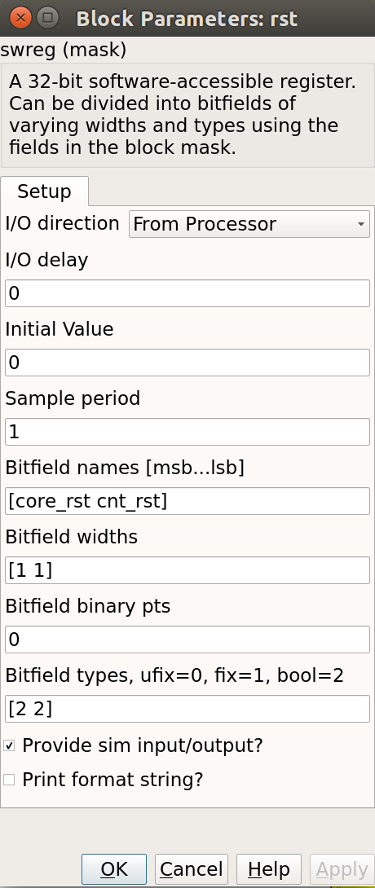

# Tutorial 2: 10GbE Interface

## Introduction ##
In this tutorial, you will create a simple Simulink design which uses the SNAP's 10GbE ports to send data at high speeds to another port. This could just as easily be another FPGA board or a computer with a 10GbE network interface card. In addition, we will learn to control the design remotely, using a supplied Python library for KATCP.

In this tutorial, a counter will be transmitted through one SFP+ port and back into another. This will allow a test of the communications link. This test can be used to test the link between boards and the effect of different cable lengths on communication robustness.

## Background ##
SNAP boards have two on-board SFP+ ports. The Ethernet interface is driven by an on-board 156.25MHz crystal oscilator. This clock is then multiplied up on the FPGA by a factor of 66. Thus, the speed on the wire is actually 156.25MHz x 66 = 10.312.5 Gbps. However, 10GbE over single-lane SFP+ connectors uses 64b/66b encoding, which means that for every 66 bits sent, 66 bits are actually transmitted. This is to ensure proper clocking, since the receiver recovers and locks-on to the transmitter's clock and requires edges in the data. Imagine transmitting a string of 0xFF or 0b11111111... which would otherwise generate a DC level on the line, now an extra two bits are introduced which includes a zero bit which the receiver can use to recover the clock and byte endings. See [here](https://en.wikipedia.org/wiki/64b/66b_encoding) for more information.

For this reason, we actually get 10Gbps usable data rate. CASPER's 10GbE Simulink core sends and receives UDP over IPv4 packets. These IP packets are wrapped in Ethernet frames. Each Ethernet frame requires a 38 byte header, IPv4 requires another 20 bytes and UDP a further 16. So, for each packet of data you send, you will incur a cost of at least 74 bytes. I say at least, because the core will zero-pad some headers to be on a 64-bit boundary. You will thus never achieve 10Gbps of usable throughput, though you can get close. It pays to send larger packets if you are trying to get higher throughputs.

The maximum payload length of the CASPER 10GbE core is 8192 bytes (implemented in BRAM) plus another 512 (implemented in distributed RAM) which is useful for an application header. These ports (and hence part of the 10 GbE cores) run at 156.25MHz, while the interface to your design runs at the FPGA clock rate (sys_clk, adcX_clk etc). The interface is asynchronous, and buffers are required at the clock boundary. For this reason, even if you send data between two SNAP boards which are running off the same hard-wired clock, there will be jitter in the data. A second consideration is how often you clock values into the core when you try to send data. If your FPGA is running faster than the core, and you try and clock data in on every clock cycle, the buffers will eventually overflow. Likewise for receiving, if you send too much data to a board and cannot clock it out of the receive buffer fast enough, the receive buffers will overflow and you will lose data. In our design, we are clocking the FPGA at 100 MHz, with the cores running at 156.25MHz. We can thus clock data into the TX buffer continuously without worrying about overflows. 

## Create a new model ##
Start Matlab and open Simulink (either by typing 'simulink' on the Matlab command line, or by clicking on the Simulink icon in the taskbar). A template is provided for Tut2 with a pre-created packet generator in the tutorials_devel git repository. Get a copy of this template and save it. You will need the `SNAP` block in the Platforms subdirectory of the xps_library. Specify a clock frequency of 100 MHz and the clock source "sys_clock".

### Add reset logic ###
A very important piece of logic to consider when designing your system is how, when and what happens during reset. In this example we shall control our resets via a software register. We shall have two independent resets, one for the 10GbE cores which shall be used initially, and one to reset the user logic which may be used more often to restart the user part of the system. Construct reset circuitry as shown below.


#### Add a software register ####
Use a software register yellow block from the CASPER XPS System Blockset for the rst block. Rename it to rst. 

It used to be that every register you inserted had to be natively 32-bits, and you were responsible for slicing these 32 bits into different signals if you want to control multiple flags. The latest block can implicitly break the 32-bit registers out into separate names signals, so we'll use that. The downside is there are a bunch of settings to configure -- you need to set up the names and data types of your register subfields. You can configure the register as follows:



#### Add Goto blocks ####
Add two Goto blocks from Simulink->Signal Routing. Configure them to have the tags as shown (core_rst and cnt_rst). These tags will be used by associated From (also found in Simulink->Signal Routing) blocks in other parts of the design. These help to reduce clutter in your design and are useful for control signals that are routed to many destinations. They should not be used a lot for data signals as it reduces the ease with which data flow can be seen through the system.

### Add 10GbE and associated registers for data transmission ###
We will now add the 10GbE block to transmit a counter at a programmable rate.

#### Add a 10GbE block for data transmission ####
Add a ten_GbE yellow block from the CASPER XPS System Blockset. It will be used to transmit data and we shall add another later to receive data. Rename it gbe0. Double click on the block to configure it and set it to be associated with SFP+ port 0. If your application can guarantee that it will be able to use received data straight away (as our application can), shallow receive buffers can be used to save resources. This optimisation is not necessary in this case as we will use a small fraction of resources in the FPGA.


#### Add registers to provide the target IP address and port number ####
Add two yellow-block software registers to provide the destination IP address and port number for transmission with the data. Name one dest_ip and the other dest_port. The registers should be
configured to receive their values from the processor. Connect them to the appropriate inputs of the gbe0 10GbE block as shown. A Slice block is required to use the lower 16 bits of data from the
dest_port register. Constant blocks from Simulink->Sources with 0 values are attached to the simulation inputs of the software registers. The destination port and IP address are not important in
this system as it is a loopback example. Add a From block from Simulink->Signal Routing and set the tag to use core_rst, this enables one to reset the block.


### Create a subsystem to generate a counter to transmit as data ###
We will now implement logic to generate a counter to transmit as data. This is already included in the Template for Tut 2. Some details are provided here for completeness.

### Construct a subsystem for data generation logic ###
It is often useful to group related functionality and hide the details. This reduces drawing space and complexity of the logic on the screen, making it easier to understand what is happening. Simulink allows the creation of Subsystems to accomplish this. 

These can be copied to places where the same functionality is required or even placed in a library for use in other projects and by other people. To create a subsystem, one can highlight the logical elements to be encapsulated, then right-click and choose Create Subsystem from the list of options. You can also simply add a Subsystem block from Simulink->Ports & Subsystems.

Subsystems inherit variables from their parent system. Simulink allows one to create a variable whose scope is only a particular subsystem. To do this, right-click on a subsystem and choose the Create Mask option. The mask created for that particular subsystem allows one to add parameters that appear when you double-click on the icon associated with the subsystem. 

The mask also allows you to associate an initialisation script with a particular subsystem. This script is called every time a mask parameter is modified and the Apply button clicked. It is especially useful if the internal structure of a subsystem must change based on mask parameters. Most of the interesting blocks in the CASPER library use these initialisation scripts. 

Drop a subsystem block into your design and rename it pkt_sim. Then double-click on it to add logic.


### Add a counter to generate a certain amount of data ###

Add a Counter block from Xilinx Blockset->Basic Elements and configure it to be unsigned, free-running, 32-bits, incrementing by 1 as shown. Add a Relational block, software register and Constant block as shown. In simulation this circuit will generate a counter from 0 to 49 and then stop counting. This will allow us to generate 50 data elements before stopping.


### Add a counter to limit the data rate ###
As mentioned earlier in this tutorial, it is impossible to supply data to the 10GbE transmission block at the full clock rate. This would mean transmitting a 64-bit word at 200MHz, and the 10GbE standard only supports up to 156.25MHz data transmission. We thus want to generate data in bursts such that the transmission FIFOs do not overflow. We thus add circuitry to limit the data rate as shown below. The logic that we have added on the left generates a reset at a fixed period determined by the software register. This will trigger the generation of a new packet of data as before. In simulation this allows us to limit the data rate to 50/200 * 200MHz = 50MHz. Using these values in actual hardware would limit the data rate to (50/(8/10*156.25)) = 4Gbps.


### Finalise logic including counter to be used as data ###
We will now finalise the data generation logic as shown below. To save time, use the existing logic provided with the tutorial. Counter1 in the illustration generates the actual data to be transmitted and the enable register allows this data stream to the transmitting 10GbE core to be turned off and on. Logic linked to the eof output port provides an indication to the 10GbE core that the final data word for the frame is being sent. This will trigger the core to begin transmission of the frame of data using the IP address and port number specified.


### Receive blocks and logic ###
The receive logic is is composed of another 10GbE yellow block with the transmission interface inputs all tied to 0 as no transmission is to be done, however Simulink requires all inputs to be connected. Connecting them to 0 should ensure that during synthesis the transmission logic for this 10GbE block is removed. Double click on the block to configure it and set it to be associated with SFP+ port 1.

### Buffers to capture received and transmitted data ###

The casperfpga Python package contains all kinds of methods to interact with your 10GbE cores. For example, grabbing packets from the TX and RX stream, or counting the number of packets sent and received are all supported, as long as you turn on the appropriate functionality in the 10GbE yellow block.
The settings we'll use are --


You can see how to use these functions in the software that accompanies this tutorial.


### LEDs and status registers ###
You can also sprinkle around other registers or LEDs to monitor status of core parameters, or give visual feedback that the design is doing something sane. Check out the reference model for some examples of potentially useful monitoring circuitry. 

## Compilation ##
Compiling this design takes approximately 20 to 30 minutes. A pre-compiled binary (.fpg file) is made available to save time.

### Programming and interacting with the FPGA ###
A pre-written python script, [''snap_tut_tge.py''](https://github.com/casper-astro/tutorials_devel/tree/master/vivado/snap/tut_tge) is provided. This script programs the fpga with your complied design (.fpg file) configures the 10GbE Ports and initiates data transfer. The script is run using:

```bash
 ./snap_tut_tge.py <SNAP_IP_ADDRESS>
```

If everything goes as expected, you should see a whole bunch of lines running across your screen as the code sets up the IP/MAC parameters of the 10GbE cores and checks their status, and that the data the cores are sending and receiving are consistent.
Have a look at this code to see how one uses the more advanced (i.e. more complex that read_int, and write_int) methods casperfpga makes available. Documentation for casperfpga is still a work in progress(!) but the basic idea is that when you instantiate a CasperFpga, the software intelligently builds python objects into this instance, based on what you put in your design. For example, your Ethernet cores should show up as objects CasperFpga.gbes.<simulink_block_name> (or CasperFpga.gbes['simulink_block_name']) which have useful methods like "setup", which sets the core's IP/MAC address, or "print_10gbe_core_details" wich will print out useful status information, like the current state of the core's ARP cache. iPython and tab-complete are your friend here, there are lots of handy methods to discover. (I'm still discovering them now :) )

The control software should be(!) well-commented, to explain what's going on behind the scene as the software interacts with your FPGA design.

## Conclusion ##
This concludes Tutorial 2. You have learned how to utilize the 10GbE ports on a SNAP to send and receive UDP packets. You also learned how to further use the Python to program the FPGA and control it remotely using some of the OOP goodies avaiable in casperfpga.