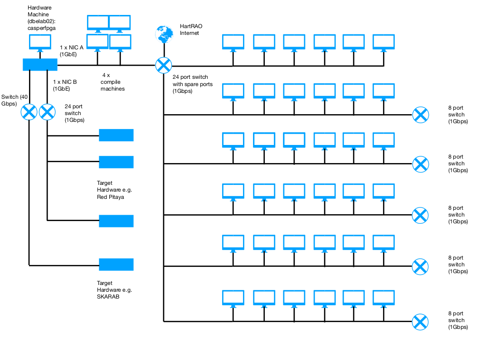

# Hardware Porting Workshop HartRAO 2019 Tutorials Help Page

## Local Configuration Information

### Accounts and login info
When you first arrive please connect to the local network in the tutorial room - note there is no WiFi in the tutorial room. If you have brought your own machine then you can plug in to one of the 1Gbps network switches on the tables - see diagram of HPW2019 network infrastructure setup below. If you dont have your own laptop then just use one of the PCs (36 of them) to ssh (with x forwarding) into the compile machines.

Once on the local network, you should be given an address on the 192.168.10.X subnet. You should be able to access the internet and the compile machines. The hardware is accessable via the control machine.



**When you arrive at the tutorial sessions you will be allocated a remote server to build designs on, and provided with login details.**

### Setting Up SSH
You will also need SSH to log in to the server in the tutorial room which controls and manages the ROACH/SNAP/SKARAB/Red Pitaya boards. SSH is supported natively in Linux and MacOS. If you are using a Windows laptop, you should install an SSH client, like Putty. Log in details for this server will be provided.

### Preparing to run the tutorials
In order to get ready to build and compile designs, you need to log into the server you have been allocated, and set up a directory in which to work. To do this, follow the step-by-step instructions below.

2. Start a terminal, by using <CRTL+T>. In the terminal, run:
```bash
#ssh into the remote server you have been assigned and enter allocated password (e.g. hpw1@casper1)
ssh -X hpw1@casper1
# Go into the home directory (you're probably already there, but let's make sure)
cd ~
# Go into the work directory
cd work/
# Make a directory unique to you, when all your work will go
mkdir <directory_name> # eg. mkdir julio-iglesias
# Go into this directory
cd <directory name> #eg. cd julio-iglesias
# Grab a copy of the tutorials repository from github
git clone https://github.com/casper-astro/tutorials_devel.git
# Grab a copy of the xml2hdl repository from bitbucket (for Red Pitaya)
git clone https://bitbucket.org/ricch/xml2vhdl.git
# Go in to the repository
cd tutorials_devel
# Switch to the version of the tutorials being used at the 2019 workshop
# The following command will check out the workshop2019 branch from CASPER's github repo, and save it as a local branch, names "workshop2019"
git checkout origin/workshop2019 -b workshop2019
# Now update the CASPER libraries to be compatible with this version of the tutorials
git submodule init
git submodule update
# This last command might take a minute or two -- it downloads the complete CASPER library codebase.
```

That wasn't so hard, right? Running all the above commands might be a little bit cumbersome, but it ensures your versions of the CASPER libraries are in sync with the tutorial models you are running and hardware you are targeting. This will prevent all kinds of pain later on.

2. Decide which hardware platform you are compiling for and go to the appropriate directory. Different directories contain slightly different MATLAB / Xilinx configurations, so it's important to choose the right one for the platform you are using.
```bash
cd vivado # For SNAP and SKARAB only
# then one of the following three commands
cd roach2 # For ROACH2 designs
cd snap   # For SNAP designs
# or...
cd vivado_2018 # For Red Pitaya only
# then the following command
cd red_pitaya # For Red Pitaya designs
cd skarab # For skarab designs
```

3. Finally, start MATLAB. The following command will configure your environment with the install locations of the MATLAB / Xilinx tools. This configuration depends on how you have set up your compile machines. The startsg.local.hpw2019 files below will only work on the HPW2019 build machines.
```bash
#You will need to add the xml2vhdl path to your startsg.local.hpw2019 file. Edit this file by using VIM or nano and add the install path of your xml2vhdl script:
export XML2VHDL_PATH="/home/hpw1/work/<your_name>/xml2vhdl/scripts/python/xml2vhdl-ox/xml2vhdl/"
#Run the following from the terminal to start MATLAB
./startsg startsg.local.hpw2019
```
You should be greeted with a MATLAB window. After a few seconds, it should be ready to accept user input.

4. From here, you can either open one of the tutorial .slx files using the "Open" button, or start a new simulink design by typing "simulink" in the MATLAB prompt and starting a new model.
5. Now go to the [Tutorials](https://casper-tutorials.readthedocs.io/en/latest/) page to find the instructions for your chosen tutorial. When you have compiled your design, come back here to see how to load it on to hardware.

## Getting your designs on to hardware
When your compile has finished, it should deliver you a .fpg file (this will be created in <build_dir>/bit_files/ for ROACHs, or <build_dir>/outputs/ for SNAP / SKARAB / Red Pitaya). This file needs copying to the server in the tutorial room which is connected to all the FPGA boards. To copy the file between machines, run (in a terminal within your vnc session):
```bash
scp /path/to/fpg_file.fpg hpw_hardware@dbelab02:<name you want your file to have>.fpg
```
For example:
```bash
scp ~/julio-iglesias/tutorials_devel/vivado/snap/tut_intro/snap_tut_intro/outputs/snap_tut_intro_2017-08-13_1508.fpg hpw_hardware@dbelab02:julio-iglesias_snap_intro.fpg
```
You should not be asked for a password. You may be warned that the authenticity of the host can't be verified. If so, type "yes" to continue.

You can now ssh from your laptop into dbelab02, with username hpw_hardware. The password will be provided at the tutorial sessions. Once you are in dbelab02, you should see the file you copied if you list all files in the home directory with the command:
```bash
ls
```
You can now follow the tutorial instructions to program this file to an FPGA board. Details of the available FPGA platforms is below.

### Available FPGA hardware
There is one SNAP, one SKARAB, and 10 Red Pitayas in the tutorial room (excludes custom brought hardware). You can access them from dbelab02 using the hostnames below. You can use your laptops as the control server but you will need to connect to the same subnet as the hardware, this means you wont have internet access though.

* snap1
* skarab02030B-01 (40GbE port)
* e.g. Red Pitaya: rp-f0495e.local (check on top of your Red Pitaya ethernet connector for your hostname)
